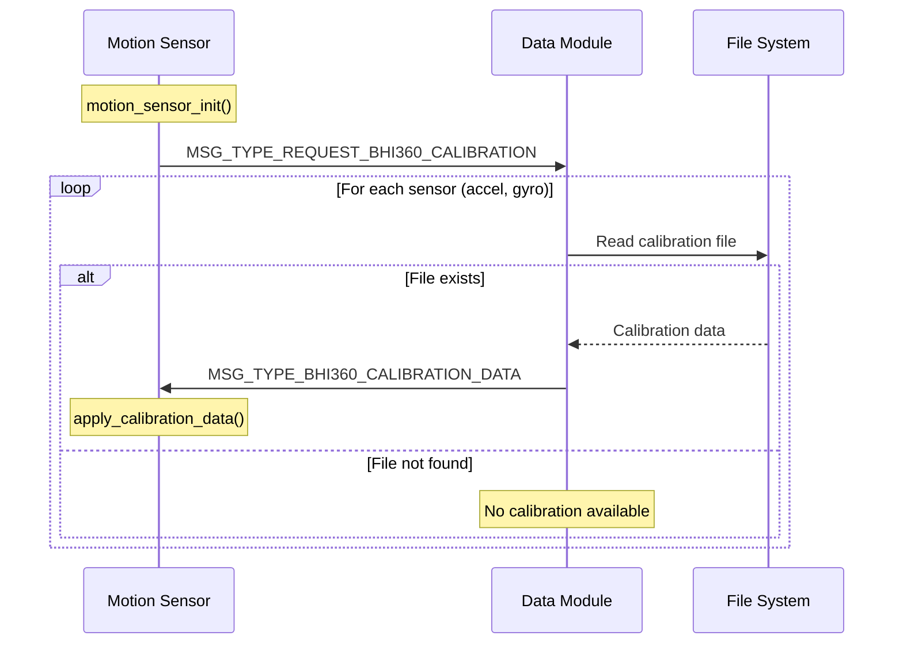
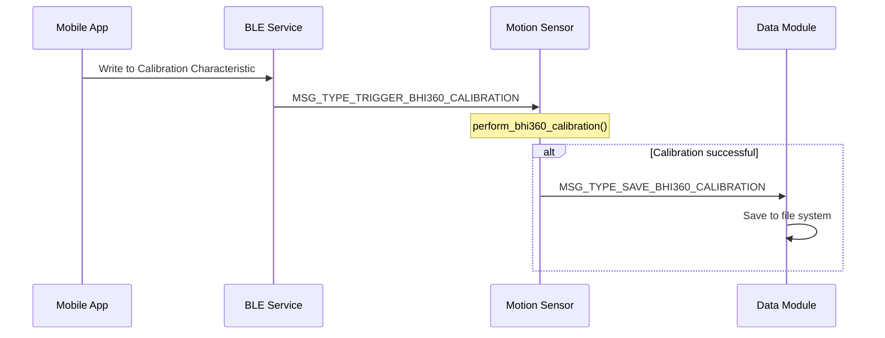

# BHI360 Complete Integration Guide

## Table of Contents
1. [Overview](#overview)
2. [Architecture](#architecture)
3. [Integration Details](#integration-details)
4. [Calibration System](#calibration-system)
5. [Configuration Options](#configuration-options)
6. [When Calibration is Beneficial](#when-calibration-is-beneficial)
7. [Calibration Message Flow](#calibration-message-flow)
8. [Implementation Guide](#implementation-guide)
9. [Troubleshooting](#troubleshooting)
10. [Best Practices](#best-practices)
11. [Calibration Storage System](#calibration-storage-system)
12. [Summary](#summary)

## Overview

The BHI360 is a smart sensor hub from Bosch that combines multiple MEMS sensors with an integrated microcontroller for sensor fusion and processing. This guide covers the complete integration of the BHI360 into the sensing firmware, including the calibration system.

### Key Features
- **Multi-sensor fusion**: Accelerometer, Gyroscope, Magnetometer
- **Virtual sensors**: Quaternion, Linear Acceleration, Gravity, Step Counter
- **Hardware offloading**: Sensor processing on BHI360, reducing host CPU load
- **Automatic calibration**: Built-in calibration algorithms with user control
- **Low power**: Optimized for battery-powered applications

## Architecture

### System Components

```
┌─────────────────────┐
│   Application       │
│ (motion_sensor.cpp) │
└──────────┬──────────┘
           │
┌──────────▼──────────┐
│   BHI360 Driver     │
│ (bhi360_zephyr.c)   │
└──────────┬──────────┘
           │
┌──────────▼──────────┐
│ Calibration Module  │
│(bhi360_calibration) │
└──────────┬──────────┘
           │
┌──────────▼──────────┐
│   BHY2 API         │
│ (Bosch Library)     │
└──────────┬──────────┘
           │
┌──────────▼──────────┐
│  Hardware (SPI)     │
│   BHI360 Chip       │
└─────────────────────┘
```

### Data Flow

1. **Interrupt-driven**: BHI360 generates interrupt when data ready
2. **FIFO Processing**: Driver reads and processes FIFO data
3. **Callback System**: Parse callbacks extract sensor data
4. **Data Distribution**: 
   - Logging to external flash via data module
   - Real-time streaming via Bluetooth
   - Standard sensor API for other modules

## Integration Details

### 1. Driver Integration

The BHI360 driver provides:
- **Standard Zephyr sensor API** compliance
- **Extended API** for BHI360-specific features
- **Thread-safe** operations with mutex protection
- **Interrupt handling** with semaphore signaling

#### Key APIs:
```c
// Standard sensor API
sensor_sample_fetch(dev);
sensor_channel_get(dev, SENSOR_CHAN_ACCEL_XYZ, values);

// Extended API
bhi360_get_bhy2_dev(dev);           // Get BHY2 handle
bhi360_wait_for_data(dev, timeout); // Wait for interrupt
bhi360_process_fifo(dev, buffer, size); // Process FIFO
bhi360_update_sensor_data(dev, data);   // Update cache
```

### 2. Sensor Configuration

The system configures four virtual sensors:

| Sensor | ID | Sample Rate | Description |
|--------|-----|------------|-------------|
| Quaternion | BHY2_SENSOR_ID_RV (34) | 50 Hz | Rotation in quaternion format |
| Linear Acceleration | BHY2_SENSOR_ID_LACC (31) | 50 Hz | Acceleration without gravity |
| Gyroscope | BHY2_SENSOR_ID_GYRO (13) | 50 Hz | Angular velocity |
| Step Counter | BHY2_SENSOR_ID_STC (52) | 5 Hz | Cumulative step count |

### 3. Data Processing

Data undergoes several transformations:

```c
// Raw sensor data → Scaled values
Quaternion: raw / 16384.0f → [-1.0, 1.0]
Linear Accel: raw / 100.0f → m/s²
Gyroscope: raw / 16384.0f → rad/s
Timestamp: raw * 15625 → nanoseconds
```

## Calibration System

### Overview

The BHI360 calibration system ensures accurate sensor measurements by compensating for:
- **Sensor offsets**: Manufacturing variations and mounting effects
- **Temperature drift**: Changes due to temperature variations
- **Magnetic interference**: Hard/soft iron effects for magnetometer
- **Aging effects**: Long-term sensor drift

### Calibration Methods

#### 1. Fast Offset Compensation (FOC)

FOC is a quick calibration method that determines static offsets:

**Gyroscope FOC**:
- **Purpose**: Eliminate zero-rate offset (bias)
- **Method**: Measure output when stationary, calculate offset
- **Duration**: 2-3 seconds
- **Requirement**: Device completely stationary

**Accelerometer FOC**:
- **Purpose**: Calibrate 1g reference and remove offsets
- **Method**: Measure output in known orientation (1g on Z-axis)
- **Duration**: 2-3 seconds
- **Requirement**: Device on flat surface, Z-axis up

#### 2. Continuous Calibration

**Magnetometer Calibration**:
- **Purpose**: Compensate for magnetic interference
- **Method**: Continuous adaptation during device movement
- **Duration**: Ongoing, improves with motion diversity
- **Requirement**: Movement in various orientations (figure-8 pattern helps)

### Calibration Status Levels

The BHI360 reports calibration status on a 0-4 scale:

| Level | Status | Description | Typical Accuracy |
|-------|--------|-------------|------------------|
| 0 | Not Calibrated | No calibration data | Poor |
| 1 | In Progress | Calibration running | Improving |
| 2 | Low Accuracy | Basic calibration | ±5-10% |
| 3 | Medium Accuracy | Good calibration | ±2-5% |
| 4 | High Accuracy | Excellent calibration | <±2% |

### Calibration Process Flow

```
Start
  │
  ▼
Check Status ──────► Status ≥ Threshold? ──Yes──► Skip Calibration
  │                          │
  │                          No
  │                          ▼
  │                    Gyro Calibration
  │                    (Device Stationary)
  │                          │
  │                          ▼
  │                    Accel Calibration
  │                    (Device Flat, Z-up)
  │                          │
  │                          ▼
  │                    Update Status
  │                          │
  ▼                          ▼
Continue ◄──────���───────────┘
```

## Configuration Options

### Kconfig Settings

The BHI360 driver provides several configuration options:

#### BHI360_AUTO_CALIBRATION
```kconfig
config BHI360_AUTO_CALIBRATION
    bool "Automatic calibration on startup"
    default y
```
- **Purpose**: Enable/disable automatic calibration during initialization
- **Default**: Enabled
- **When to disable**:
  - Factory-calibrated devices
  - Quick startup required
  - Calibration handled elsewhere

#### BHI360_CALIBRATION_THRESHOLD
```kconfig
config BHI360_CALIBRATION_THRESHOLD
    int "Calibration accuracy threshold (0-4)"
    default 3
    range 0 4
```
- **Purpose**: Set minimum acceptable calibration accuracy
- **Default**: 3 (Medium accuracy)
- **Guidelines**:
  - 2: Basic applications, rough measurements
  - 3: General purpose, good accuracy
  - 4: Precision applications, best accuracy

### Project Configuration Examples

**High Accuracy Application** (prj.conf):
```conf
# Require high accuracy calibration
CONFIG_BHI360_AUTO_CALIBRATION=y
CONFIG_BHI360_CALIBRATION_THRESHOLD=4
```

**Quick Start Application** (prj.conf):
```conf
# Skip calibration for fast boot
CONFIG_BHI360_AUTO_CALIBRATION=n
```

**Battery-Powered Device** (prj.conf):
```conf
# Medium accuracy to balance power/performance
CONFIG_BHI360_AUTO_CALIBRATION=y
CONFIG_BHI360_CALIBRATION_THRESHOLD=3
```

## When Calibration is Beneficial

### Always Calibrate When:

1. **First Use**
   - New device or sensor
   - After firmware update
   - After hardware changes

2. **Environmental Changes**
   - Large temperature variations (>20°C)
   - New magnetic environment
   - After exposure to strong magnetic fields

3. **Accuracy Degradation**
   - Drift observed in measurements
   - Calibration status drops below threshold
   - After mechanical shock/drop

4. **Application Requirements**
   - Precision measurements needed
   - Safety-critical applications
   - Scientific/medical use cases

### Calibration May Be Skipped When:

1. **Factory Calibrated**
   - Professional calibration performed
   - Calibration data pre-loaded
   - Known stable environment

2. **Time Constraints**
   - Quick startup required
   - Temporary measurements
   - Non-critical applications

3. **Continuous Operation**
   - Device rarely powered off
   - Calibration maintained in memory
   - Regular runtime calibration

### Impact of Poor Calibration

**Gyroscope**:
- Drift in orientation tracking
- Integration errors accumulate
- False rotation detection

**Accelerometer**:
- Incorrect motion detection
- Wrong tilt angles
- False acceleration readings

**Magnetometer**:
- Wrong heading/compass direction
- Susceptible to interference
- Poor indoor navigation

## Calibration Message Flow

### Message Types

The calibration system uses the following message types for inter-module communication:

| Message Type | Description | Sender | Receiver |
|--------------|-------------|---------|----------|
| `MSG_TYPE_TRIGGER_BHI360_CALIBRATION` | Trigger calibration process | Bluetooth/Control Service | Motion Sensor |
| `MSG_TYPE_REQUEST_BHI360_CALIBRATION` | Request stored calibration data | Motion Sensor | Data Module |
| `MSG_TYPE_BHI360_CALIBRATION_DATA` | Calibration data response | Data Module | Motion Sensor |
| `MSG_TYPE_SAVE_BHI360_CALIBRATION` | Save calibration to storage | Motion Sensor | Data Module |

### Startup Calibration Loading

When the motion sensor module initializes, it automatically loads any previously saved calibration:



### Manual Calibration Trigger

Users can trigger calibration via BLE characteristic or shell command:



### Periodic Calibration Updates

The motion sensor periodically checks for calibration improvements:

```c
// In motion_sensor_process() thread
if (++calibration_check_counter >= CALIBRATION_CHECK_INTERVAL) {
    calibration_check_counter = 0;
    check_and_save_calibration_updates(bhi360_dev);
}
```

### Calibration Data Storage

Calibration profiles are stored in the file system:

```
/lfs1/calibration/
├── bhi360_calib_accel.bin   # Accelerometer calibration
└── bhi360_calib_gyro.bin    # Gyroscope calibration
```

File format:
- 2 bytes: profile_size (uint16_t)
- N bytes: profile_data (calibration data from BHI360)

## Implementation Guide

### Basic Implementation

```c
// 1. Include headers
#include <bhi360.h>
#include <bhi360_calibration.h>

// 2. Initialize with auto-calibration (if enabled)
static void motion_sensor_init()
{
    // ... device initialization ...
    
    #if IS_ENABLED(CONFIG_BHI360_AUTO_CALIBRATION)
    // Automatic calibration happens here
    #endif
}

// 3. Manual calibration trigger
void trigger_calibration()
{
    struct bhi360_calibration_status status;
    struct bhi360_foc_result result;
    
    // Check current status
    bhi360_get_calibration_status(bhi360_dev, &status);
    
    // Calibrate if needed
    if (status.gyro_calib_status < CONFIG_BHI360_CALIBRATION_THRESHOLD) {
        bhi360_perform_gyro_foc(bhi360_dev, &result);
    }
}
```

### Advanced Implementation with Storage

```c
// Save calibration to flash
void save_calibration()
{
    uint8_t profile[512];
    size_t size;
    
    // Get calibration profile
    bhi360_get_calibration_profile(bhi360_dev, BHI360_SENSOR_GYRO,
                                  profile, sizeof(profile), &size);
    
    // Store in flash (using Zephyr settings API)
    settings_save_one("bhi360/gyro_calib", profile, size);
}

// Restore calibration from flash
void restore_calibration()
{
    uint8_t profile[512];
    size_t size = sizeof(profile);
    
    // Load from flash
    if (settings_load_subtree_direct("bhi360/gyro_calib", 
                                    profile, &size) == 0) {
        // Apply calibration
        bhi360_set_calibration_profile(bhi360_dev, BHI360_SENSOR_GYRO,
                                      profile, size);
    }
}
```

### Runtime Calibration Monitoring

```c
// Monitor and maintain calibration
void calibration_monitor_thread()
{
    struct bhi360_calibration_status status;
    
    while (1) {
        k_sleep(K_MINUTES(5));
        
        // Check calibration status
        bhi360_get_calibration_status(bhi360_dev, &status);
        
        // Log warnings if calibration degrades
        if (status.gyro_calib_status < 2) {
            LOG_WRN("Gyro calibration degraded: %d", 
                    status.gyro_calib_status);
        }
        
        // Trigger recalibration if needed
        if (status.gyro_calib_status < CONFIG_BHI360_CALIBRATION_THRESHOLD) {
            // Notify user or trigger calibration
            trigger_recalibration_event();
        }
    }
}
```

## Troubleshooting

### Common Issues and Solutions

#### 1. Calibration Fails Repeatedly
**Symptoms**: FOC returns failure, status remains 0
**Causes**:
- Device not stationary (gyro)
- Device not level (accel)
- Sensor hardware issue

**Solutions**:
- Ensure stable mounting
- Check for vibrations
- Verify sensor communication
- Try in different environment

#### 2. Calibration Doesn't Persist
**Symptoms**: Good calibration lost after reset
**Causes**:
- No flash storage implementation
- Power loss during write
- Corrupted calibration data

**Solutions**:
- Implement calibration storage
- Add power-fail protection
- Validate stored profiles

#### 3. Poor Magnetometer Calibration
**Symptoms**: Status stuck at 1-2, heading errors
**Causes**:
- Strong magnetic interference
- Limited motion diversity
- Hard/soft iron effects

**Solutions**:
- Move away from magnets/metal
- Perform figure-8 motions
- Use magnetic shielding

### Debug Commands

Add these commands for debugging:

```c
// Shell command for calibration status
static int cmd_calib_status(const struct shell *shell, 
                           size_t argc, char **argv)
{
    struct bhi360_calibration_status status;
    bhi360_get_calibration_status(bhi360_dev, &status);
    
    shell_print(shell, "Calibration Status:");
    shell_print(shell, "  Accel: %d", status.accel_calib_status);
    shell_print(shell, "  Gyro:  %d", status.gyro_calib_status);
    shell_print(shell, "  Mag:   %d", status.mag_calib_status);
    
    return 0;
}

// Shell command to trigger calibration
static int cmd_calib_trigger(const struct shell *shell,
                            size_t argc, char **argv)
{
    if (argc < 2) {
        shell_error(shell, "Usage: calib trigger <accel|gyro|all>");
        return -EINVAL;
    }
    
    if (strcmp(argv[1], "gyro") == 0) {
        struct bhi360_foc_result result;
        shell_print(shell, "Keep device stationary...");
        k_sleep(K_SECONDS(2));
        bhi360_perform_gyro_foc(bhi360_dev, &result);
    }
    // ... handle other sensors ...
    
    return 0;
}
```

## Best Practices

### 1. Calibration Strategy
- **Initial Setup**: Perform full calibration during first boot
- **Periodic Checks**: Monitor status every 5-10 minutes
- **Event-Based**: Recalibrate after temperature changes or shocks
- **User-Triggered**: Provide manual calibration option

### 2. User Experience
- **Clear Instructions**: Guide users during calibration
- **Progress Feedback**: Show calibration progress
- **Status Indicators**: Display current calibration quality
- **Minimal Disruption**: Calibrate during natural pauses

### 3. Production Considerations
- **Factory Calibration**: Pre-calibrate during manufacturing
- **Quick Start Mode**: Option to skip calibration
- **Calibration Profiles**: Ship with default profiles
- **Field Updates**: Support remote calibration triggers

### 4. Power Management
- **Selective Calibration**: Only calibrate sensors in use
- **Lazy Calibration**: Defer until high accuracy needed
- **Background Calibration**: Use idle time for calibration
- **Profile Caching**: Avoid repeated calibrations

### 5. Data Quality
- **Validation**: Check calibration results are reasonable
- **Redundancy**: Keep backup calibration profiles
- **Monitoring**: Track calibration quality over time
- **Alerts**: Notify when recalibration needed

## Calibration Storage System

### Overview

The BHI360 calibration data is automatically saved to and loaded from the littlefs filesystem. This ensures calibration persists across power cycles and reduces the need for repeated calibration procedures.

### Storage Location

Calibration files are stored in:
```
/lfs1/calibration/
├── bhi360_calib_accel.bin   # Accelerometer calibration
��── bhi360_calib_gyro.bin    # Gyroscope calibration
```

### Storage API

The data module provides dedicated functions for calibration storage:

```c
// Store calibration data
err_t store_bhi360_calibration_data(
    uint8_t sensor_type,    // 0=accel, 1=gyro
    const uint8_t *profile_data,
    size_t profile_size
);

// Retrieve calibration data
err_t get_bhi360_calibration_data(
    uint8_t sensor_type,
    uint8_t *profile_data,
    size_t buffer_size,
    size_t *actual_size
);
```

### Automatic Save/Load Flow

#### Startup Loading
```c
static void load_saved_calibrations(const struct device *bhi360_dev)
{
    struct {
        enum bhi360_sensor_type sensor;
        uint8_t type_id;
        const char *name;
    } sensors[] = {
        {BHI360_SENSOR_ACCEL, 0, "accel"},
        {BHI360_SENSOR_GYRO, 1, "gyro"}
    };

    for (int i = 0; i < ARRAY_SIZE(sensors); i++) {
        uint8_t profile_data[512];
        size_t actual_size;
        
        err_t err = get_bhi360_calibration_data(sensors[i].type_id, 
                                               profile_data, 
                                               sizeof(profile_data), 
                                               &actual_size);
        if (err == err_t::NO_ERROR) {
            int ret = bhi360_set_calibration_profile(bhi360_dev, 
                                                    sensors[i].sensor,
                                                    profile_data, 
                                                    actual_size);
            if (ret == 0) {
                LOG_INF("Loaded %s calibration from storage", sensors[i].name);
            }
        }
    }
}
```

#### Post-Calibration Saving
```c
static void save_calibration_profile(const struct device *bhi360_dev, 
                                   enum bhi360_sensor_type sensor,
                                   uint8_t type_id)
{
    uint8_t profile_data[512];
    size_t actual_size;
    
    int ret = bhi360_get_calibration_profile(bhi360_dev, sensor, 
                                            profile_data, 
                                            sizeof(profile_data), 
                                            &actual_size);
    if (ret == 0) {
        err_t err = store_bhi360_calibration_data(type_id, 
                                                 profile_data, 
                                                 actual_size);
        if (err == err_t::NO_ERROR) {
            LOG_INF("Saved calibration for sensor type %d", type_id);
        }
    }
}
```

### Message-Based Storage

The system also supports message-based calibration commands:

```c
// Save calibration via message queue
generic_message_t msg = {
    .sender = SENDER_BHI360_THREAD,
    .type = MSG_TYPE_SAVE_BHI360_CALIBRATION,
    .data.bhi360_calibration = {
        .sensor_type = 1,  // gyro
        .profile_size = actual_size,
        // profile_data copied to message
    }
};
k_msgq_put(&data_msgq, &msg, K_NO_WAIT);
```

### Storage Format

Each calibration file contains:
- **Header** (2 bytes): Profile size as uint16_t
- **Data** (N bytes): Raw calibration profile from BHI360

### Error Handling

| Error Code | Description | Action |
|------------|-------------|---------|
| `NO_ERROR` | Success | Continue |
| `FILE_SYSTEM_NO_FILES` | No saved calibration | Perform new calibration |
| `FILE_SYSTEM_ERROR` | Storage access failed | Log error, continue without |
| `INVALID_PARAMETER` | Invalid sensor type | Check sensor_type value |

### Best Practices for Storage

1. **Save After Successful Calibration**: Only store profiles after verifying calibration quality
2. **Load During Init**: Attempt to load before checking calibration status
3. **Periodic Updates**: Save improved calibration profiles during runtime
4. **Graceful Fallback**: Continue operation even if storage fails

## Summary

The BHI360 integration provides a robust sensor solution with comprehensive calibration support. Key takeaways:

1. **Automatic Calibration**: Enabled by default, configurable via Kconfig
2. **Flexible Thresholds**: Adjust accuracy requirements per application
3. **Multiple Methods**: FOC for quick calibration, continuous for magnetometer
4. **Status Monitoring**: 0-4 scale indicates calibration quality
5. **Persistent Storage**: Calibration data saved to flash automatically
6. **Production Ready**: Support for factory calibration and field updates

Proper calibration is essential for accurate sensor measurements. The integrated calibration system with persistent storage makes it easy to maintain sensor accuracy while providing flexibility for different use cases and requirements.