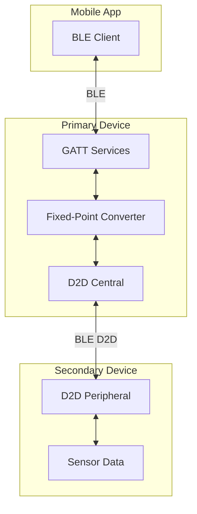
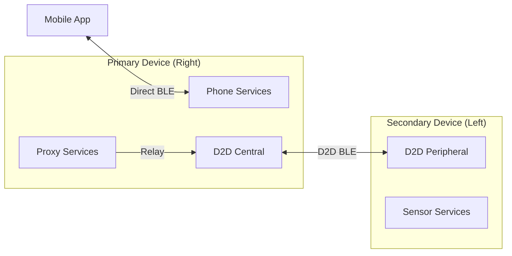
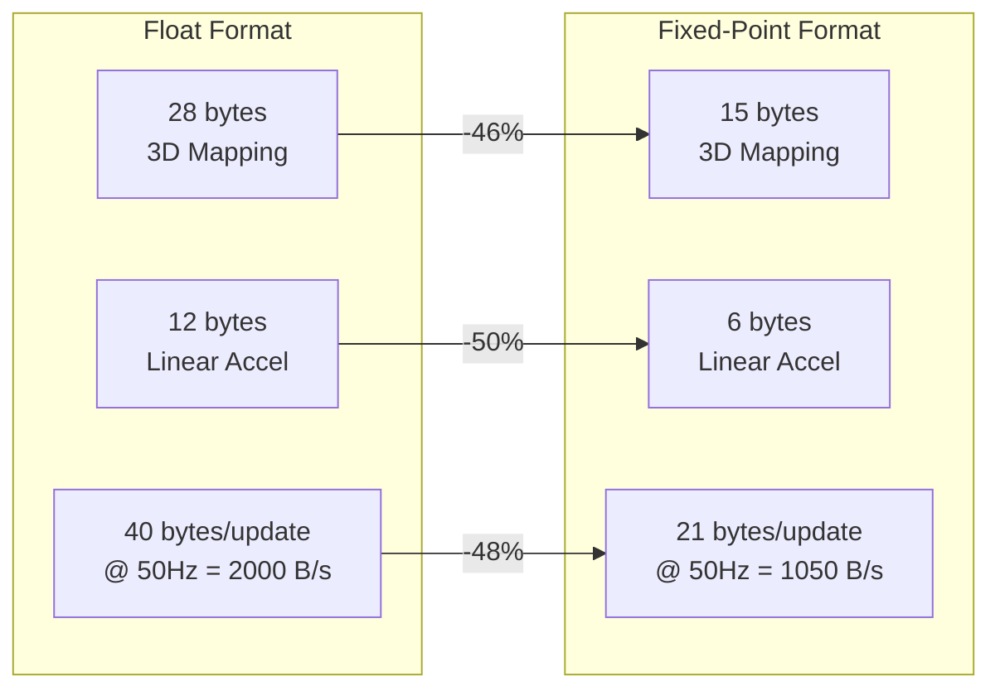
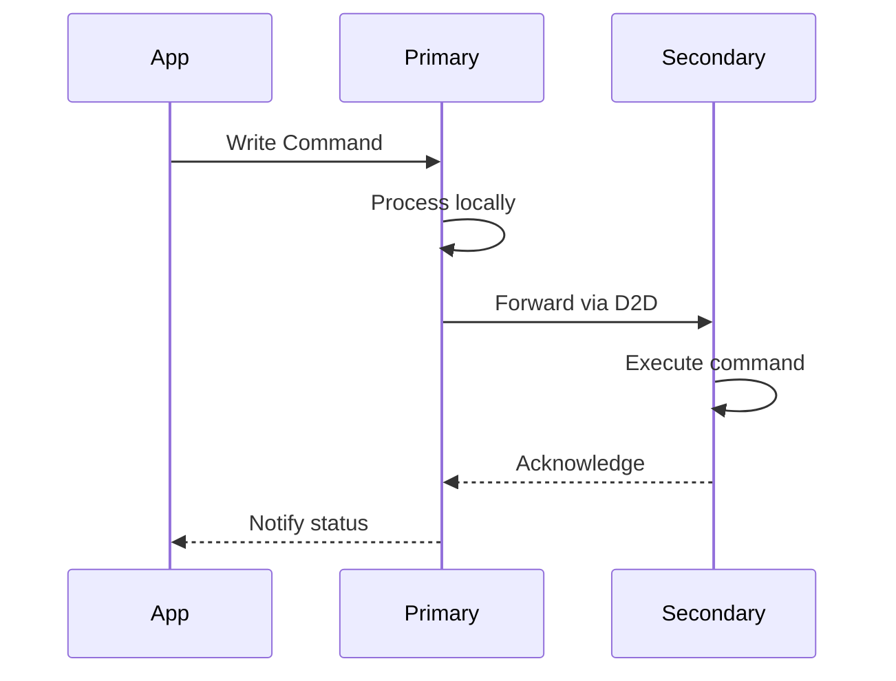
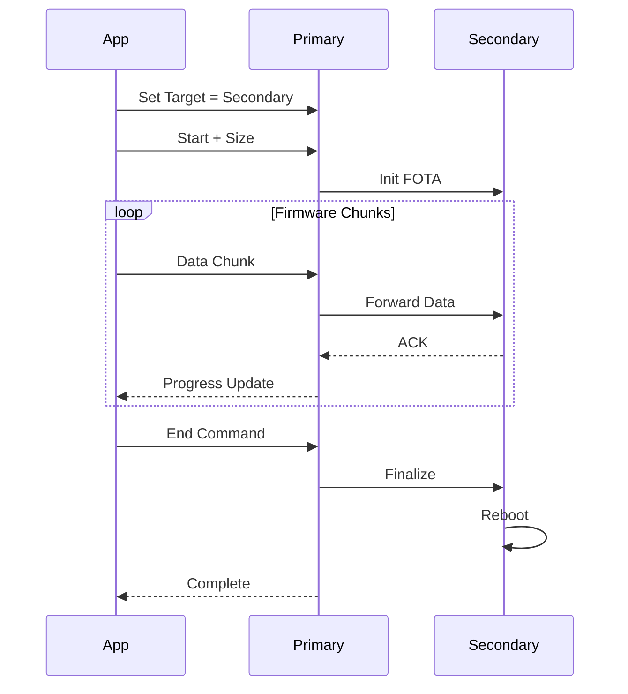
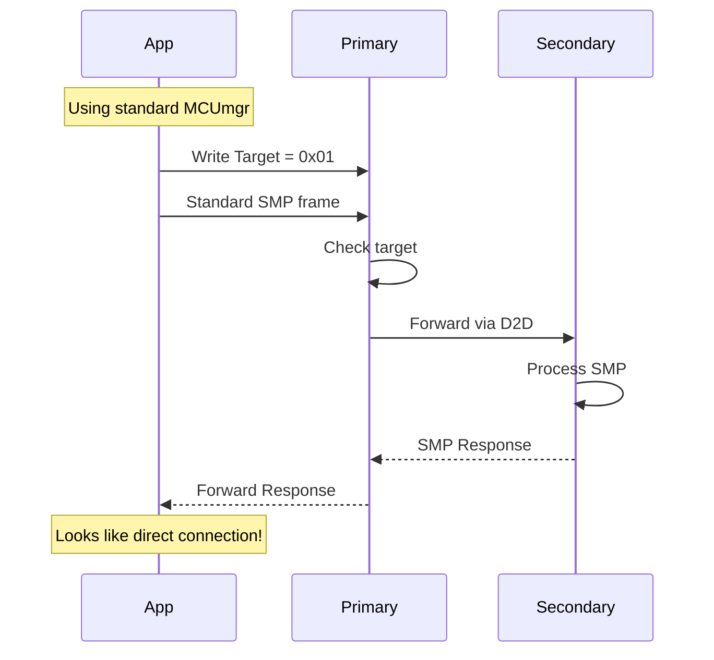
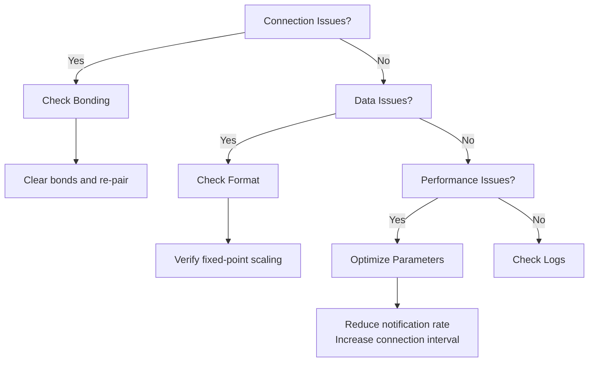

# Bluetooth GATT Specification

**Version:** 2.0  
**Date:** June 2025  
**Scope:** Complete Bluetooth GATT services, characteristics, and protocols for mobile app and device integration  
**Purpose:** Comprehensive reference for BLE integration including fixed-point data formats, service definitions, and implementation examples

---

## Table of Contents

1. [Introduction](#1-introduction)
2. [System Architecture](#2-system-architecture)
3. [Fixed-Point Data Format](#3-fixed-point-data-format)
4. [Standard Services](#4-standard-services)
5. [Information Service](#5-information-service)
6. [Control Service](#6-control-service)
7. [Proxy Services](#7-proxy-services)
8. [Device-to-Device (D2D) Services](#8-device-to-device-d2d-services)
9. [Data Structures](#9-data-structures)
10. [Integration Examples](#10-integration-examples)
11. [Error Handling and Status Communication](#11-error-handling-and-status-communication)
12. [Common BLE Error Codes](#12-common-ble-error-codes)

---

## 1. Introduction

This device implements a comprehensive set of Bluetooth Low Energy (BLE) GATT services for:
- Real-time sensor data transmission
- Device control and configuration
- Log file management
- Firmware updates (FOTA)
- Device-to-device communication

### Key Features
- **Fixed-point integer format** for optimal bandwidth usage
- **Encrypted communication** for all services
- **Dual-device architecture** with primary/secondary roles
- **40% bandwidth reduction** compared to floating-point format



---

## 2. System Architecture

### Device Roles



| Feature | Primary Device | Secondary Device |
|---------|----------------|------------------|
| Device Name | "SensingGR" | "SensingGL" |
| BLE Role | Peripheral + Central | Peripheral only |
| Phone Connection | Yes | No |
| D2D Connection | Central (initiates) | Peripheral (accepts) |
| Services | Full set | D2D only |

---

## 3. Fixed-Point Data Format

All sensor data uses fixed-point integers to optimize bandwidth and ensure portability.

### Scaling Factors

| Data Type | Scale Factor | Precision | Range | Example |
|-----------|--------------|-----------|-------|---------|
| Quaternion | 10,000 | 0.0001 | ±1.0 | 0.7071 → 7071 |
| Linear Acceleration | 1,000 | 0.001 m/s² | ±20 m/s² | 9.81 → 9810 |
| Gyroscope | 10,000 | 0.0001 rad/s | ±2.0 rad/s | 1.5708 → 15708 |
| Accuracy | 100 | 0.01 | 0-3.0 | 2.5 → 250 |

### Bandwidth Comparison



### Conversion Functions

```c
// Encoding (Device → BLE)
int16_t encode_quaternion(float value) {
    return (int16_t)(value * 10000.0f);
}

int16_t encode_acceleration(float value) {
    return (int16_t)(value * 1000.0f);
}

// Decoding (BLE → App)
float decode_quaternion(int16_t fixed) {
    return (float)fixed / 10000.0f;
}

float decode_acceleration(int16_t fixed) {
    return (float)fixed / 1000.0f;
}
```

---

## 4. Standard Services

### Device Information Service (DIS)
**UUID:** `0000180A-0000-1000-8000-00805F9B34FB`

| Characteristic | UUID | Properties | Data Type |
|----------------|------|------------|-----------|
| Manufacturer Name | 0x2A29 | Read | String |
| Model Number | 0x2A24 | Read | String |
| Serial Number | 0x2A25 | Read | String |
| Hardware Revision | 0x2A27 | Read | String |
| Firmware Revision | 0x2A26 | Read | String |

### Battery Service
**UUID:** `0000180F-0000-1000-8000-00805F9B34FB`

| Characteristic | UUID | Properties | Data Type | Description |
|----------------|------|------------|-----------|-------------|
| Battery Level | 0x2A19 | Read, Notify | uint8_t | 0-100% |

### Current Time Service (CTS)
**UUID:** `00001805-0000-1000-8000-00805F9B34FB`

| Characteristic | UUID | Properties | Data Type |
|----------------|------|------------|-----------|
| Current Time | 0x2A2B | Read, Write, Notify | CTS struct |

---

## 5. Information Service

**UUID:** `0c372eaa-27eb-437e-bef4-775aefaf3c97`  
**Availability:** Primary device only

### Characteristics

| Characteristic | UUID Suffix | Properties | Data Type | Description |
|----------------|-------------|------------|-----------|-------------|
| Current Time | 0x2A2B | Read, Notify | CTS format | Device time |
| Status | `...eab` | Read, Notify | uint32_t | Status bitfield |
| Foot Sensor Samples | `...eaf` | Read, Notify | foot_samples_t | 16 ADC channels |
| Foot Log Available | `...eac` | Read, Notify | uint8_t | Latest log ID |
| Charge Status | `...ead` | Read, Notify | uint8_t | 0-100% |
| Foot Log Path | `...eae` | Read, Notify | char[] | UTF-8 path |
| BHI360 Log Available | `...eb0` | Read, Notify | uint8_t | Latest log ID |
| BHI360 Log Path | `...eb1` | Read, Notify | char[] | UTF-8 path |
| **BHI360 3D Mapping** | `...eb2` | Read, Notify | bhi360_3d_mapping_fixed_t | **Fixed-point** |
| **BHI360 Step Count** | `...eb3` | Read, Notify | bhi360_step_count_t | Steps + duration |
| **BHI360 Linear Accel** | `...eb4` | Read, Notify | bhi360_linear_accel_fixed_t | **Fixed-point** |
| FOTA Progress | `...eb5` | Read, Notify | fota_progress_t | Update status |
| **Activity Log Available** | `...ec2` | Read, Notify | uint8_t | Latest log ID |
| **Activity Log Path** | `...ec3` | Read, Notify | char[] | UTF-8 path |

#### Secondary Device Characteristics (Primary Device Only)

These characteristics are only available on the primary device and relay information from the connected secondary device:

| Characteristic | UUID Suffix | Properties | Data Type | Description |
|----------------|-------------|------------|-----------|-------------|
| Secondary Manufacturer | `...eb6` | Read | String | Secondary device manufacturer |
| Secondary Model | `...eb7` | Read | String | Secondary device model |
| Secondary Serial | `...eb8` | Read | String | Secondary device serial |
| Secondary HW Rev | `...eb9` | Read | String | Secondary hardware revision |
| Secondary FW Rev | `...eba` | Read | String | Secondary firmware revision |
| Secondary FOTA Progress | `...ebb` | Read, Notify | fota_progress_t | Secondary update status |
| Secondary Foot Log Available | `...ebc` | Read, Notify | uint8_t | Secondary foot log ID |
| Secondary Foot Log Path | `...ebd` | Read, Notify | char[] | Secondary foot log path |
| Secondary BHI360 Log Available | `...ebe` | Read, Notify | uint8_t | Secondary BHI360 log ID |
| Secondary BHI360 Log Path | `...ebf` | Read, Notify | char[] | Secondary BHI360 log path |
| Secondary Activity Log Available | `...ec0` | Read, Notify | uint8_t | Secondary activity log ID |
| Secondary Activity Log Path | `...ec1` | Read, Notify | char[] | Secondary activity log path |

### Status Bitfield

```c
#define STATUS_IDLE                    0x00000001
#define STATUS_LOGGING                 0x00000002
#define STATUS_ERROR                   0x00000004
#define STATUS_LOW_BATTERY             0x00000008
#define STATUS_CHARGING                0x00000010
#define STATUS_BLUETOOTH_CONNECTED     0x00000020
#define STATUS_D2D_CONNECTED           0x00000040
#define STATUS_FILE_SYSTEM_ERROR       0x00000080
#define STATUS_SENSOR_ERROR            0x00000100
#define STATUS_CALIBRATING             0x00000200
```

---

## 6. Control Service

**UUID:** `4fd5b67f-9d89-4061-92aa-319ca786baae`  
**Availability:** Primary device only

### Characteristics

| Characteristic | UUID Suffix | Properties | Data Type | Description |
|----------------|-------------|------------|-----------|-------------|
| Set Time | `...b681` | Write | uint32_t | Epoch time (big-endian) |
| Delete Foot Log | `...b682` | Write, Notify | uint8_t | Log ID to delete |
| Delete BHI360 Log | `...b683` | Write, Notify | uint8_t | Log ID to delete |
| Delete Activity Log | `...b687` | Write, Notify | uint8_t | Log ID to delete |
| Start Activity | `...b684` | Write, Notify | uint8_t | Write 1 to start |
| Stop Activity | `...b685` | Write, Notify | uint8_t | Write 1 to stop |
| **Trigger BHI360 Calibration** | `...b686` | Write, Notify | uint8_t | Write 1 to trigger calibration |

### Command Flow



---

## 7. Proxy Services

### 7.1 FOTA Proxy Service

**UUID:** `6e400001-b5a3-f393-e0a9-e50e24dcca9e`  
**Availability:** Primary device only  
**Purpose:** Firmware updates for secondary device via primary

| Characteristic | UUID Suffix | Properties | Data Type | Description |
|----------------|-------------|------------|-----------|-------------|
| Target Selection | `...0002` | Write | uint8_t | 0x00=Primary, 0x01=Secondary, 0xFF=All |
| Command | `...0003` | Write | uint8_t + data | See command table |
| Data | `...0004` | Write | byte[] | Firmware chunks |
| Status | `...0005` | Read, Notify | uint8_t | Operation status |

#### FOTA Commands

| Command | Value | Data | Description |
|---------|-------|------|-------------|
| Start | 0x01 | 4 bytes size | Begin update |
| Data | 0x02 | Firmware bytes | Send chunk |
| End | 0x03 | None | Complete update |
| Abort | 0x04 | None | Cancel update |
| Query | 0x05 | None | Get status |
| Reset | 0x06 | None | Reset device |

#### FOTA Flow



### 7.2 3D Orientation Service

**UUID:** `0c372ec0-27eb-437e-bef4-775aefaf3c97`  
**Availability:** Primary device only  
**Purpose:** High-rate 3D orientation data for real-time visualization

| Characteristic | UUID Suffix | Properties | Data Type | Description |
|----------------|-------------|------------|-----------|-------------|
| 3D Orientation | `...2ec1` | Read, Notify | orientation_3d_packet_t | Combined quaternions |

#### 3D Orientation Packet Structure

```c
// 3D Orientation packet structure (20 bytes)
typedef struct __attribute__((packed)) {
    uint16_t delta_time_ms;         // 0-1: Time since last packet
    
    // Left shoe quaternion (scaled to int16)
    int16_t left_quat_w;            // 2-3: w × 16384
    int16_t left_quat_x;            // 4-5: x × 16384
    int16_t left_quat_y;            // 6-7: y × 16384
    int16_t left_quat_z;            // 8-9: z × 16384
    
    // Right shoe quaternion (scaled to int16)
    int16_t right_quat_w;           // 10-11: w × 16384
    int16_t right_quat_x;           // 12-13: x × 16384
    int16_t right_quat_y;           // 14-15: y × 16384
    int16_t right_quat_z;           // 16-17: z × 16384
    
    // Status flags
    uint8_t left_contact;           // 18: 0=air, 1=ground
    uint8_t right_contact;          // 19: 0=air, 1=ground
} orientation_3d_packet_t;
```

**Update Rate**: 20Hz (50ms intervals)  
**Availability**: Only when logging is NOT active  
**Purpose**: Real-time 3D visualization of both shoes

#### Integration Example

```swift
// iOS Swift
func handle3DOrientation(_ data: Data) {
    let buffer = data.withUnsafeBytes { $0.bindMemory(to: Int16.self) }
    
    // Skip delta time at index 0
    let leftQuat = simd_quatf(
        ix: Float(buffer[2]) / 16384.0,
        iy: Float(buffer[3]) / 16384.0,
        iz: Float(buffer[4]) / 16384.0,
        r: Float(buffer[1]) / 16384.0
    ).normalized
    
    let rightQuat = simd_quatf(
        ix: Float(buffer[6]) / 16384.0,
        iy: Float(buffer[7]) / 16384.0,
        iz: Float(buffer[8]) / 16384.0,
        r: Float(buffer[5]) / 16384.0
    ).normalized
    
    // Update 3D models
    updateShoeModel(left: leftQuat, right: rightQuat)
}
```

### 7.3 SMP Proxy Service

**UUID:** `8D53DC1E-1DB7-4CD3-868B-8A527460AA84`  
**Availability:** Primary device only  
**Purpose:** Unified MCUmgr/SMP access to both primary and secondary devices

| Characteristic | UUID Suffix | Properties | Data Type | Description |
|----------------|-------------|------------|-----------|-------------|
| Target Selection | `DA2E7829-FBCE-4E01-AE9E-261174997C48` | Read, Write | uint8_t | 0x00=Primary, 0x01=Secondary |
| SMP Data | `DA2E7828-FBCE-4E01-AE9E-261174997C48` | Write, Notify | byte[] | Standard SMP frames |

#### Benefits
- Use standard MCUmgr libraries for both devices
- No custom protocols needed
- Same code for FOTA, file access, and all MCUmgr operations
- Transparent forwarding to secondary device

#### Usage Flow



### 7.4 File Proxy Service

**UUID:** `7e500001-b5a3-f393-e0a9-e50e24dcca9e`  
**Availability:** Primary device only  
**Purpose:** Access log files on secondary device (legacy - use SMP Proxy instead)

| Characteristic | UUID Suffix | Properties | Data Type | Description |
|----------------|-------------|------------|-----------|-------------|
| Target Device | `...0002` | Write | uint8_t | 0x00=Primary, 0x01=Secondary |
| File Command | `...0003` | Write | Command struct | See below |
| File Data | `...0004` | Notify | byte[] | File chunks |
| File Status | `...0005` | Read, Notify | uint8_t | Operation status |

#### File Commands

```c
typedef struct {
    uint8_t cmd;      // Command type
    uint8_t file_id;  // File ID
    uint8_t type;     // 0x01=Foot, 0x02=BHI360, 0x03=Activity
} file_command_t;
```

| Command | Value | Description |
|---------|-------|-------------|
| List Files | 0x01 | Get file list |
| Read File | 0x02 | Read by ID |
| Delete File | 0x03 | Delete by ID |
| Get Info | 0x04 | Get file metadata |
| Abort | 0x05 | Cancel operation |

---

## 8. Device-to-Device (D2D) Services

### 8.1 D2D RX Service (Primary Device)

**UUID:** `e060ca1f-3115-4ad6-9709-8c5ff3bf558b`  
**Purpose:** Receive commands from phone to relay to secondary

| Characteristic | UUID Suffix | Properties | Data Type | Description |
|----------------|-------------|------------|-----------|-------------|
| D2D Set Time | `...ca1f` | Write | uint32_t | Time relay |
| D2D Delete Foot Log | `...ca82` | Write | uint8_t | Delete command |
| D2D Delete BHI360 Log | `...ca83` | Write | uint8_t | Delete command |
| D2D Delete Activity Log | `...ca87` | Write | uint8_t | Delete command |
| D2D Start Activity | `...ca84` | Write | uint8_t | Start command |
| D2D Stop Activity | `...ca85` | Write | uint8_t | Stop command |
| **D2D Trigger BHI360 Calibration** | `...ca86` | Write | uint8_t | Calibration trigger |

### 8.2 D2D TX Service (Secondary Device)

**UUID:** `75ad68d6-200c-437d-98b5-061862076c5f`  
**Purpose:** Transmit sensor data from secondary to primary

| Characteristic | UUID Suffix | Properties | Data Type | Description |
|----------------|-------------|------------|-----------|-------------|
| D2D Status | `...68d6` | Notify | uint32_t | Status bitfield |
| D2D Foot Log Available | `...68d7` | Notify | uint8_t | Log ID |
| D2D Charge Status | `...68d8` | Notify | uint8_t | Battery % |
| D2D Foot Log Path | `...68d9` | Notify | char[] | File path |
| D2D BHI360 Log Available | `...68da` | Notify | uint8_t | Log ID |
| D2D BHI360 Log Path | `...68db` | Notify | char[] | File path |
| D2D Foot Samples | `...68dc` | Notify | foot_samples_t | ADC data |
| **D2D BHI360 3D Mapping** | `...68dd` | Notify | bhi360_3d_mapping_fixed_t | **Fixed-point** |
| **D2D BHI360 Step Count** | `...68de` | Notify | bhi360_step_count_t | Steps |
| **D2D BHI360 Linear Accel** | `...68df` | Notify | bhi360_linear_accel_fixed_t | **Fixed-point** |
| D2D Current Time | `...68e0` | Notify | CTS struct | Time sync |
| D2D Activity Log Available | `...68e4` | Notify | uint8_t | Log ID |
| D2D Activity Log Path | `...68e5` | Notify | char[] | File path |

### 8.3 D2D File Transfer Service

**UUID:** `8e600001-b5a3-f393-e0a9-e50e24dcca9e`  
**Purpose:** File transfer between devices

| Characteristic | UUID Suffix | Properties | Data Type |
|----------------|-------------|------------|-----------|
| Command | `...0002` | Write | Command packet |
| Data | `...0003` | Notify | Data packet |
| Status | `...0004` | Notify | Status byte |

### D2D Architecture

```mermaid
graph TB
    subgraph "Data Flow"
        SEC[Secondary Sensors] -->|"Notify"| SECTX[D2D TX Service]
        SECTX -->|"BLE"| PRIMRX[Primary D2D Client]
        PRIMRX -->|"Internal"| PRIMINFO[Information Service]
        PRIMINFO -->|"Notify"| PHONE[Mobile App]
    end
    
    subgraph "Command Flow"
        PHONE2[Mobile App] -->|"Write"| PRIMCTRL[Control Service]
        PRIMCTRL -->|"Internal"| PRIMD2D[D2D TX Client]
        PRIMD2D -->|"BLE Write"| SECRX[D2D RX Service]
        SECRX -->|"Execute"| SECDEV[Secondary Device]
    end
```



---

## 9. Data Structures

### Fixed-Point Structures

```c
// BHI360 3D Mapping - 15 bytes
typedef struct {
    int16_t quat_x;        // Quaternion X × 10000
    int16_t quat_y;        // Quaternion Y × 10000
    int16_t quat_z;        // Quaternion Z × 10000
    int16_t quat_w;        // Quaternion W × 10000
    int16_t gyro_x;        // Gyroscope X × 10000 (rad/s)
    int16_t gyro_y;        // Gyroscope Y × 10000 (rad/s)
    int16_t gyro_z;        // Gyroscope Z × 10000 (rad/s)
    uint8_t quat_accuracy; // Accuracy × 100 (0-300)
} __packed bhi360_3d_mapping_fixed_t;

// BHI360 Linear Acceleration - 6 bytes
typedef struct {
    int16_t x;  // Acceleration X × 1000 (mm/s²)
    int16_t y;  // Acceleration Y × 1000 (mm/s²)
    int16_t z;  // Acceleration Z × 1000 (mm/s²)
} __packed bhi360_linear_accel_fixed_t;

// BHI360 Step Count - 8 bytes
typedef struct {
    uint32_t step_count;
    uint32_t activity_duration_s;
} __packed bhi360_step_count_t;

// Foot Sensor Samples - 16 bytes
typedef struct {
    uint16_t values[8];  // 8 ADC channels
} __packed foot_samples_t;

// FOTA Progress - 15 bytes
typedef struct {
    uint8_t is_active;        // 0=inactive, 1=active
    uint8_t status;           // 0=idle, 1=progress, 2=pending, 3=confirmed, 4=error
    uint8_t percent_complete; // 0-100
    uint32_t bytes_received;
    uint32_t total_size;
    int32_t error_code;
} __packed fota_progress_t;
```

### SMP Service

**UUID:** `8D53DC1D-1DB7-4CD3-868B-8A527460AA84`  
**Characteristic:** `DA2E7828-FBCE-4E01-AE9E-261174997C48`  
**Purpose:** MCUmgr protocol for firmware updates and file access

---

## 10. Integration Examples

### iOS Swift - BLE Characteristic Handler

```swift
import CoreBluetooth

class BHI360DataHandler {
    static let QUAT_SCALE: Float = 10000.0
    static let ACCEL_SCALE: Float = 1000.0
    static let GYRO_SCALE: Float = 10000.0
    
    func handle3DMapping(_ data: Data) -> BHI360Data? {
        guard data.count >= 15 else { return nil }
        
        // Parse fixed-point values (little-endian)
        let buffer = data.withUnsafeBytes { $0.bindMemory(to: Int16.self) }
        
        return BHI360Data(
            quaternion: SIMD4<Float>(
                Float(buffer[0]) / Self.QUAT_SCALE,
                Float(buffer[1]) / Self.QUAT_SCALE,
                Float(buffer[2]) / Self.QUAT_SCALE,
                Float(buffer[3]) / Self.QUAT_SCALE
            ),
            gyroscope: SIMD3<Float>(
                Float(buffer[4]) / Self.GYRO_SCALE,
                Float(buffer[5]) / Self.GYRO_SCALE,
                Float(buffer[6]) / Self.GYRO_SCALE
            ),
            accuracy: Float(data[14]) / 100.0
        )
    }
}
```

### Android Kotlin - Service Discovery

```kotlin
class SensingDeviceManager(private val context: Context) {
    companion object {
        val INFO_SERVICE_UUID = UUID.fromString("0c372eaa-27eb-437e-bef4-775aefaf3c97")
        val BHI360_3D_UUID = UUID.fromString("0c372eb2-27eb-437e-bef4-775aefaf3c97")
        
        const val QUAT_SCALE = 10000f
        const val ACCEL_SCALE = 1000f
    }
    
    fun onServicesDiscovered(gatt: BluetoothGatt) {
        val service = gatt.getService(INFO_SERVICE_UUID) ?: return
        val characteristic = service.getCharacteristic(BHI360_3D_UUID) ?: return
        
        // Enable notifications
        gatt.setCharacteristicNotification(characteristic, true)
        
        val descriptor = characteristic.getDescriptor(CLIENT_CHARACTERISTIC_CONFIG)
        descriptor.value = BluetoothGattDescriptor.ENABLE_NOTIFICATION_VALUE
        gatt.writeDescriptor(descriptor)
    }
    
    fun parse3DMapping(data: ByteArray): BHI360Data {
        val buffer = ByteBuffer.wrap(data).order(ByteOrder.LITTLE_ENDIAN)
        
        return BHI360Data(
            quaternion = Quaternion(
                buffer.getShort().toFloat() / QUAT_SCALE,
                buffer.getShort().toFloat() / QUAT_SCALE,
                buffer.getShort().toFloat() / QUAT_SCALE,
                buffer.getShort().toFloat() / QUAT_SCALE
            ),
            gyroscope = Vector3(
                buffer.getShort().toFloat() / QUAT_SCALE,
                buffer.getShort().toFloat() / QUAT_SCALE,
                buffer.getShort().toFloat() / QUAT_SCALE
            ),
            accuracy = buffer.get().toFloat() / 100f
        )
    }
}
```

### Python - FOTA Update Script

```python
import asyncio
from bleak import BleakClient, BleakScanner

FOTA_SERVICE_UUID = "6e400001-b5a3-f393-e0a9-e50e24dcca9e"
TARGET_CHAR_UUID = "6e400002-b5a3-f393-e0a9-e50e24dcca9e"
COMMAND_CHAR_UUID = "6e400003-b5a3-f393-e0a9-e50e24dcca9e"
STATUS_CHAR_UUID = "6e400005-b5a3-f393-e0a9-e50e24dcca9e"

async def update_secondary_device(address: str, firmware: bytes):
    async with BleakClient(address) as client:
        # Set target to secondary
        await client.write_gatt_char(TARGET_CHAR_UUID, bytes([0x01]))
        
        # Start FOTA with size
        size_bytes = len(firmware).to_bytes(4, 'little')
        await client.write_gatt_char(COMMAND_CHAR_UUID, bytes([0x01]) + size_bytes)
        
        # Send firmware in chunks
        chunk_size = 240
        for i in range(0, len(firmware), chunk_size):
            chunk = firmware[i:i+chunk_size]
            await client.write_gatt_char(COMMAND_CHAR_UUID, bytes([0x02]) + chunk)
            await asyncio.sleep(0.1)  # Prevent congestion
            
            # Check status
            status = await client.read_gatt_char(STATUS_CHAR_UUID)
            print(f"Progress: {i}/{len(firmware)} bytes, Status: {status[0]}")
        
        # Complete update
        await client.write_gatt_char(COMMAND_CHAR_UUID, bytes([0x03]))
        print("FOTA update complete!")

# Usage
asyncio.run(update_secondary_device("XX:XX:XX:XX:XX:XX", firmware_data))
```

---

## 11. Error Handling and Status Communication

### Status Characteristic Details

The Status characteristic in the Information Service provides real-time device health monitoring through a 32-bit bitmask.

#### Status Bit Definitions

```c
#define STATUS_OK                     0x00000000  // No errors
#define STATUS_BATTERY_FAULT          (1 << 0)   // Battery fault detected
#define STATUS_BLUETOOTH_ERROR        (1 << 4)   // Bluetooth communication error
#define STATUS_HARDWARE_ERROR         (1 << 14)  // General hardware error
#define STATUS_DATA_ERROR             (1 << 15)  // Data module error
#define STATUS_DFU_ERROR              (1 << 16)  // DFU/firmware update error
#define STATUS_ADC_ERROR              (1 << 18)  // ADC/foot sensor error
#define STATUS_I2C_ERROR              (1 << 19)  // I2C communication error
#define STATUS_BATTERY_DISCONNECTED   (1 << 20)  // Battery disconnected
#define STATUS_MOTION_ERROR           (1 << 21)  // Motion sensor error
#define STATUS_RTC_ERROR              (1 << 22)  // Real-time clock error
#define STATUS_FILE_SYSTEM_ERROR      (1 << 23)  // File system error
#define STATUS_PROTO_ENCODE_ERROR     (1 << 24)  // Protocol buffer encoding error
#define STATUS_FILE_SYSTEM_NO_FILES   (1 << 25)  // No files in file system
#define STATUS_FILE_SYSTEM_FULL       (1 << 26)  // File system storage full
#define STATUS_FLASH_FAILURE          (1 << 27)  // Flash memory failure
#define STATUS_INVALID_PARAMETER      (1 << 28)  // Invalid parameter error
#define STATUS_QUEUE_FULL             (1 << 29)  // Message queue full
```

#### Status Examples

```
0x00000000 - System operating normally
0x00040000 - ADC error (foot sensor failure)
0x00200000 - Motion sensor error
0x00240000 - Both ADC and motion sensor errors
0x00800000 - File system error
0x04000000 - File system full
```

### Sensor Criticality Configuration

The firmware supports configurable sensor criticality, determining whether the system continues operating when a sensor fails.

#### Build-Time Configuration

```kconfig
choice PRIMARY_SENSING_FUNCTION
    prompt "Primary sensing function"
    default PRIMARY_FUNCTION_BOTH
    
    config PRIMARY_FUNCTION_FOOT
        bool "Foot pressure sensing is primary"
        help
          Motion sensor failures will be reported but system continues.
        
    config PRIMARY_FUNCTION_MOTION
        bool "Motion/IMU sensing is primary"
        help
          Foot sensor failures will be reported but system continues.
        
    config PRIMARY_FUNCTION_BOTH
        bool "Both sensors are required"
        help
          Either sensor failure will prevent system startup.
endchoice
```

#### Behavior by Configuration

| Configuration | Foot Sensor Fails | Motion Sensor Fails | Both Fail |
|--------------|-------------------|---------------------|-----------|
| **BOTH** (default) | System halts | System halts | System halts |
| **FOOT** primary | System continues* | System halts | System halts |
| **MOTION** primary | System halts | System continues* | System halts |

*Error is reported via BLE status characteristic but system operates in degraded mode

### Mobile App Status Handling

#### iOS Swift Example

```swift
func parseDeviceStatus(_ statusValue: UInt32) -> [String] {
    var errors: [String] = []
    
    if statusValue == 0 {
        return ["System OK"]
    }
    
    if statusValue & (1 << 18) != 0 {
        errors.append("Foot sensor error")
    }
    if statusValue & (1 << 21) != 0 {
        errors.append("Motion sensor error")
    }
    if statusValue & (1 << 23) != 0 {
        errors.append("File system error")
    }
    if statusValue & (1 << 26) != 0 {
        errors.append("Storage full")
    }
    
    return errors
}
```

#### Android Kotlin Example

```kotlin
fun parseDeviceStatus(statusValue: Int): List<String> {
    val errors = mutableListOf<String>()
    
    if (statusValue == 0) {
        return listOf("System OK")
    }
    
    if (statusValue and (1 shl 18) != 0) {
        errors.add("Foot sensor error")
    }
    if (statusValue and (1 shl 21) != 0) {
        errors.add("Motion sensor error")
    }
    if (statusValue and (1 shl 23) != 0) {
        errors.add("File system error")
    }
    if (statusValue and (1 shl 26) != 0) {
        errors.add("Storage full")
    }
    
    return errors
}
```

### Error Priority Guidelines

1. **Critical** (System cannot function):
   - Bluetooth errors
   - All sensors failed (if both required)

2. **High** (Degraded operation):
   - Single sensor failure
   - Storage full

3. **Medium** (Feature unavailable):
   - RTC error
   - Battery monitoring failure

4. **Low** (Informational):
   - Temporary file system errors
   - Queue full (usually transient)

## 12. Common BLE Error Codes

| Error | Code | Description | Solution |
|-------|------|-------------|----------|
| ENOTCONN | -128 | Not connected | Ensure connection established |
| ENOMEM | -12 | Out of memory | Reduce notification rate |
| EINVAL | -22 | Invalid parameter | Check data format |
| EACCES | -13 | Access denied | Ensure proper bonding |
| ETIMEDOUT | -116 | Operation timeout | Check connection stability |

### Troubleshooting Guide



### Security Considerations

1. **All services require encryption** (BT_GATT_PERM_READ_ENCRYPT)
2. **Bonding required** before accessing characteristics
3. **Pairing process** must complete successfully
4. **Fixed PIN** or numeric comparison for pairing

### Performance Optimization

1. **Connection Parameters**
   - Min interval: 7.5ms
   - Max interval: 30ms
   - Latency: 0
   - Timeout: 5000ms

2. **MTU Size**
   - Request 247 bytes for optimal throughput
   - Fallback to 23 bytes if not supported

3. **Notification Rate**
   - Sensor data: 50Hz max
   - Status updates: On change only
   - File transfers: Chunked with flow control

---

## Appendix A: 3D Orientation Service Data Rate Analysis

### Data Rate Pipeline

#### Physical Sensors (Inside BHI360)
- **Accelerometer**: 400-1600Hz (configurable)
- **Gyroscope**: 400-1600Hz (configurable)
- **Magnetometer**: 100Hz typical

#### BHI360 Processing
1. **Raw sensor data**: Sampled at high rate (400Hz+)
2. **Sensor fusion algorithm**: Runs at high rate internally
3. **Virtual sensor output**: 
   - Currently configured: 50Hz
   - Maximum supported: 400Hz
   - Recommended for 3D viz: 100Hz

#### Data Flow Rates

```
Physical Sensors (400Hz+)
    ↓
BHI360 Fusion Algorithm (Internal high rate)
    ↓
Virtual Quaternion Output (Configurable: 50-400Hz)
    ↓
Motion Sensor Callback (Same as virtual sensor rate)
    ↓
For Primary Device:
    - Direct to BLE Service (No delay)
    
For Secondary Device:
    - D2D Transmission (Rate limited to 20-50Hz)
    ↓
BLE Transmission (Rate limited: 20-50Hz)
    ↓
Mobile App (Receives at BLE rate)
```

### Rate Bottlenecks

1. **BHI360 Configuration**: Currently set to 50Hz (can be increased)
2. **BLE Connection Interval**: Typically 15-30ms (limits to ~33-66Hz max)
3. **BLE Bandwidth**: 20-byte packets at high rate can congest
4. **D2D Communication**: Secondary to primary adds latency

### Optimization Options

| Configuration | BHI360 Rate | BLE Rate | Power Impact |
|--------------|-------------|----------|--------------|
| Standard     | 50Hz        | 20Hz     | Baseline     |
| High Rate    | 100Hz       | 50Hz     | +15-20%      |
| Maximum      | 200Hz       | 50Hz     | +30-40%      |

### Recommendations for 3D Orientation Service

1. **For 3D Visualization**: Use 100Hz BHI360 with 50Hz BLE
2. **For Battery Life**: Stay with 50Hz/20Hz configuration
3. **For Development**: Make rates configurable via Kconfig

The BHI360 performs sensor fusion at high internal rates regardless of output rate, ensuring smooth quaternion data even at lower transmission rates.

---

**End of Specification**