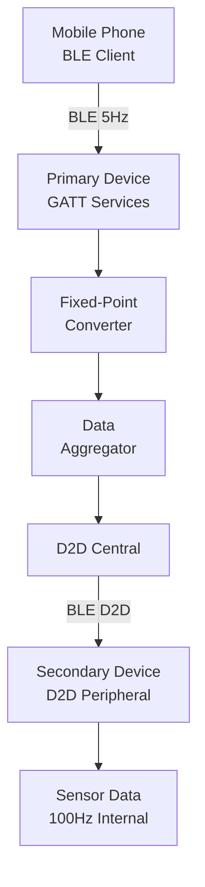
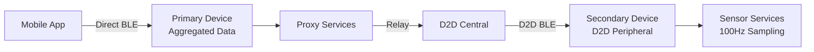
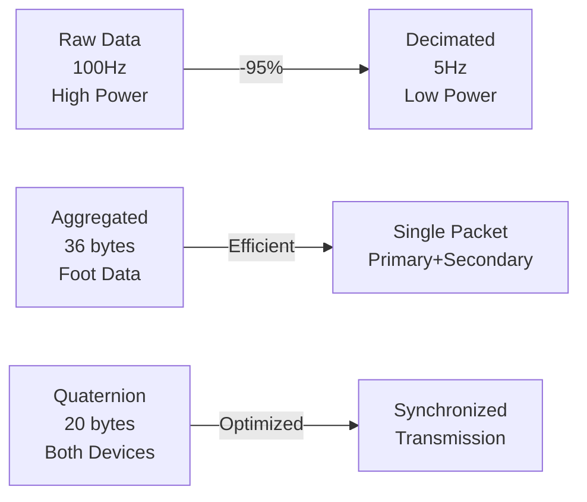

# Bluetooth GATT Specification

**Version:** 3.0
**Date:** December 2024
**Scope:** Complete Bluetooth GATT services, characteristics, and protocols for mobile app and device integration
**Purpose:** Comprehensive reference for BLE integration including fixed-point data formats, aggregated sensor data, service definitions, and implementation examples

---

## Changelog

### Version 3.0 (December 2024)
- **Major Update - Aggregated Data Structures**:
  - Added foot samples aggregation for primary and secondary devices with timestamp (36 bytes)
  - Added quaternion aggregation for primary and secondary devices with timestamp (20 bytes)
  - Raw data streaming frequency updated to 5Hz for Bluetooth (foot sensor and quaternion)
  - Internal sensor sampling remains at 100Hz for motion and foot sensors
  - Removed references to deprecated legacy modules
  - Clarified streaming control mechanisms with independent foot/quaternion flags
  - Enhanced documentation for raw data streaming architecture

### Version 2.14 (August 2024)
- **Enhanced Activity Control Commands**:
  - Added pause/unpause functionality to Start/Stop Activity characteristics
  - Start Activity characteristic now supports values 1-5 for different operations
  - Stop Activity characteristic now supports values 1-5 for different operations
  - Added independent raw data streaming control for foot sensor and quaternion data
  - Streaming control operates independently of activity logging for power optimization
- **Information Service Streaming Control**:
  - Added global streaming flags (`g_foot_sensor_streaming_enabled`, `g_quaternion_streaming_enabled`)
  - BLE notifications now respect streaming enable/disable flags
  - Power optimization through selective data streaming (30-40% reduction possible)
- **State Preservation During Pause**:
  - Files remain open during pause (no I/O overhead)
  - All metrics preserved (cadence, pace, contact times, etc.)
  - Session continuity maintained across pause/unpause
- **Full D2D Synchronization**: All new commands cascade to secondary device

---

## Table of Contents

1. [Introduction](#1-introduction)
2. [System Architecture](#2-system-architecture)
3. [Fixed-Point Data Format](#3-fixed-point-data-format)
4. [Standard Services](#4-standard-services)
5. [Information Service](#5-information-service)
6. [Control Service](#6-control-service)
7. [Background Execution Support](#7-background-execution-support)
8. [Activity Metrics Service](#8-activity-metrics-service)
9. [Secondary Device Service](#9-secondary-device-service)
10. [Proxy Services](#10-proxy-services)
11. [Device-to-Device (D2D) Services](#11-device-to-device-d2d-services)
12. [Data Structures](#12-data-structures)
13. [Packet Sequencing and Recovery](#13-packet-sequencing-and-recovery)
14. [Integration Examples](#14-integration-examples)
15. [Error Handling and Status Communication](#15-error-handling-and-status-communication)
16. [Common BLE Error Codes](#16-common-ble-error-codes)
17. [Implementation Status](#17-implementation-status)

---

## 1. Introduction

This device implements a comprehensive set of Bluetooth Low Energy (BLE) GATT services for:
- Real-time aggregated sensor data transmission (primary + secondary devices)
- Device control and configuration
- Log file management
- Firmware updates (FOTA)
- Device-to-device communication
- Real-time activity metrics and analytics

### Key Features
- **Aggregated data structures** for synchronized primary/secondary device data
- **Fixed-point integer format** for optimal bandwidth usage
- **Encrypted communication** for all services
- **Dual-device architecture** with primary/secondary roles
- **40% bandwidth reduction** compared to floating-point format
- **Real-time activity metrics** for running and sports applications
- **5Hz BLE streaming rate** with 100Hz internal sampling



---

## 2. System Architecture

### Device Roles



| Feature | Primary Device | Secondary Device |
|---:|:---:|:---:|
| Device Name | "BotzRightSh" | "BotzLeftSh" |
| BLE Role | Peripheral + Central | Peripheral only |
| Phone Connection | Yes | No |
| D2D Connection | Central (initiates) | Peripheral (accepts) |
| Services | Full set + Aggregation | D2D only |
| Data Aggregation | Yes (Primary + Secondary) | No |

---

## 3. Fixed-Point Data Format

All sensor data uses fixed-point integers to optimize bandwidth and ensure portability.

### Scaling Factors

| Data Type | Scale Factor | Precision | Range | Example |
|---:|---:|---:|---:|---:|
| Quaternion | 10,000 | 0.0001 | ±1.0 | 0.7071 → 7071 |
| Linear Acceleration | 1,000 | 0.001 m/s² | ±20 m/s² | 9.81 → 9810 |
| Gyroscope | 10,000 | 0.0001 rad/s | ±2.0 rad/s | 1.5708 → 15708 |
| Accuracy | 100 | 0.01 | 0-3.0 | 2.5 → 250 |

### System Sampling Rates

| Data Source | Internal Rate | BLE Transmission Rate | Description |
|---:|---:|---:|---:|
| Foot Pressure Sensors | 100Hz | 5Hz | 8-channel ADC sampling, aggregated |
| BHI360 Motion Sensor | 50-100Hz | 5Hz | Quaternion, acceleration, gyroscope |
| Sensor Data Processing | 100Hz | N/A | Internal sensor fusion |
| Real-time Metrics | 1Hz | 1Hz | Calculated metrics transmission |

### Data Flow Architecture

```
Internal Processing (100Hz)
    ↓
Data Aggregation (Primary + Secondary)
    ↓
Rate Decimation (Every 20th sample)
    ↓
BLE Transmission (5Hz)
    ↓
Mobile Application
```

### Bandwidth Optimization



### Conversion Functions

```c
// Encoding (Device → BLE)
int16_t encode_quaternion(float value) {
    return (int16_t)(value * 10000.0f);
}

int16_t encode_acceleration(float value) {
    return (int16_t)(value * 1000.0f);
}

// Decoding (BLE → App)
float decode_quaternion(int16_t fixed) {
    return (float)fixed / 10000.0f;
}

float decode_acceleration(int16_t fixed) {
    return (float)fixed / 1000.0f;
}
```

---

## 4. Standard Services

### Device Information Service (DIS)
**UUID:** `0000180A-0000-1000-8000-00805F9B34FB`

| Characteristic | UUID | Properties | Data Type |
|---:|---:|---:|---:|
| Manufacturer Name | 0x2A29 | Read | String |
| Model Number | 0x2A24 | Read | String |
| Serial Number | 0x2A25 | Read | String |
| Hardware Revision | 0x2A27 | Read | String |
| Firmware Revision | 0x2A26 | Read | String |

### Battery Service
**UUID:** `0000180F-0000-1000-8000-00805F9B34FB`

| Characteristic | UUID | Properties | Data Type | Description |
|---:|---:|---:|---:|---:|
| Battery Level | 0x2A19 | Read, Notify | uint8_t | 0-100% (Secondary device only) |

**Note:** The standard Battery Service is only used on secondary devices for compatibility. Primary devices report both battery levels through the Information Service Battery Status characteristic.

### Current Time Service (CTS)
**UUID:** `00001805-0000-1000-8000-00805F9B34FB`

| Characteristic | UUID | Properties | Data Type |
|---:|---:|---:|---:|
| Current Time | 0x2A2B | Read, Write, Notify | CTS struct |

---

## 5. Information Service

**UUID:** `0c372eaa-27eb-437e-bef4-775aefaf3c97`  
**Availability:** Primary device only

### Characteristics

| Characteristic | UUID Suffix | Properties | Data Type | Description | **Streaming Control** |
|---:|---:|---:|---:|---:|---:|
| Current Time | 0x2A2B | Read, Notify | CTS format | Device time | Always active |
| Status | `...eab` | Read, Notify | uint32_t | Status bitfield | Always active |
| **Foot Sensor Samples (Aggregated)** | `...eaf` | Read, Notify | foot_samples_aggregated_t | **36 bytes: timestamp + 16 channels (primary + secondary)** | **Controlled by foot streaming flag** |
| **Charge Status (Legacy)** | `...ead` | Read | uint8_t | Legacy charge status | Deprecated |
| **Battery Levels** | `...ec8` | Read, Notify | uint8_t[2] | **[0]=Primary 0-100%, [1]=Secondary 0-100%** | Always active |
| **BHI360 3D Mapping (Aggregated)** | `...eb2` | Read, Notify | quaternion_aggregated_t | **20 bytes: timestamp + quaternions (primary + secondary)** | **Controlled by quaternion streaming flag** |
| **Weight Measurement** | `...ec6` | Read, Notify | uint16_t | Weight in kg × 10 (0.1kg precision) | Always active |
| **Device Status Packed** | `...ec7` | Read, Notify | device_status_packed_t | Packed device status (12 bytes) | Always active |
| FOTA Progress | `...eb5` | Read, Notify | fota_progress_msg_t | Update status | Always active |
| **Activity Log Available** | `...ec2` | Read, Notify | uint8_t | Latest log ID | Always active |
| **Activity Log Path** | `...ec3` | Read, Notify | char[] | UTF-8 path | Always active |

### Aggregated Data Structures

#### Foot Sensor Samples Aggregated (36 bytes)

```c
struct foot_samples_aggregated_t {
    uint32_t timestamp;                             // 4 bytes - uptime in ms
    uint16_t primary[NUM_FOOT_SENSOR_CHANNELS];     // 16 bytes - primary foot (8 channels)
    uint16_t secondary[NUM_FOOT_SENSOR_CHANNELS];   // 16 bytes - secondary foot (8 channels)
} __attribute__((packed));
```

**Key Features:**
- Single packet contains both feet data synchronized
- Timestamp ensures temporal alignment
- 5Hz update rate (decimated from 100Hz internal sampling)
- Zero-filled secondary data when secondary device not connected

#### Quaternion Aggregated (20 bytes)

```c
struct quaternion_aggregated_t {
    uint32_t timestamp;         // 4 bytes - uptime in ms
    int16_t primary_x;          // 2 bytes - Fixed-point scaled by 10000
    int16_t primary_y;          // 2 bytes
    int16_t primary_z;          // 2 bytes
    int16_t primary_w;          // 2 bytes
    int16_t secondary_x;        // 2 bytes - Fixed-point scaled by 10000
    int16_t secondary_y;        // 2 bytes
    int16_t secondary_z;        // 2 bytes
    int16_t secondary_w;        // 2 bytes
} __attribute__((packed));
```

**Key Features:**
- Synchronized quaternion data from both devices
- Fixed-point format (scale factor: 10000)
- 5Hz update rate optimized for BLE bandwidth
- Enables synchronized 3D visualization of both feet

### Streaming Control Mechanism

As of version 2.14, the Information Service implements selective streaming control using global flags:

#### Global Streaming Flags
- `g_foot_sensor_streaming_enabled`: Controls foot sensor data BLE notifications
- `g_quaternion_streaming_enabled`: Controls quaternion/3D mapping BLE notifications

#### Streaming Control Implementation
```c
// In information_service.cpp
bool g_foot_sensor_streaming_enabled = false;  // Default: disabled
bool g_quaternion_streaming_enabled = false;   // Default: disabled

// Foot sensor notification check
void jis_foot_sensor_notify(const foot_samples_aggregated_t* data) {
    if (!g_foot_sensor_streaming_enabled) {
        return;  // Skip notification if streaming disabled
    }
    // Update aggregated data and send notification
}

// Quaternion notification check
void jis_bhi360_data1_notify(const quaternion_aggregated_t* data) {
    if (!g_quaternion_streaming_enabled) {
        return;  // Skip notification if streaming disabled
    }
    // Update aggregated data and send notification
}
```

#### Power Optimization Strategy
1. **Before Activity**: Disable streaming (Stop Activity value=5)
2. **During Activity**: Run with no BLE overhead (30-40% power saving)
3. **After Activity**: Re-enable for data review (Start Activity value=5)

### Raw Data Streaming Details

#### Foot Sensor Data Flow
```
ADC Sampling (100Hz)
    ↓
Calibration Applied
    ↓
Message Queue (100Hz to sensor_data)
    ↓
Rate Decimation (Every 20th sample)
    ↓
Aggregation (Primary + Secondary)
    ↓
BLE Notification (5Hz)
```

#### Quaternion Data Flow
```
BHI360 Sensor (50-100Hz)
    ↓
Motion Processing
    ↓
Fixed-Point Conversion
    ↓
Rate Decimation
    ↓
Aggregation (Primary + Secondary)
    ↓
BLE Notification (5Hz)
```

### Secondary Device Characteristics (Primary Device Only)

These characteristics are only available on the primary device and relay information from the connected secondary device:

| Characteristic | UUID Suffix | Properties | Data Type | Description |
|---:|---:|---:|---:|---:|
| Secondary Manufacturer | `...eb6` | Read | String | Secondary device manufacturer |
| Secondary Model | `...eb7` | Read | String | Secondary device model |
| Secondary Serial | `...eb8` | Read | String | Secondary device serial |
| Secondary HW Rev | `...eb9` | Read | String | Secondary hardware revision |
| Secondary FW Rev | `...eba` | Read | String | Secondary firmware revision |
| Secondary FOTA Progress | `...ebb` | Read, Notify | fota_progress_msg_t | Secondary update status |
| Secondary Activity Log Available | `...ec0` | Read, Notify | uint8_t | Secondary activity log ID |
| Secondary Activity Log Path | `...ec1` | Read, Notify | char[] | Secondary activity log path |

### Battery Levels Details

The Battery Levels characteristic reports both primary and secondary device battery levels:

- **UUID Suffix**: `...ec8`
- **Data Format**: Array of 2 uint8_t values
- **Index 0**: Primary device battery level (0-100%)
- **Index 1**: Secondary device battery level (0-100%, 0 when not connected)
- **Update Rate**: Every 10 seconds or on significant change
- **D2D Integration**: Secondary device sends its battery level via D2D notification

### Device Status Packed

The Device Status Packed characteristic provides a comprehensive device status in a single packed structure:

- **UUID Suffix**: `...ec7`
- **Data Format**: `device_status_packed_t` (12 bytes)
- **Fields**:
  - `status_bitfield` (4 bytes): Same as Status characteristic
  - `battery_percent` (1 byte): Primary battery level
  - `charge_status` (1 byte): Charging status
  - `temperature_c` (1 byte): Device temperature
  - `activity_state` (1 byte): Activity logging state
  - `uptime_seconds` (4 bytes): Device uptime

### Weight Measurement

The weight measurement feature calculates total weight using all 16 pressure sensors:

- **Type**: `uint16_t`
- **Unit**: kg × 10 (for 0.1kg precision)
- **Range**: 0-6553.5 kg
- **Requirements**: Person must be standing still, both feet on sensors
- **Measurement Time**: ~3 seconds

### Status Bitfield

```c
#define STATUS_IDLE                    0x00000001
#define STATUS_LOGGING_ACTIVE          0x00000002
#define STATUS_ERROR                   0x00000004
#define STATUS_LOW_BATTERY             0x00000008
#define STATUS_CHARGING                0x00000010
#define STATUS_BLUETOOTH_CONNECTED     0x00000020
#define STATUS_D2D_CONNECTED           0x00000040
#define STATUS_FILE_SYSTEM_ERROR       0x00000080
#define STATUS_SENSOR_ERROR            0x00000100
#define STATUS_CALIBRATING             0x00000200
```

---

## 6. Control Service

**UUID:** `4fd5b67f-9d89-4061-92aa-319ca786baae`  
**Availability:** Primary device only

### Characteristics

| Characteristic | UUID Suffix | Properties | Data Type | Description |
|---:|---:|---:|---:|---:|
| Set Time | `...b681` | Write | uint32_t | Epoch time (big-endian) |
| **Start Activity** | `...b684` | Write, Notify | uint8_t | **Values: 1=Start, 2=Unpause, 3=Foot stream, 4=Quat stream, 5=Both streams** |
| **Stop Activity** | `...b685` | Write, Notify | uint8_t | **Values: 1=Stop, 2=Pause, 3=Stop foot, 4=Stop quat, 5=Stop both** |
| **Trigger BHI360 Calibration** | `...b686` | Write, Notify | uint8_t | Write 1 to trigger calibration |
| Delete Activity Log | `...b687` | Write, Notify | uint8_t | Log ID to delete |
| Delete Secondary Activity Log | `...b68a` | Write, Notify | uint8_t | Log ID to delete on secondary (primary only) |
| **Connection Parameter Control** | `...b68b` | Read, Write | uint8_t | Connection profile (0=Foreground, 1=Background, 2=Background Idle) |
| **Weight Calibration** | `...b68d` | Write, Notify | weight_calibration_step_t | Trigger weight calibration with known weight |
| **GPS Update** | `...b68e` | Write | GPSUpdateCommand | GPS data from mobile app |
| **Reset Bonds** | `...b68f` | Write | uint8_t | Write 1 to reset all BLE bonds (primary only) |
| **User Info** | `...b690` | Write | UserInfoData | User demographics (primary only) |
| **Erase External Flash** | `...b691` | Write | uint8_t | Write 1 to erase external flash |

### Start/Stop Activity Command Details

#### Start Activity Commands (Characteristic `...b684`)

| Value | Command | Description | Effect |
|-------|---------|-------------|--------|
| **1** | START_ACTIVITY | Start new activity session | Opens files, starts sensors at 100Hz, creates new session |
| **2** | UNPAUSE_ACTIVITY | Resume paused activity | Resumes sensors, files stay open, continues session |
| **3** | ENABLE_FOOT_STREAMING | Enable foot sensor BLE only | Sets foot streaming flag for 5Hz BLE, no activity change |
| **4** | ENABLE_QUAT_STREAMING | Enable quaternion BLE only | Sets quaternion streaming flag for 5Hz BLE, no activity change |
| **5** | ENABLE_BOTH_STREAMING | Enable both BLE streams | Sets both streaming flags for 5Hz BLE, no activity change |

#### Stop Activity Commands (Characteristic `...b685`)

| Value | Command | Description | Effect |
|-------|---------|-------------|--------|
| **1** | STOP_ACTIVITY | End activity session | Closes files, stops sensors, ends session |
| **2** | PAUSE_ACTIVITY | Pause current activity | Suspends sensors, keeps files open, preserves state |
| **3** | DISABLE_FOOT_STREAMING | Disable foot sensor BLE | Clears foot streaming flag, no activity change |
| **4** | DISABLE_QUAT_STREAMING | Disable quaternion BLE | Clears quaternion streaming flag, no activity change |
| **5** | DISABLE_BOTH_STREAMING | Disable both BLE streams | Clears both streaming flags, no activity change |

#### Pause vs Stop Comparison

| Aspect | Stop (Value=1) | Pause (Value=2) |
|--------|----------------|-----------------|
| Sensors | Stopped completely | Temporarily suspended |
| Data Files | Closed | Remain open |
| Session | Ends | Continues |
| Metrics | Reset for next session | Preserved |
| Resume | Creates new session | Continues same session |
| File I/O | Open/close overhead | No I/O overhead |

#### Streaming Control

The streaming control commands (values 3-5) operate independently of activity state:
- **Power Optimization**: Disable streaming during activities to save 30-40% BLE power
- **Selective Monitoring**: Enable only needed data streams (foot or quaternion)
- **Independent Control**: Streaming can be enabled/disabled regardless of activity state
- **5Hz Rate**: When enabled, streams send aggregated data at 5Hz

Example usage flow:
```
1. Disable all streaming (Stop Activity, value=5)
2. Start activity (Start Activity, value=1) - sensors run at 100Hz internally
3. Activity runs with no BLE overhead
4. Stop activity (Stop Activity, value=1)
5. Enable streaming for review (Start Activity, value=5) - 5Hz BLE updates
```

---

## 7. Background Execution Support

The Connection Parameter Control characteristic enables dynamic optimization for different mobile app execution states.

### Connection Parameter Profiles

| Profile | Value | Interval | Latency | Timeout | Use Case |
|---:|---:|---:|---:|---:|---:|
| **FOREGROUND** | 0 | 15-30ms | 0 | 4s | Active app, real-time viewing |
| **BACKGROUND** | 1 | 50-100ms | 4 | 6s | App backgrounded, active session |
| **BACKGROUND_IDLE** | 2 | 200-500ms | 10 | 10s | App backgrounded, idle monitoring |

### Data Rate Adaptation

| Profile | Foot Sensor | Motion Sensor | Aggregation | Power Saving |
|---:|---:|---:|---:|---:|
| FOREGROUND | 5Hz | 5Hz | Enabled | Baseline |
| BACKGROUND | 2Hz | 2Hz | Enhanced | ~40% |
| BACKGROUND_IDLE | 0.5Hz | 0.5Hz | Maximum | ~70% |

---

## 8. Activity Metrics Service

**UUID:** `4fd5b690-9d89-4061-92aa-319ca786baae`  
**Availability:** Primary device only  
**Purpose:** Real-time activity metrics for sports and fitness applications

### Characteristics

| Characteristic | UUID Suffix | Properties | Data Type | Description |
|---:|---:|---:|---:|---:|
| Cadence SPM | `...b691` | Read, Notify | uint16_t | Steps per minute, 1Hz |
| Pace Sec/Km | `...b698` | Read, Notify | uint16_t | Seconds per kilometer, 1Hz |
| Distance M | `...b699` | Read, Notify | uint32_t | Distance in meters, 1Hz |
| Form Score | `...b69a` | Read, Notify | uint8_t | Form score 0-100, 1Hz |
| Balance L/R | `...b69b` | Read, Notify | int8_t | Balance -50 to +50, 1Hz |
| Ground Contact MS | `...b69c` | Read, Notify | uint16_t | Contact time ms, 1Hz |
| Flight Time MS | `...b69d` | Read, Notify | uint16_t | Flight time ms, 1Hz |
| Efficiency Score | `...b69e` | Read, Notify | uint8_t | Efficiency 0-100, 1Hz |
| Alerts | `...b69f` | Read, Notify | uint8_t | Alert flags, 1Hz |
| Contact Time Asym | `...b6a0` | Read, Notify | uint8_t | Asymmetry %, 1Hz |
| Flight Time Asym | `...b6a1` | Read, Notify | uint8_t | Asymmetry %, 1Hz |
| Force Asym | `...b6a2` | Read, Notify | uint8_t | Asymmetry %, 1Hz |
| Pronation Asym | `...b6a3` | Read, Notify | uint8_t | Asymmetry %, 1Hz |
| Strike Left | `...b6a4` | Read, Notify | uint8_t | 0=heel, 1=mid, 2=fore |
| Strike Right | `...b6a5` | Read, Notify | uint8_t | 0=heel, 1=mid, 2=fore |
| Pronation Left | `...b6a6` | Read, Notify | int8_t | Degrees |
| Pronation Right | `...b6a7` | Read, Notify | int8_t | Degrees |
| Loading Rate Left | `...b6a8` | Read, Notify | uint16_t | N/s |
| Loading Rate Right | `...b6a9` | Read, Notify | uint16_t | N/s |
| Arch Collapse Left | `...b6aa` | Read, Notify | uint8_t | 0-100 |
| Arch Collapse Right | `...b6ab` | Read, Notify | uint8_t | 0-100 |
| Total Distance M | `...b6ac` | Read, Notify | uint32_t | Total meters |
| Avg Pace Sec/Km | `...b6ad` | Read, Notify | uint16_t | Average pace |
| Avg Cadence SPM | `...b6ae` | Read, Notify | uint16_t | Average cadence |
| Total Steps | `...b6af` | Read, Notify | uint32_t | Total steps |
| Calories Kcal | `...b6b0` | Read, Notify | uint16_t | Calories burned |
| Avg Form Score | `...b6b1` | Read, Notify | uint8_t | Average form |
| Duration Sec | `...b6b2` | Read, Notify | uint32_t | Session duration |
| Stride Duration MS | `...b6b3` | Read, Notify | uint16_t | Stride time ms |
| Stride Duration Asym | `...b6b4` | Read, Notify | uint8_t | Asymmetry % |
| Stride Length CM | `...b6b5` | Read, Notify | uint16_t | Stride length cm |
| Stride Length Asym | `...b6b6` | Read, Notify | uint8_t | Asymmetry % |
| Stride Length Avg MM | `...b6b7` | Read, Notify | uint16_t | Average stride mm |
| Run Speed CMS | `...b6b8` | Read, Notify | uint16_t | Speed cm/s |
| **GPS Data** | `...b695` | Write | gps_data_ble_t | 16 bytes, from phone |
| **Total Step Count** | `...b696` | Read, Notify | bhi360_step_count_fixed_t | Aggregated both feet |
| **Activity Step Count** | `...b697` | Read, Notify | bhi360_step_count_fixed_t | Activity-specific steps |

---

## 9. Secondary Device Service

**UUID:** `4fd5b6a0-9d89-4061-92aa-319ca786baae`  
**Availability:** Primary device only  
**Purpose:** Consolidated secondary device information and management

---

## 10. Proxy Services

### FOTA Proxy Service

**UUID:** `6e400001-b5a3-f393-e0a9-e50e24dcca9e`  
**Availability:** Primary device only  
**Purpose:** Firmware updates for secondary device via primary

### SMP Proxy Service

**Service UUID:** `8D53DC1E-1DB7-4CD3-868B-8A527460AA84`  
**Availability:** Primary device only  
**Purpose:** Unified MCUmgr/SMP access to both primary and secondary devices

---

## 11. Device-to-Device (D2D) Services

The D2D service enables direct communication between primary and secondary devices, allowing:
- Secondary sensor data forwarding to primary
- Command propagation from primary to secondary
- Synchronized data collection
- Battery level sharing

---

## 12. Data Structures

### Fixed-Point Structures

```c
// BHI360 3D Mapping - 15 bytes
typedef struct {
    int16_t quat_x;        // Quaternion X × 10000
    int16_t quat_y;        // Quaternion Y × 10000
    int16_t quat_z;        // Quaternion Z × 10000
    int16_t quat_w;        // Quaternion W × 10000
    int16_t gyro_x;        // Gyroscope X × 10000 (rad/s)
    int16_t gyro_y;        // Gyroscope Y × 10000 (rad/s)
    int16_t gyro_z;        // Gyroscope Z × 10000 (rad/s)
    uint8_t quat_accuracy; // Accuracy × 100 (0-300)
} __packed bhi360_3d_mapping_fixed_t;

// Foot Sensor Samples - 16 bytes (file logging)
typedef struct {
    uint16_t values[8];  // 8 ADC channels
} __packed foot_samples_t;

// FOTA Progress - 15 bytes
typedef struct {
    uint8_t is_active;        // 0=inactive, 1=active
    uint8_t status;           // 0=idle, 1=progress, 2=pending, 3=confirmed, 4=error
    uint8_t percent_complete; // 0-100
    uint32_t bytes_received;
    uint32_t total_size;
    int32_t error_code;
} __packed fota_progress_msg_t;
```

---

## 13. Packet Sequencing and Recovery

### Overview

High-rate sensor data includes sequence numbers for packet loss detection and limited recovery.

### Affected Data Types

| Data Type | Update Rate | Sequence Number | Recovery Buffer |
|---:|---:|---:|---:|
| Foot Sensor Samples (Aggregated) | 5Hz | Optional | 10 packets (~2s) |
| BHI360 3D Mapping (Aggregated) | 5Hz | Optional | 10 packets (~2s) |

---

## 14. Integration Examples

### iOS Swift - Processing Aggregated Data

```swift
import CoreBluetooth

class AggregatedDataHandler {
    static let QUAT_SCALE: Float = 10000.0
    
    func handleAggregatedFootData(_ data: Data) -> FootSensorData? {
        guard data.count >= 36 else { return nil }
        
        var result = FootSensorData()
        let buffer = data.withUnsafeBytes { $0.bindMemory(to: UInt8.self) }
        
        // Extract timestamp (4 bytes)
        result.timestamp = UInt32(buffer[0]) | 
                          (UInt32(buffer[1]) << 8) |
                          (UInt32(buffer[2]) << 16) |
                          (UInt32(buffer[3]) << 24)
        
        // Extract primary foot data (16 bytes, 8 channels)
        for i in 0..<8 {
            let offset = 4 + (i * 2)
            result.primary[i] = UInt16(buffer[offset]) | 
                               (UInt16(buffer[offset + 1]) << 8)
        }
        
        // Extract secondary foot data (16 bytes, 8 channels)
        for i in 0..<8 {
            let offset = 20 + (i * 2)
            result.secondary[i] = UInt16(buffer[offset]) | 
                                (UInt16(buffer[offset + 1]) << 8)
        }
        
        return result
    }
    
    func handleAggregatedQuaternion(_ data: Data) -> QuaternionData? {
        guard data.count >= 20 else { return nil }
        
        let buffer = data.withUnsafeBytes { $0.bindMemory(to: Int16.self) }
        
        return QuaternionData(
            timestamp: UInt32(buffer[0]) | (UInt32(buffer[1]) << 16),
            primaryQuat: SIMD4<Float>(
                Float(buffer[2]) / Self.QUAT_SCALE,  // x
                Float(buffer[3]) / Self.QUAT_SCALE,  // y
                Float(buffer[4]) / Self.QUAT_SCALE,  // z
                Float(buffer[5]) / Self.QUAT_SCALE   // w
            ),
            secondaryQuat: SIMD4<Float>(
                Float(buffer[6]) / Self.QUAT_SCALE,  // x
                Float(buffer[7]) / Self.QUAT_SCALE,  // y
                Float(buffer[8]) / Self.QUAT_SCALE,  // z
                Float(buffer[9]) / Self.QUAT_SCALE   // w
            )
        )
    }
}
```

### Android Kotlin - Service Discovery

```kotlin
class SensingDeviceManager(private val context: Context) {
    companion object {
        val INFO_SERVICE_UUID = UUID.fromString("0c372eaa-27eb-437e-bef4-775aefaf3c97")
        val FOOT_SENSOR_UUID = UUID.fromString("0c372eaf-27eb-437e-bef4-775aefaf3c97")
        val BHI360_3D_UUID = UUID.fromString("0c372eb2-27eb-437e-bef4-775aefaf3c97")
        
        const val QUAT_SCALE = 10000f
    }
    
    fun parseAggregatedFootData(data: ByteArray): AggregatedFootData {
        val buffer = ByteBuffer.wrap(data).order(ByteOrder.LITTLE_ENDIAN)
        
        return AggregatedFootData(
            timestamp = buffer.getInt(),
            primary = IntArray(8) { buffer.getShort().toInt() and 0xFFFF },
            secondary = IntArray(8) { buffer.getShort().toInt() and 0xFFFF }
        )
    }
    
    fun parseAggregatedQuaternion(data: ByteArray): AggregatedQuaternion {
        val buffer = ByteBuffer.wrap(data).order(ByteOrder.LITTLE_ENDIAN)
        
        return AggregatedQuaternion(
            timestamp = buffer.getInt(),
            primaryQuaternion = Quaternion(
                buffer.getShort().toFloat() / QUAT_SCALE,
                buffer.getShort().toFloat() / QUAT_SCALE,
                buffer.getShort().toFloat() / QUAT_SCALE,
                buffer.getShort().toFloat() / QUAT_SCALE
            ),
            secondaryQuaternion = Quaternion(
                buffer.getShort().toFloat() / QUAT_SCALE,
                buffer.getShort().toFloat() / QUAT_SCALE,
                buffer.getShort().toFloat() / QUAT_SCALE,
                buffer.getShort().toFloat() / QUAT_SCALE
            )
        )
    }
}
```

---

## 15. Error Handling and Status Communication

### Status Characteristic Details

The Status characteristic in the Information Service provides real-time device health monitoring through a 32-bit bitmask.

#### Status Bit Definitions

```c
#define STATUS_OK                     0x00000000  // No errors
#define STATUS_BATTERY_FAULT          (1 << 0)   // Battery fault detected
#define STATUS_BLUETOOTH_ERROR        (1 << 4)   // Bluetooth communication error
#define STATUS_HARDWARE_ERROR         (1 << 14)  // General hardware error
#define STATUS_DATA_ERROR             (1 << 15)  // Data module error
#define STATUS_DFU_ERROR              (1 << 16)  // DFU/firmware update error
#define STATUS_ADC_ERROR              (1 << 18)  // ADC/foot sensor error
#define STATUS_I2C_ERROR              (1 << 19)  // I2C communication error
#define STATUS_BATTERY_DISCONNECTED   (1 << 20)  // Battery disconnected
#define STATUS_MOTION_ERROR           (1 << 21)  // Motion sensor error
#define STATUS_RTC_ERROR              (1 << 22)  // Real-time clock error
#define STATUS_FILE_SYSTEM_ERROR      (1 << 23)  // File system error
#define STATUS_PROTO_ENCODE_ERROR     (1 << 24)  // Protocol buffer encoding error
#define STATUS_FILE_SYSTEM_NO_FILES   (1 << 25)  // No files in file system
#define STATUS_FILE_SYSTEM_FULL       (1 << 26)  // File system storage full
#define STATUS_FLASH_FAILURE          (1 << 27)  // Flash memory failure
#define STATUS_INVALID_PARAMETER      (1 << 28)  // Invalid parameter error
#define STATUS_QUEUE_FULL             (1 << 29)  // Message queue full
```

---

## 16. Common BLE Error Codes

| Error | Code | Description | Solution |
|---:|---:|---:|---:|
| ENOTCONN | -128 | Not connected | Ensure connection established |
| ENOMEM | -12 | Out of memory | Reduce notification rate |
| EINVAL | -22 | Invalid parameter | Check data format |
| EACCES | -13 | Access denied | Ensure proper bonding |
| ETIMEDOUT | -116 | Operation timeout | Check connection stability |

### Performance Optimization

1. **Connection Parameters**
   - Min interval: 7.5ms
   - Max interval: 30ms
   - Latency: 0
   - Timeout: 5000ms

2. **MTU Size**
   - Request 247 bytes for optimal throughput
   - Fallback to 23 bytes if not supported

3. **Notification Rate**
   - Sensor data: 5Hz (decimated from 100Hz internal)
   - Status updates: On change only
   - File transfers: Chunked with flow control

---

## 17. Implementation Status

### 17.1 Fully Implemented ✅
- Aggregated foot sensor data (primary + secondary) with timestamp
- Aggregated quaternion data (primary + secondary) with timestamp
- 5Hz BLE streaming with 100Hz internal sampling
- All Information Service characteristics
- All Control Service characteristics including Connection Parameter Control
- Activity Metrics Service with step count aggregation
- D2D TX/RX services with all characteristics
- FOTA, File, and SMP proxy services
- Secondary Device Service
- Weight measurement functionality
- Background execution support framework
- Pause/Unpause Commands with state preservation
- Raw Data Streaming Control with independent flags
- D2D Command Cascading to secondary device
- Power Optimization (30-40% BLE power reduction during activities)

### 17.2 Data Flow Architecture ✅

```
100Hz Internal Sampling (Foot & Motion Sensors)
    ↓
Data Processing & Calibration
    ↓
Rate Decimation (Every 20th sample)
    ↓
Primary/Secondary Aggregation
    ↓
5Hz BLE Transmission
    ↓
Mobile Application
```

### 17.3 Planned Features 📋
- Enhanced data aggregation for background mode
- Automatic profile detection based on connection parameters
- Extended biomechanics calculations
- Advanced packet recovery mechanisms
- Configurable sensor rate control

### 17.4 Known Limitations

1. **Sensor Rate Control**: The foot and motion sensor rates are fixed at 100Hz internally
2. **GPS Processing**: GPS data from mobile app is received but not yet fully integrated in calculations
3. **Background Aggregation**: Data aggregation for background mode is designed but not fully optimized

### 17.5 Testing Recommendations

1. **Aggregated Data Integrity**: Verify synchronized timestamps between primary/secondary
2. **Streaming Control**: Test independent foot/quaternion streaming enable/disable
3. **5Hz Rate Verification**: Confirm actual BLE transmission rate matches specification
4. **Power Consumption**: Measure power savings with streaming disabled during activities
5. **Cross-Platform**: Test aggregated data parsing on both iOS and Android

---

**End of Specification**