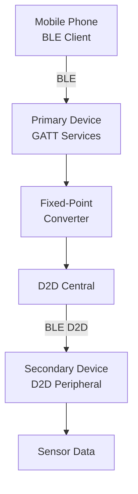
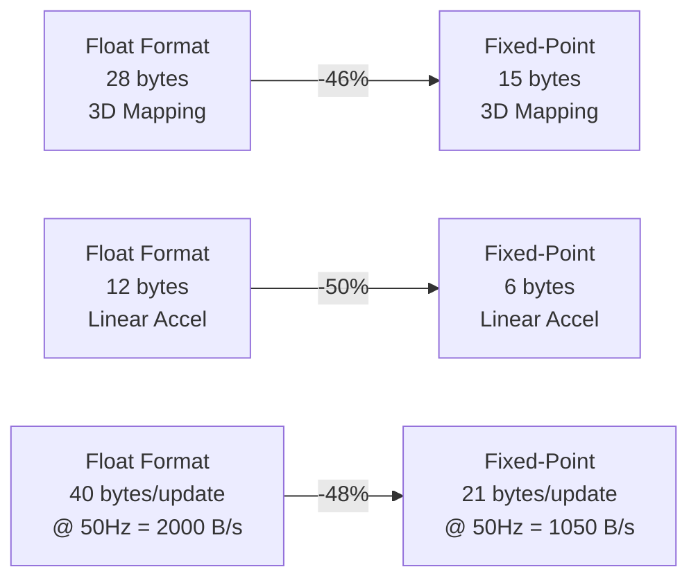
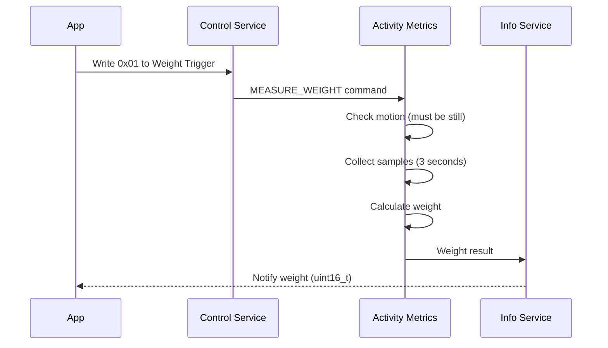
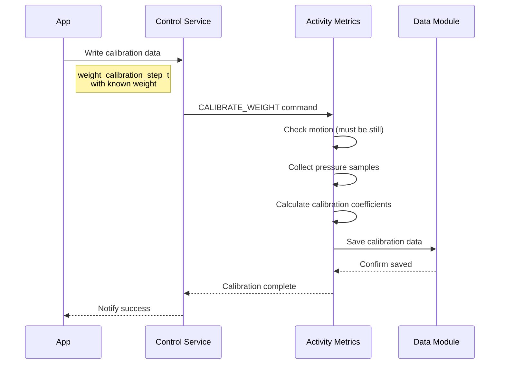
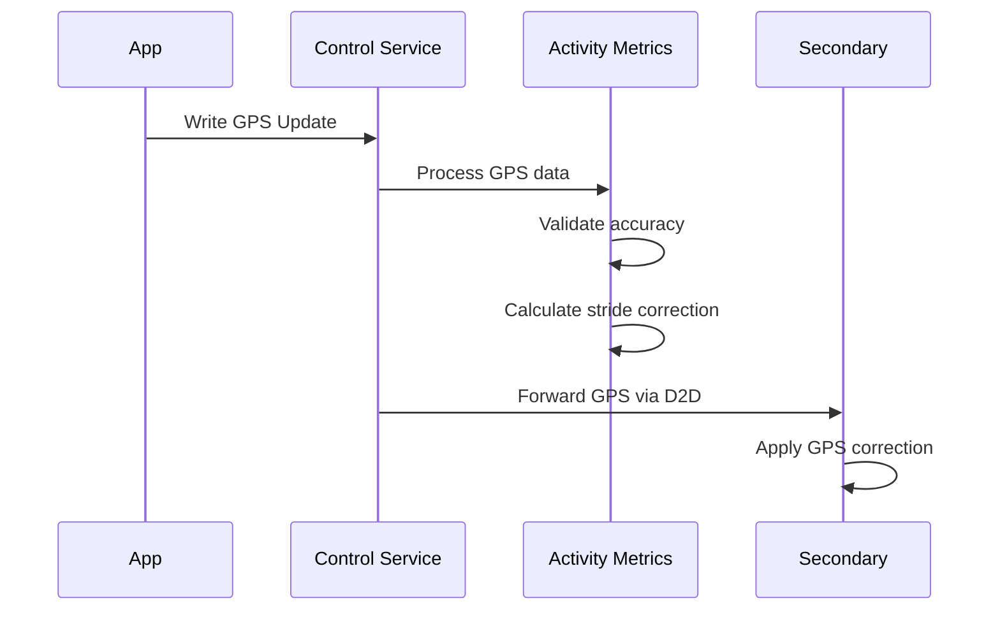
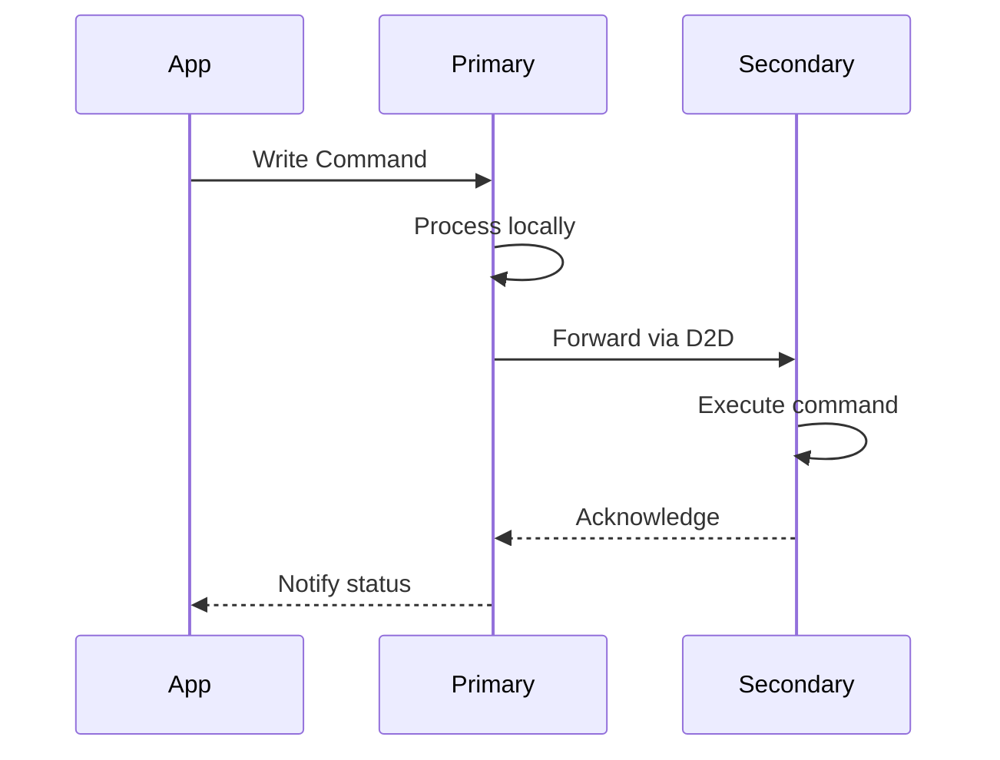
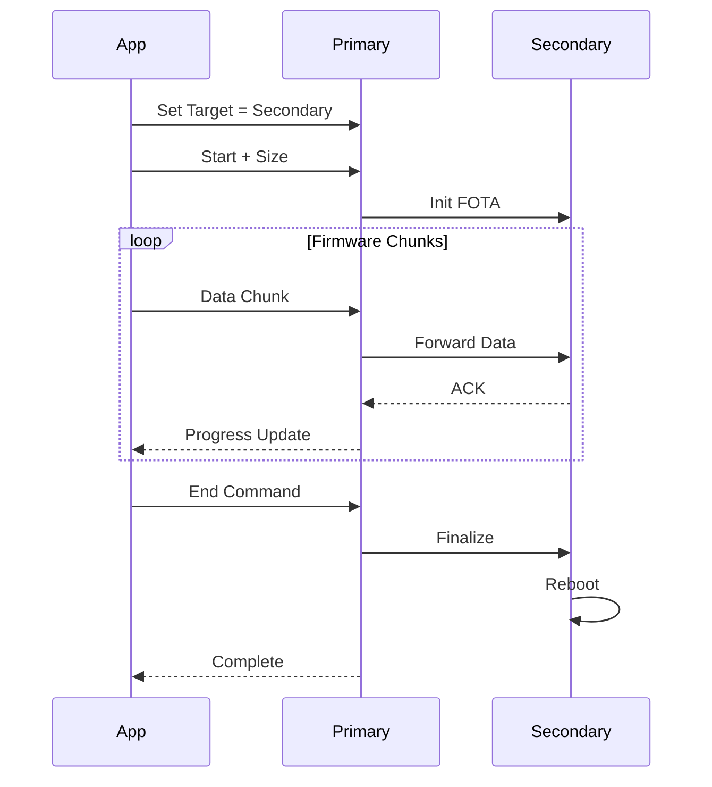
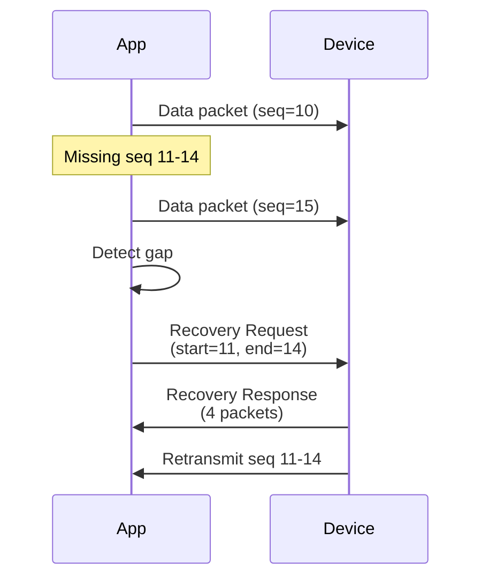
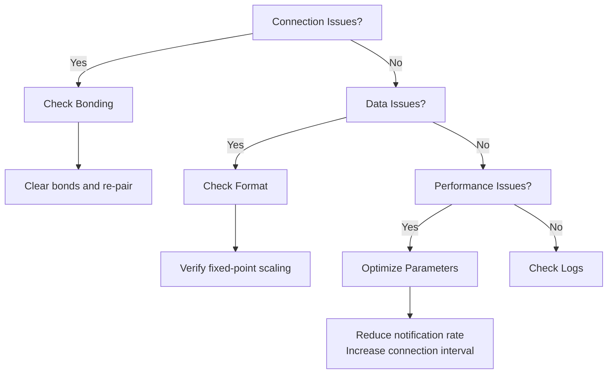

# Bluetooth GATT Specification

**Version:** 2.11  
**Date:** July 2025  
**Scope:** Complete Bluetooth GATT services, characteristics, and protocols for mobile app and device integration  
**Purpose:** Comprehensive reference for BLE integration including fixed-point data formats, service definitions, and implementation examples

---

## Changelog

### Version 2.11 (July 2025)
- Added System Sampling Rates section to clarify actual sensor data rates
- Corrected documentation to reflect 80Hz foot sensor sampling (not 100Hz)
- Clarified that sensor_data module processes at 80Hz

### Version 2.10 (December 2024)
- Added GPS Update characteristic (`...b68e`) to Control Service
- Added comprehensive GPS update documentation including data structure and usage examples
- GPS updates enhance distance/pace accuracy from ±15-20% to ±1-3%
- GPS data is forwarded to secondary device via D2D

### Version 2.9 (January 2025)
- Added Weight Calibration Trigger characteristic (`...b68d`) to Control Service
- Added comprehensive weight calibration documentation including process flow and data structures
- Updated Sensor Logging Specification with write batching optimization details

### Version 2.8 (December 2024)
- Added Connection Parameter Control characteristic (`...b68b`) to Control Service for background execution support
- Documented 3D Orientation Service (`0c372ec0-...`) with full specification
- Added missing D2D RX characteristics: FOTA Status (`...ca86`) and Request Device Info (`...ca89`)
- Added D2D File Transfer Service complete specification
- Documented MCUmgr SMP availability on secondary devices
- Added Background Execution Support section with connection profiles
- Clarified packed vs. individual data structure usage
- Added Implementation Status section documenting TODOs and limitations

### Version 2.7 (July 2025)
- Added Activity Metrics Service (`4fd5b690-...`) for real-time running metrics
- Moved Total Step Count (`...b696`) and Activity Step Count (`...b697`) to Activity Metrics Service
- Added Secondary Device Service (`4fd5b6a0-...`) for secondary device information (primary only)
- Added packed data structures for efficient BLE transmission:
  - Packed Device Status (`...ec7`) in Information Service
  - Packed File Notification (`...ec8`) in Information Service
- Improved file notification system with combined ID and path notifications
- Updated step count behavior documentation for Activity Metrics Service

### Version 2.6 (June 2025)
- Added Weight Measurement characteristic (`...ec6`) to Information Service
- Added Weight Measurement Trigger (`...b68c`) to Control Service
- Added D2D Weight Measurement (`...68e7`) for secondary device weight data
- Weight measurement provides total weight from all 16 pressure sensors

### Version 2.5 (June 2025)
- Identified UUID conflicts between 3D Orientation Service and Information Service characteristics
- Documented actual MCUmgr SMP service UUIDs vs. documentation discrepancies
- Added notes about implementation issues to be fixed in future firmware updates

### Version 2.4 (June 2025)
- Modified Information Service to only send aggregated step counts to mobile phones
- Individual foot step counts (BHI360 Step Count) are now deprecated for phone communication
- D2D communication between primary and secondary devices remains unchanged
- Mobile apps should use Total Step Count and Activity Step Count characteristics only

### Version 2.3 (June 2025)
- Added D2D Activity Step Count characteristic (`76ad68e6-...`) for secondary device activity steps
- Fixed activity step count separation between primary and secondary devices
- Removed unreliable heuristic for detecting activity steps from secondary
- Added Total Step Count characteristic (`...ec4`) for aggregated steps from both feet
- Added Activity Step Count characteristic (`...ec5`) for activity-specific step counting
- Deprecated `activity_duration_s` field in `bhi360_step_count_t` - now always 0

### Version 2.2 (June 2025)
- Updated step count characteristics to provide count only (time tracking moved to separate characteristics)
- Clarified that BHI360 Step Count (`...eb3`) provides global step count

### Version 2.1 (May 2025)
- Added Connection Parameter Control characteristic (`...b68b`) to Control Service
- Added secondary device delete commands (`...b688`, `...b689`, `...b68a`) to Control Service
- Added detailed documentation for connection profiles (Foreground, Background, Background Idle)
- Added mobile app integration examples for background execution optimization

### Version 2.0 (May 2025)
- Initial comprehensive specification

---

## Table of Contents

1. [Introduction](#1-introduction)
2. [System Architecture](#2-system-architecture)
3. [Fixed-Point Data Format](#3-fixed-point-data-format)
4. [Standard Services](#4-standard-services)
5. [Information Service](#5-information-service)
6. [Control Service](#6-control-service)
7. [Background Execution Support](#7-background-execution-support)
8. [Activity Metrics Service](#8-activity-metrics-service)
9. [Secondary Device Service](#9-secondary-device-service)
10. [Proxy Services](#10-proxy-services)
11. [Device-to-Device (D2D) Services](#11-device-to-device-d2d-services)
12. [Data Structures](#12-data-structures)
13. [Packet Sequencing and Recovery](#13-packet-sequencing-and-recovery)
14. [Integration Examples](#14-integration-examples)
15. [Error Handling and Status Communication](#15-error-handling-and-status-communication)
16. [Common BLE Error Codes](#16-common-ble-error-codes)
17. [Implementation Status](#17-implementation-status)

---

## 1. Introduction

This device implements a  set of Bluetooth Low Energy (BLE) GATT services for:
- Real-time sensor data transmission
- Device control and configuration
- Log file management
- Firmware updates (FOTA)
- Device-to-device communication
- Real-time activity metrics and analytics

### Key Features
- **Fixed-point integer format** for optimal bandwidth usage
- **Encrypted communication** for all services
- **Dual-device architecture** with primary/secondary roles
- **40% bandwidth reduction** compared to floating-point format
- **Real-time activity metrics** for running and sports applications
- **Packed data structures** for efficient multi-field transmission



---

## 2. System Architecture

### Device Roles


| Feature | Primary Device | Secondary Device |
|---:|:---:|:---:|
| Device Name | "BotzRightSh" | "BotzLeftSh" |
| BLE Role | Peripheral + Central | Peripheral only |
| Phone Connection | Yes | No |
| D2D Connection | Central (initiates) | Peripheral (accepts) |
| Services | Full set | D2D only |

---

## 3. Fixed-Point Data Format

All sensor data uses fixed-point integers to optimize bandwidth and ensure portability.

### Scaling Factors

| Data Type | Scale Factor | Precision | Range | Example |
|---:|---:|---:|---:|---:|
| Quaternion | 10,000 | 0.0001 | ±1.0 | 0.7071 → 7071 |
| Linear Acceleration | 1,000 | 0.001 m/s² | ±20 m/s² | 9.81 → 9810 |
| Gyroscope | 10,000 | 0.0001 rad/s | ±2.0 rad/s | 1.5708 → 15708 |
| Accuracy | 100 | 0.01 | 0-3.0 | 2.5 → 250 |

### System Sampling Rates

| Data Source | Actual Rate | Description |
|---:|---:|---:|
| Foot Pressure Sensors | 80Hz | 8-channel ADC sampling |
| BHI360 Motion Sensor | 50Hz | Quaternion, acceleration, gyroscope |
| Sensor Data Processing | 80Hz | Consolidated sensor fusion |
| Real-time Metrics | 1Hz | BLE transmission rate |

### Bandwidth Comparison



### Conversion Functions

```c
// Encoding (Device → BLE)
int16_t encode_quaternion(float value) {
    return (int16_t)(value * 10000.0f);
}

int16_t encode_acceleration(float value) {
    return (int16_t)(value * 1000.0f);
}

// Decoding (BLE → App)
float decode_quaternion(int16_t fixed) {
    return (float)fixed / 10000.0f;
}

float decode_acceleration(int16_t fixed) {
    return (float)fixed / 1000.0f;
}
```

---

## 4. Standard Services

### Device Information Service (DIS)
**UUID:** `0000180A-0000-1000-8000-00805F9B34FB`

| Characteristic | UUID | Properties | Data Type |
|---:|---:|---:|---:|
| Manufacturer Name | 0x2A29 | Read | String |
| Model Number | 0x2A24 | Read | String |
| Serial Number | 0x2A25 | Read | String |
| Hardware Revision | 0x2A27 | Read | String |
| Firmware Revision | 0x2A26 | Read | String |

### Battery Service
**UUID:** `0000180F-0000-1000-8000-00805F9B34FB`

| Characteristic | UUID | Properties | Data Type | Description |
|---:|---:|---:|---:|---:|
| Battery Level | 0x2A19 | Read, Notify | uint8_t | 0-100% |

### Current Time Service (CTS)
**UUID:** `00001805-0000-1000-8000-00805F9B34FB`

| Characteristic | UUID | Properties | Data Type |
|---:|---:|---:|---:|
| Current Time | 0x2A2B | Read, Write, Notify | CTS struct |

---

## 5. Information Service

**UUID:** `0c372eaa-27eb-437e-bef4-775aefaf3c97`  
**Availability:** Primary device only

### Characteristics

| Characteristic | UUID Suffix | Properties | Data Type | Description |
|---:|---:|---:|---:|---:|
| Current Time | 0x2A2B | Read, Notify | CTS format | Device time |
| Status | `...eab` | Read, Notify | uint32_t | Status bitfield |
| Foot Sensor Samples | `...eaf` | Read, Notify | foot_samples_t | 16 ADC channels |
| Foot Log Available | `...eac` | Read, Notify | uint8_t | Latest log ID |
| Charge Status | `...ead` | Read, Notify | uint8_t | 0-100% |
| Foot Log Path | `...eae` | Read, Notify | char[] | UTF-8 path |
| BHI360 Log Available | `...eb0` | Read, Notify | uint8_t | Latest log ID |
| BHI360 Log Path | `...eb1` | Read, Notify | char[] | UTF-8 path |
| **BHI360 3D Mapping** | `...eb2` | Read, Notify | bhi360_3d_mapping_fixed_t | **Fixed-point** |
| **BHI360 Step Count** | `...eb3` | Read, Notify | step_count_only_t | **DEPRECATED** - Individual foot steps |
| **BHI360 Linear Accel** | `...eb4` | Read, Notify | bhi360_linear_accel_fixed_t | **Fixed-point** |
| **Weight Measurement** | `...ec6` | Read, Notify | uint16_t | Weight in kg × 10 (0.1kg precision) |
| FOTA Progress | `...eb5` | Read, Notify | fota_progress_t | Update status |
| **Activity Log Available** | `...ec2` | Read, Notify | uint8_t | Latest log ID |
| **Activity Log Path** | `...ec3` | Read, Notify | char[] | UTF-8 path |


### Secondary Device Characteristics (Primary Device Only)

These characteristics are only available on the primary device and relay information from the connected secondary device:

| Characteristic | UUID Suffix | Properties | Data Type | Description |
|---:|---:|---:|---:|---:|
| Secondary Manufacturer | `...eb6` | Read | String | Secondary device manufacturer |
| Secondary Model | `...eb7` | Read | String | Secondary device model |
| Secondary Serial | `...eb8` | Read | String | Secondary device serial |
| Secondary HW Rev | `...eb9` | Read | String | Secondary hardware revision |
| Secondary FW Rev | `...eba` | Read | String | Secondary firmware revision |
| Secondary FOTA Progress | `...ebb` | Read, Notify | fota_progress_t | Secondary update status |
| Secondary Foot Log Available | `...ebc` | Read, Notify | uint8_t | Secondary foot log ID |
| Secondary Foot Log Path | `...ebd` | Read, Notify | char[] | Secondary foot log path |
| Secondary BHI360 Log Available | `...ebe` | Read, Notify | uint8_t | Secondary BHI360 log ID |
| Secondary BHI360 Log Path | `...ebf` | Read, Notify | char[] | Secondary BHI360 log path |
| Secondary Activity Log Available | `...ec0` | Read, Notify | uint8_t | Secondary activity log ID |
| Secondary Activity Log Path | `...ec1` | Read, Notify | char[] | Secondary activity log path |

**Note:** Secondary device characteristics show "Not Connected" when the secondary device is not connected via D2D.

### Packed Data Structures

The Information Service includes packed characteristics that combine multiple related fields for efficient transmission:

#### Packed Device Status (`...ec7`)

Combines all device status information into a single 16-byte structure:

```c
typedef struct __attribute__((packed)) {
    uint32_t status_bitfield;      // 0-3: Status flags
    uint8_t  battery_percent;      // 4: Battery percentage (0-100)
    uint8_t  charge_status;        // 5: Charging status
    uint8_t  temperature_c;        // 6: Device temperature
    uint8_t  activity_state;       // 7: Activity state
    uint32_t uptime_seconds;       // 8-11: Device uptime
    uint16_t free_storage_mb;      // 12-13: Free storage
    uint8_t  connected_devices;    // 14: Connected device count
    uint8_t  reserved;             // 15: Reserved
} device_status_packed_t;
```

#### Packed File Notification (`...ec8`)

Combines file availability and path into a single notification:

```c
typedef struct __attribute__((packed)) {
    uint8_t  file_id;             // 0: File ID
    uint8_t  file_type;           // 1: Type (0=foot, 1=BHI360, 2=activity)
    uint8_t  device_source;       // 2: Source (0=primary, 1=secondary)
    uint8_t  reserved;            // 3: Reserved
    char     file_path[60];       // 4-63: File path
} file_notification_packed_t;
```

### Step Count Note

**Important**: As of version 2.7, the aggregated step count characteristics (Total Step Count and Activity Step Count) have been moved to the Activity Metrics Service. The BHI360 Step Count characteristic remains in the Information Service for backward compatibility but is deprecated and should not be used by mobile applications.

### Weight Measurement

The weight measurement feature calculates a person's total weight using all 16 pressure sensors (8 per foot). The measurement requires the person to stand still on both feet for accurate results.

#### Usage Flow



#### Weight Data Format

- **Type**: `uint16_t`
- **Unit**: kg × 10 (for 0.1kg precision)
- **Range**: 0-6553.5 kg
- **Example**: Value 752 = 75.2 kg

#### Requirements

1. Person must be standing still (motion < 0.5 m/s²)
2. Both feet must be on the sensors
3. Measurement takes approximately 3 seconds
4. System must be calibrated for accurate results

#### Error Conditions

- If person moves during measurement, no notification is sent
- If weight calculation fails, no notification is sent
- Mobile app should implement timeout (e.g., 10 seconds)

### Weight Calibration

The weight calibration feature allows the system to learn the relationship between pressure sensor readings and actual weight. This calibration is stored persistently and used for all subsequent weight measurements.

#### Calibration Process



#### Calibration Data Structure

```c
// Weight calibration trigger data
typedef struct {
    float known_weight_kg;  // User's actual weight for calibration
} weight_calibration_step_t;

// Stored calibration data
typedef struct {
    float scale_factor;     // kg per ADC unit
    float nonlinear_a;      // Nonlinear coefficient A
    float nonlinear_b;      // Nonlinear coefficient B  
    float nonlinear_c;      // Nonlinear coefficient C
    float temp_coeff;       // Temperature coefficient (%/°C)
    float temp_ref;         // Reference temperature (°C)
    bool is_calibrated;     // Flag to indicate if calibration is valid
} weight_calibration_data_t;
```

#### Calibration Requirements

1. **User must be standing still** (motion < 0.5 m/s²)
2. **Both feet must be on the sensors**
3. **Known weight must be provided** (e.g., from user profile)
4. **Calibration takes approximately 5 seconds**
5. **Calibration is stored persistently** and survives reboots

#### Calibration Flow

1. **Mobile app** sends user's known weight via Weight Calibration Trigger
2. **Primary device** forwards calibration command to secondary via D2D
3. **Both devices** collect pressure sensor data while user stands still
4. **Activity metrics module** calculates calibration coefficients
5. **Calibration data** is saved to flash via data module
6. **On startup**, calibration is loaded from flash automatically

#### Usage Example

```swift
// iOS - Trigger weight calibration
func calibrateWeight(knownWeight: Float) {
    var calibrationData = weight_calibration_step_t()
    calibrationData.known_weight_kg = knownWeight
    
    let data = Data(bytes: &calibrationData, count: 4)
    peripheral.writeValue(data, 
                         for: weightCalibrationCharacteristic,
                         type: .withResponse)
}
```

```kotlin
// Android - Weight calibration
fun calibrateWeight(knownWeightKg: Float) {
    val buffer = ByteBuffer.allocate(4)
        .order(ByteOrder.LITTLE_ENDIAN)
        .putFloat(knownWeightKg)
    
    val characteristic = controlService
        .getCharacteristic(WEIGHT_CALIBRATION_UUID)
    characteristic.value = buffer.array()
    
    bluetoothGatt.writeCharacteristic(characteristic)
}
```

### Status Bitfield

```c
#define STATUS_IDLE                    0x00000001
#define STATUS_LOGGING                 0x00000002
#define STATUS_ERROR                   0x00000004
#define STATUS_LOW_BATTERY             0x00000008
#define STATUS_CHARGING                0x00000010
#define STATUS_BLUETOOTH_CONNECTED     0x00000020
#define STATUS_D2D_CONNECTED           0x00000040
#define STATUS_FILE_SYSTEM_ERROR       0x00000080
#define STATUS_SENSOR_ERROR            0x00000100
#define STATUS_CALIBRATING             0x00000200
```

---

## 6. Control Service

**UUID:** `4fd5b67f-9d89-4061-92aa-319ca786baae`  
**Availability:** Primary device only

### Characteristics

| Characteristic | UUID Suffix | Properties | Data Type | Description |
|---:|---:|---:|---:|---:|
| Set Time | `...b681` | Write | uint32_t | Epoch time (big-endian) |
| Delete Foot Log | `...b682` | Write, Notify | uint8_t | Log ID to delete |
| Delete BHI360 Log | `...b683` | Write, Notify | uint8_t | Log ID to delete |
| Delete Activity Log | `...b687` | Write, Notify | uint8_t | Log ID to delete |
| Start Activity | `...b684` | Write, Notify | uint8_t | Write 1 to start |
| Stop Activity | `...b685` | Write, Notify | uint8_t | Write 1 to stop |
| **Trigger BHI360 Calibration** | `...b686` | Write, Notify | uint8_t | Write 1 to trigger calibration |
| **Connection Parameter Control** | `...b68b` | Read, Write | uint8_t | Connection profile (0=Foreground, 1=Background, 2=Background Idle) |
| Delete Secondary Foot Log | `...b688` | Write, Notify | uint8_t | Log ID to delete on secondary |
| Delete Secondary BHI360 Log | `...b689` | Write, Notify | uint8_t | Log ID to delete on secondary |
| Delete Secondary Activity Log | `...b68a` | Write, Notify | uint8_t | Log ID to delete on secondary |
| **Weight Measurement Trigger** | `...b68c` | Write | uint8_t | Write 1 to trigger weight measurement |
| **Weight Calibration Trigger** | `...b68d` | Write | weight_calibration_step_t | Trigger weight calibration with known weight |
| **GPS Update** | `...b68e` | Write | GPSUpdateCommand | GPS data from mobile app |

### GPS Update

The GPS Update characteristic allows mobile applications to provide GPS data to enhance distance and pace accuracy during activities. This is particularly useful for outdoor running where GPS is available.

#### GPS Update Command Structure

```c
// GPS update command from mobile app (20 bytes)
typedef struct {
    uint8_t  opcode;                  // = 0x10
    uint32_t timestamp;               // Unix time
    int32_t  latitude_e7;             // Latitude × 10^7
    int32_t  longitude_e7;            // Longitude × 10^7
    uint16_t speed_cms;               // Speed in cm/s
    uint16_t distance_m;              // Distance since last update
    uint8_t  accuracy_m;              // GPS accuracy
    int16_t  elevation_change_m;      // Elevation change
} GPSUpdateCommand;
```

#### GPS Update Flow



#### GPS Usage Guidelines

1. **Update Frequency**: Send GPS updates every 10-60 seconds depending on GPS mode
2. **Accuracy Check**: Device ignores updates with accuracy > 20m
3. **Stride Calibration**: GPS distance is used to calibrate stride length estimation
4. **Battery Optimization**: Reduce GPS frequency in background mode
5. **Fallback**: System continues to work without GPS using sensor-only estimation

#### Example Usage

```swift
// iOS - Send GPS update
func sendGPSUpdate(location: CLLocation, distanceDelta: Double) {
    var gpsUpdate = GPSUpdateCommand()
    gpsUpdate.opcode = 0x10
    gpsUpdate.timestamp = UInt32(Date().timeIntervalSince1970)
    gpsUpdate.latitude_e7 = Int32(location.coordinate.latitude * 1e7)
    gpsUpdate.longitude_e7 = Int32(location.coordinate.longitude * 1e7)
    gpsUpdate.speed_cms = UInt16(location.speed * 100) // m/s to cm/s
    gpsUpdate.distance_m = UInt16(distanceDelta)
    gpsUpdate.accuracy_m = UInt8(location.horizontalAccuracy)
    gpsUpdate.elevation_change_m = 0 // Calculate from previous
    
    let data = Data(bytes: &gpsUpdate, count: 20)
    peripheral.writeValue(data, for: gpsUpdateCharacteristic, type: .withResponse)
}
```

### Command Flow



---

## 7. Background Execution Support

The Connection Parameter Control characteristic enables dynamic optimization for different mobile app execution states, allowing significant power savings during background operation.

### 7.1 Connection Parameter Profiles

| Profile | Value | Interval | Latency | Timeout | Use Case |
|---:|---:|---:|---:|---:|---:|
| **FOREGROUND** | 0 | 15-30ms | 0 | 4s | Active app, real-time viewing |
| **BACKGROUND** | 1 | 50-100ms | 4 | 6s | App backgrounded, active session |
| **BACKGROUND_IDLE** | 2 | 200-500ms | 10 | 10s | App backgrounded, idle monitoring |

### 7.2 Profile Behavior


### 7.3 Data Rate Adaptation

| Profile | Foot Sensor | Motion Sensor | Aggregation | Power Saving |
|---:|---:|---:|---:|---:|
| FOREGROUND | 15ms | 30ms | Disabled | Baseline |
| BACKGROUND | 50ms | 100ms | 3 samples | ~40% |
| BACKGROUND_IDLE | 200ms | 500ms | 5 samples | ~70% |

### 7.4 Integration Example

```swift
// iOS - Request background profile when app enters background
func applicationDidEnterBackground() {
    // Write 1 (BACKGROUND profile) to Connection Parameter Control
    peripheral.writeValue(Data([0x01]), 
                         for: connParamCharacteristic, 
                         type: .withResponse)
}

func applicationWillEnterForeground() {
    // Write 0 (FOREGROUND profile) when returning
    peripheral.writeValue(Data([0x00]), 
                         for: connParamCharacteristic, 
                         type: .withResponse)
}
```

```kotlin
// Android - Background service with connection management
class SensingBackgroundService : Service() {
    override fun onCreate() {
        super.onCreate()
        
        // Request background profile when service starts
        bluetoothGatt?.let { gatt ->
            val service = gatt.getService(CONTROL_SERVICE_UUID)
            val characteristic = service?.getCharacteristic(CONN_PARAM_UUID)
            
            characteristic?.value = byteArrayOf(0x01) // BACKGROUND profile
            gatt.writeCharacteristic(characteristic)
        }
    }
    
    private fun optimizeForBackground() {
        // Adjust connection parameters
        requestConnectionPriority(BluetoothGatt.CONNECTION_PRIORITY_LOW_POWER)
        
        // Disable non-essential notifications
        setCharacteristicNotification(orientation3DChar, false)
        
        // Keep only activity metrics
        setCharacteristicNotification(activityMetricsChar, true)
    }
}
```

### 7.5 Best Practices

1. **Profile Switching**: Switch to BACKGROUND profile immediately when app enters background
2. **Notification Management**: Disable high-rate characteristics (3D Orientation, raw sensor data)
3. **Data Aggregation**: Enable aggregation for reduced BLE overhead
4. **Recovery**: Switch back to FOREGROUND when app becomes active
5. **Timeout Handling**: Implement reconnection logic for background disconnections

---

## 8. Activity Metrics Service

**UUID:** `4fd5b690-9d89-4061-92aa-319ca786baae`  
**Availability:** Primary device only  
**Purpose:** Real-time activity metrics for sports and fitness applications

### Characteristics

| Characteristic | UUID Suffix | Properties | Data Type | Description |
|---:|---:|---:|---:|---:|
| Real-time Metrics | `...b691` | Read, Notify | realtime_metrics_ble_t | 20 bytes, 1Hz updates |
| Asymmetry Metrics | `...b692` | Read, Notify | asymmetry_metrics_ble_t | 8 bytes, 1Hz updates |
| Biomechanics Extended | `...b693` | Read, Notify | biomechanics_extended_ble_t | 12 bytes, on-demand |
| Session Summary | `...b694` | Read, Notify | session_summary_ble_t | 20 bytes, end of session |
| GPS Data | `...b695` | Write | gps_data_ble_t | 16 bytes, from phone |
| **Total Step Count** | `...b696` | Read, Notify | bhi360_step_count_fixed_t | Aggregated both feet |
| **Activity Step Count** | `...b697` | Read, Notify | bhi360_step_count_fixed_t | Activity-specific steps |

### Real-time Metrics Structure

```c
typedef struct __attribute__((packed)) {
    uint16_t cadence_spm;        // 0-1: Steps per minute
    uint16_t pace_sec_km;        // 2-3: Seconds per kilometer
    uint32_t distance_m;         // 4-7: Distance in meters
    uint8_t  form_score;         // 8: Form score 0-100
    int8_t   balance_lr_pct;     // 9: Balance -50 to +50
    uint16_t ground_contact_ms;  // 10-11: Average ground contact time
    uint16_t flight_time_ms;     // 12-13: Average flight time
    uint8_t  efficiency_score;   // 14: Efficiency 0-100
    uint8_t  alerts;            // 15: Alert flags
    uint32_t reserved;          // 16-19: Reserved
} realtime_metrics_ble_t;
```

### Asymmetry Metrics Structure

```c
typedef struct __attribute__((packed)) {
    uint8_t contact_time_asym;   // 0: Contact time asymmetry %
    uint8_t flight_time_asym;    // 1: Flight time asymmetry %
    uint8_t force_asym;          // 2: Force asymmetry %
    uint8_t pronation_asym;      // 3: Pronation asymmetry %
    uint8_t strike_left;         // 4: Left strike pattern
    uint8_t strike_right;        // 5: Right strike pattern
    uint16_t reserved;           // 6-7: Reserved
} asymmetry_metrics_ble_t;
```

### Step Count Behavior

The Activity Metrics Service manages aggregated step counts from both feet:

| Characteristic | Description | Behavior | Update Rate |
|---:|---:|---:|---:|
| **Total Step Count** | Sum of both feet global counts | Always active, never resets | On change |
| **Activity Step Count** | Steps during current activity only | 0 when idle, resets on start | On change |

#### Step Count States

1. **Global Counts** (Total Step Count):
   - Start at 0 on device boot
   - Continuously increment throughout device operation
   - Never reset except on device restart
   - Continue counting regardless of activity state

2. **Activity Step Count**:
   - Shows 0 when no activity is active
   - Resets to 0 when activity starts (via Control Service)
   - Counts only during active sessions
   - Freezes at final value when activity stops
   - Remains at last value until next activity

### GPS Data Input

Mobile applications can provide GPS data to enhance activity metrics:

```c
typedef struct __attribute__((packed)) {
    int32_t  latitude_e7;        // 0-3: Latitude * 10^7
    int32_t  longitude_e7;       // 4-7: Longitude * 10^7
    uint16_t distance_delta_m;   // 8-9: Distance since last update
    uint8_t  accuracy_m;         // 10: GPS accuracy in meters
    int16_t  elevation_change_m; // 11-12: Elevation change
    uint8_t  gps_mode;          // 13: GPS mode
    uint16_t reserved;           // 14-15: Reserved
} gps_data_ble_t;
```

---

## 9. Secondary Device Service

**UUID:** `4fd5b6a0-9d89-4061-92aa-319ca786baae`  
**Availability:** Primary device only  
**Purpose:** Consolidated secondary device information and management

### Characteristics

| Characteristic | UUID Suffix | Properties | Data Type | Description |
|---:|---:|---:|---:|---:|
| Secondary Manufacturer | `...b6a1` | Read | String | Manufacturer name |
| Secondary Model | `...b6a2` | Read | String | Model name |
| Secondary Serial | `...b6a3` | Read | String | Serial number |
| Secondary HW Rev | `...b6a4` | Read | String | Hardware revision |
| Secondary FW Rev | `...b6a5` | Read | String | Firmware revision |
| Secondary FOTA Progress | `...b6a6` | Read, Notify | fota_progress_msg_t | Update status |
| Secondary Foot Log Available | `...b6a7` | Read, Notify | uint8_t | Log ID |
| Secondary Foot Log Path | `...b6a8` | Read, Notify | char[] | File path |
| Secondary BHI360 Log Available | `...b6a9` | Read, Notify | uint8_t | Log ID |
| Secondary BHI360 Log Path | `...b6aa` | Read, Notify | char[] | File path |
| Secondary Activity Log Available | `...b6ab` | Read, Notify | uint8_t | Log ID |
| Secondary Activity Log Path | `...b6ac` | Read, Notify | char[] | File path |
| Secondary Weight Measurement | `...b6ad` | Read, Notify | uint16_t | Weight kg × 10 |

### Benefits

- **Centralized Access**: All secondary device information in one service
- **Reduced Complexity**: No need to scan multiple services
- **Consistent Interface**: Same patterns as primary device characteristics
- **Efficient Updates**: Single service for all secondary device notifications

---

## 10. Proxy Services

### 10.1 FOTA Proxy Service

**UUID:** `6e400001-b5a3-f393-e0a9-e50e24dcca9e`  
**Availability:** Primary device only  
**Purpose:** Firmware updates for secondary device via primary

| Characteristic | UUID Suffix | Properties | Data Type | Description |
|---:|---:|---:|---:|---:|
| Target Selection | `...0002` | Write | uint8_t | 0x00=Primary, 0x01=Secondary, 0xFF=All |
| Command | `...0003` | Write | uint8_t + data | See command table |
| Data | `...0004` | Write | byte[] | Firmware chunks |
| Status | `...0005` | Read, Notify | uint8_t | Operation status |

#### FOTA Commands

| Command | Value | Data | Description |
|---:|---:|---:|---:|
| Start | 0x01 | 4 bytes size | Begin update |
| Data | 0x02 | Firmware bytes | Send chunk |
| End | 0x03 | None | Complete update |
| Abort | 0x04 | None | Cancel update |
| Query | 0x05 | None | Get status |
| Reset | 0x06 | None | Reset device |

#### FOTA Flow



### 10.2 3D Orientation Service

**UUID:** `0c372ec0-27eb-437e-bef4-775aefaf3c97`  
**Availability:** Primary device only  
**Purpose:** High-rate 3D orientation data for real-time visualization

| Characteristic | UUID Suffix | Properties | Data Type | Description |
|---:|---:|---:|---:|---:|
| 3D Orientation | `...2ec1` | Read, Notify | orientation_3d_packet_t | Combined quaternions |

#### 3D Orientation Packet Structure

```c
// 3D Orientation packet structure (20 bytes)
typedef struct __attribute__((packed)) {
    uint16_t delta_time_ms;         // 0-1: Time since last packet
    
    // Left shoe quaternion (scaled to int16)
    int16_t left_quat_w;            // 2-3: w × 16384
    int16_t left_quat_x;            // 4-5: x × 16384
    int16_t left_quat_y;            // 6-7: y × 16384
    int16_t left_quat_z;            // 8-9: z × 16384
    
    // Right shoe quaternion (scaled to int16)
    int16_t right_quat_w;           // 10-11: w × 16384
    int16_t right_quat_x;           // 12-13: x × 16384
    int16_t right_quat_y;           // 14-15: y × 16384
    int16_t right_quat_z;           // 16-17: z × 16384
    
    // Status flags
    uint8_t left_contact;           // 18: 0=air, 1=ground
    uint8_t right_contact;          // 19: 0=air, 1=ground
} orientation_3d_packet_t;
```

**Update Rate**: 20Hz (50ms intervals)  
**Availability**: Only when logging is NOT active  
**Purpose**: Real-time 3D visualization of both shoes

#### Integration Example

```swift
// iOS Swift
func handle3DOrientation(_ data: Data) {
    let buffer = data.withUnsafeBytes { $0.bindMemory(to: Int16.self) }
    
    // Skip delta time at index 0
    let leftQuat = simd_quatf(
        ix: Float(buffer[2]) / 16384.0,
        iy: Float(buffer[3]) / 16384.0,
        iz: Float(buffer[4]) / 16384.0,
        r: Float(buffer[1]) / 16384.0
    ).normalized
    
    let rightQuat = simd_quatf(
        ix: Float(buffer[6]) / 16384.0,
        iy: Float(buffer[7]) / 16384.0,
        iz: Float(buffer[8]) / 16384.0,
        r: Float(buffer[5]) / 16384.0
    ).normalized
    
    // Update 3D models
    updateShoeModel(left: leftQuat, right: rightQuat)
}
```

```kotlin
// Android Kotlin
fun parse3DMapping(data: ByteArray): BHI360Data {
    val buffer = ByteBuffer.wrap(data).order(ByteOrder.LITTLE_ENDIAN)
    
    return BHI360Data(
        quaternion = Quaternion(
            buffer.getShort().toFloat() / QUAT_SCALE,
            buffer.getShort().toFloat() / QUAT_SCALE,
            buffer.getShort().toFloat() / QUAT_SCALE,
            buffer.getShort().toFloat() / QUAT_SCALE
        ),
        gyroscope = Vector3(
            buffer.getShort().toFloat() / QUAT_SCALE,
            buffer.getShort().toFloat() / QUAT_SCALE,
            buffer.getShort().toFloat() / QUAT_SCALE
        ),
        accuracy = buffer.get().toFloat() / 100f
    )
}
```

### 10.3 SMP Proxy Service

**Service UUID:** `8D53DC1E-1DB7-4CD3-868B-8A527460AA84`  
**Availability:** Primary device only  
**Purpose:** Unified MCUmgr/SMP access to both primary and secondary devices

This service allows mobile applications to use standard MCUmgr libraries to communicate with both devices through a single interface.

#### Characteristics

| Characteristic | UUID | Properties | Description |
|---:|---:|---:|---:|
| Target Select | `DA2E7829-FBCE-4E01-AE9E-261174997C48` | Read, Write | Select target device |
| SMP Data | `DA2E7828-FBCE-4E01-AE9E-261174997C48` | Write, Write Without Response, Notify | Standard SMP protocol |

#### Target Values
- `0x00`: Primary device (default)
- `0x01`: Secondary device

#### Benefits
- No custom protocols needed
- Same code for FOTA, file access, and all MCUmgr operations
- Transparent forwarding to secondary device

#### Usage Example

```swift
// Set target to secondary
writeCharacteristic(targetUUID, data: Data([0x01]))

// Use standard MCUmgr with proxy characteristic
let transport = McuMgrBleTransport(peripheral)
transport.smpCharacteristic = smpDataCharacteristic

// All MCUmgr operations now work with secondary!
let dfuManager = FirmwareUpgradeManager(transporter: transport)
dfuManager.start(data: firmware)
```

### 10.4 File Proxy Service

**UUID:** `7e500001-b5a3-f393-e0a9-e50e24dcca9e`  
**Availability:** Primary device only  
**Purpose:** Access log files on secondary device

| Characteristic | UUID Suffix | Properties | Data Type | Description |
|---:|---:|---:|---:|---:|
| Target Device | `...0002` | Write | uint8_t | 0x00=Primary, 0x01=Secondary |
| File Command | `...0003` | Write | Command struct | See below |
| File Data | `...0004` | Notify | byte[] | File chunks |
| File Status | `...0005` | Read, Notify | uint8_t | Operation status |

#### File Commands

```c
typedef struct {
    uint8_t cmd;      // Command type
    uint8_t file_id;  // File ID
    uint8_t type;     // 0x01=Foot, 0x02=BHI360, 0x03=Activity
} file_command_t;
```

| Command | Value | Description |
|---:|---:|---:|
| List Files | 0x01 | Get file list |
| Read File | 0x02 | Read by ID |
| Delete File | 0x03 | Delete by ID |
| Get Info | 0x04 | Get file metadata |
| Abort | 0x05 | Cancel operation |

---

## 11. Device-to-Device (D2D) Services

## Services

### Device-to-Device (D2D) Service

This service is used for direct communication between the Primary and Secondary devices.

### File Proxy Service

**UUID:** `7e500001-b5a3-f393-e0a9-e50e24dcca9e`  
**Availability:** Primary device only  
**Purpose:** Access log files on secondary device

| Characteristic | UUID Suffix | Properties | Data Type | Description |
|---:|---:|---:|---:|---:|
| Target Device | `...0002` | Write | uint8_t | 0x00=Primary, 0x01=Secondary |
| File Command | `...0003` | Write | Command struct | See below |
| File Data | `...0004` | Notify | byte[] | File chunks |
| File Status | `...0005` | Read, Notify | uint8_t | Operation status |

#### File Commands

```c
typedef struct {
    uint8_t cmd;      // Command type
    uint8_t file_id;  // File ID
    uint8_t type;     // 0x01=Foot, 0x02=BHI360, 0x03=Activity
} file_command_t;
```

| Command | Value | Description |
|---:|---:|---:|
| List Files | 0x01 | Get file list |
| Read File | 0x02 | Read by ID |
| Delete File | 0x03 | Delete by ID |
| Get Info | 0x04 | Get file metadata |
| Abort | 0x05 | Cancel operation |

---

## 12. Data Structures

### Fixed-Point Structures

```c
// BHI360 3D Mapping - 15 bytes
typedef struct {
    int16_t quat_x;        // Quaternion X × 10000
    int16_t quat_y;        // Quaternion Y × 10000
    int16_t quat_z;        // Quaternion Z × 10000
    int16_t quat_w;        // Quaternion W × 10000
    int16_t gyro_x;        // Gyroscope X × 10000 (rad/s)
    int16_t gyro_y;        // Gyroscope Y × 10000 (rad/s)
    int16_t gyro_z;        // Gyroscope Z × 10000 (rad/s)
    uint8_t quat_accuracy; // Accuracy × 100 (0-300)
} __packed bhi360_3d_mapping_fixed_t;

// BHI360 Linear Acceleration - 6 bytes
typedef struct {
    int16_t x;  // Acceleration X × 1000 (mm/s²)
    int16_t y;  // Acceleration Y × 1000 (mm/s²)
    int16_t z;  // Acceleration Z × 1000 (mm/s²)
} __packed bhi360_linear_accel_fixed_t;

// Step Count Only - 4 bytes (no duration)
typedef struct {
    uint32_t step_count;
} __packed step_count_only_t;

// Legacy Step Count - 8 bytes (for backward compatibility)
typedef struct {
    uint32_t step_count;
    uint32_t activity_duration_s;  // DEPRECATED - always 0
} __packed bhi360_step_count_t;

// Step Count Fixed (BLE format) - 8 bytes
typedef struct {
    uint32_t step_count;
    uint32_t activity_duration_s;  // DEPRECATED - always 0
} __packed bhi360_step_count_fixed_t;

// Foot Sensor Samples - 16 bytes (file logging)
typedef struct {
    uint16_t values[8];  // 8 ADC channels
} __packed foot_samples_t;
```

### BLE Data Structures with Sequence Numbers

For high-rate data streams, BLE transmission includes sequence numbers for packet loss detection:

```c
// Foot sensor data with sequence - 17 bytes (BLE only)
typedef struct {
    uint8_t seq_num;                           // Rolling sequence (0-255)
    uint16_t values[NUM_FOOT_SENSOR_CHANNELS]; // 8 channels
} __packed foot_samples_ble_t;

// BHI360 3D mapping with sequence - 16 bytes (BLE only)
typedef struct {
    uint8_t seq_num;       // Rolling sequence (0-255)
    int16_t quat_x;        // Quaternion X × 10000
    int16_t quat_y;        // Quaternion Y × 10000
    int16_t quat_z;        // Quaternion Z × 10000
    int16_t quat_w;        // Quaternion W × 10000
    int16_t gyro_x;        // Gyroscope X × 10000
    int16_t gyro_y;        // Gyroscope Y × 10000
    int16_t gyro_z;        // Gyroscope Z × 10000
    uint8_t quat_accuracy; // Accuracy × 100
} __packed bhi360_3d_mapping_ble_t;

// BHI360 linear acceleration with sequence - 7 bytes (BLE only)
typedef struct {
    uint8_t seq_num;  // Rolling sequence (0-255)
    int16_t x;        // Acceleration X × 1000
    int16_t y;        // Acceleration Y × 1000
    int16_t z;        // Acceleration Z × 1000
} __packed bhi360_linear_accel_ble_t;

// FOTA Progress - 15 bytes
typedef struct {
    uint8_t is_active;        // 0=inactive, 1=active
    uint8_t status;           // 0=idle, 1=progress, 2=pending, 3=confirmed, 4=error
    uint8_t percent_complete; // 0-100
    uint32_t bytes_received;
    uint32_t total_size;
    int32_t error_code;
} __packed fota_progress_msg_t;
```

### Packed Data Structures

```c
// Packed Device Status - 16 bytes
typedef struct __attribute__((packed)) {
    uint32_t status_bitfield;      // 0-3: Status flags
    uint8_t  battery_percent;      // 4: Battery percentage
    uint8_t  charge_status;        // 5: Charging status
    uint8_t  temperature_c;        // 6: Device temperature
    uint8_t  activity_state;       // 7: Activity state
    uint32_t uptime_seconds;       // 8-11: Device uptime
    uint16_t free_storage_mb;      // 12-13: Free storage
    uint8_t  connected_devices;    // 14: Connected devices
    uint8_t  reserved;             // 15: Reserved
} device_status_packed_t;

// Packed File Notification - 64 bytes
typedef struct __attribute__((packed)) {
    uint8_t  file_id;             // 0: File ID
    uint8_t  file_type;           // 1: File type
    uint8_t  device_source;       // 2: Device source
    uint8_t  reserved;            // 3: Reserved
    char     file_path[60];       // 4-63: File path
} file_notification_packed_t;

// Secondary Device Info Packed - 64 bytes
typedef struct __attribute__((packed)) {
    char     manufacturer[16];    // 0-15: Manufacturer
    char     model[16];          // 16-31: Model
    char     serial[12];         // 32-43: Serial
    char     hw_rev[8];          // 44-51: HW revision
    char     fw_rev[8];          // 52-59: FW revision
    uint8_t  battery_percent;    // 60: Battery %
    uint8_t  status;             // 61: Status
    uint16_t reserved;           // 62-63: Reserved
} secondary_device_info_packed_t;
```

### SMP Service

**UUID:** `8D53DC1D-1DB7-4CD3-868B-8A527460AA84`  
**Characteristic:** `DA2E7828-FBCE-4E01-AE9E-261174997C48`  
**Purpose:** MCUmgr protocol for firmware updates and file access

---

## 13. Packet Sequencing and Recovery

### Overview

High-rate sensor data includes sequence numbers for packet loss detection and limited recovery. This mechanism is used ONLY for BLE transmission, not for file logging.

### Affected Data Types

| Data Type | Update Rate | Sequence Number | Recovery Buffer |
|---:|---:|---:|---:|
| Foot Sensor Samples | 20Hz | Yes (8-bit) | 10 packets (~500ms) |
| BHI360 3D Mapping | 50Hz | Yes (8-bit) | 10 packets (~200ms) |
| BHI360 Linear Accel | 50Hz | Yes (8-bit) | 10 packets (~200ms) |
| BHI360 Step Count | 5Hz | No | N/A |
| Other characteristics | Variable | No | N/A |

### Sequence Number Rules

1. **Range**: 0-255 (8-bit rolling counter)
2. **Initialization**: Starts at 0 on device boot
3. **Increment**: +1 for each packet sent
4. **Rollover**: After 255, next is 0
5. **Independent**: Each data type has its own sequence counter

### Packet Loss Detection

```swift
// iOS Example
func detectPacketLoss(lastSeq: UInt8, currentSeq: UInt8) -> UInt8 {
    if currentSeq >= lastSeq {
        return currentSeq - lastSeq - 1
    } else {
        // Handle rollover
        return (255 - lastSeq) + currentSeq
    }
}
```

### Recovery Mechanism

When packet loss is detected, the mobile app can request retransmission of recent packets:



### Recovery Limitations

- **Buffer Size**: Only last 10 packets are kept
- **Time Window**: ~500ms for 20Hz data, ~200ms for 50Hz data
- **Best Effort**: Not all requested packets may be available
- **Rate Limited**: Max 1 recovery request per second

### Implementation Notes

1. **First Packet**: Apps should ignore sequence check on first packet after connection
2. **Large Gaps**: If gap > 10 packets, accept the loss and continue
3. **Statistics**: Track packet loss rate for connection quality monitoring
4. **Graceful Degradation**: System continues to function with packet loss

For detailed implementation, see [BLE Packet Sequencing and Recovery](BLE_Packet_Sequencing_Recovery_Coda.md).

---

## 14. Integration Examples

### iOS Swift - BLE Characteristic Handler

```swift
import CoreBluetooth

class BHI360DataHandler {
    static let QUAT_SCALE: Float = 10000.0
    static let ACCEL_SCALE: Float = 1000.0
    static let GYRO_SCALE: Float = 10000.0
    
    func handle3DMapping(_ data: Data) -> BHI360Data? {
        guard data.count >= 15 else { return nil }
        
        // Parse fixed-point values (little-endian)
        let buffer = data.withUnsafeBytes { $0.bindMemory(to: Int16.self) }
        
        return BHI360Data(
            quaternion: SIMD4<Float>(
                Float(buffer[0]) / Self.QUAT_SCALE,
                Float(buffer[1]) / Self.QUAT_SCALE,
                Float(buffer[2]) / Self.QUAT_SCALE,
                Float(buffer[3]) / Self.QUAT_SCALE
            ),
            gyroscope: SIMD3<Float>(
                Float(buffer[4]) / Self.GYRO_SCALE,
                Float(buffer[5]) / Self.GYRO_SCALE,
                Float(buffer[6]) / Self.GYRO_SCALE
            ),
            accuracy: Float(data[14]) / 100.0
        )
    }
}
```

### Android Kotlin - Service Discovery

```kotlin
class SensingDeviceManager(private val context: Context) {
    companion object {
        val INFO_SERVICE_UUID = UUID.fromString("0c372eaa-27eb-437e-bef4-775aefaf3c97")
        val BHI360_3D_UUID = UUID.fromString("0c372eb2-27eb-437e-bef4-775aefaf3c97")
        
        const val QUAT_SCALE = 10000f
        const val ACCEL_SCALE = 1000f
    }
    
    fun onServicesDiscovered(gatt: BluetoothGatt) {
        val service = gatt.getService(INFO_SERVICE_UUID) ?: return
        val characteristic = service.getCharacteristic(BHI360_3D_UUID) ?: return
        
        // Enable notifications
        gatt.setCharacteristicNotification(characteristic, true)
        
        val descriptor = characteristic.getDescriptor(CLIENT_CHARACTERISTIC_CONFIG)
        descriptor.value = BluetoothGattDescriptor.ENABLE_NOTIFICATION_VALUE
        gatt.writeDescriptor(descriptor)
    }
    
    fun parse3DMapping(data: ByteArray): BHI360Data {
        val buffer = ByteBuffer.wrap(data).order(ByteOrder.LITTLE_ENDIAN)
        
        return BHI360Data(
            quaternion = Quaternion(
                buffer.getShort().toFloat() / QUAT_SCALE,
                buffer.getShort().toFloat() / QUAT_SCALE,
                buffer.getShort().toFloat() / QUAT_SCALE,
                buffer.getShort().toFloat() / QUAT_SCALE
            ),
            gyroscope = Vector3(
                buffer.getShort().toFloat() / QUAT_SCALE,
                buffer.getShort().toFloat() / QUAT_SCALE,
                buffer.getShort().toFloat() / QUAT_SCALE
            ),
            accuracy = buffer.get().toFloat() / 100f
        )
    }
}
```

### Python - FOTA Update Script

```python
import asyncio
from bleak import BleakClient, BleakScanner

FOTA_SERVICE_UUID = "6e400001-b5a3-f393-e0a9-e50e24dcca9e"
TARGET_CHAR_UUID = "6e400002-b5a3-f393-e0a9-e50e24dcca9e"
COMMAND_CHAR_UUID = "6e400003-b5a3-f393-e0a9-e50e24dcca9e"
STATUS_CHAR_UUID = "6e400005-b5a3-f393-e0a9-e50e24dcca9e"

async def update_secondary_device(address: str, firmware: bytes):
    async with BleakClient(address) as client:
        # Set target to secondary
        await client.write_gatt_char(TARGET_CHAR_UUID, bytes([0x01]))
        
        # Start FOTA with size
        size_bytes = len(firmware).to_bytes(4, 'little')
        await client.write_gatt_char(COMMAND_CHAR_UUID, bytes([0x01]) + size_bytes)
        
        # Send firmware in chunks
        chunk_size = 240
        for i in range(0, len(firmware), chunk_size):
            chunk = firmware[i:i+chunk_size]
            await client.write_gatt_char(COMMAND_CHAR_UUID, bytes([0x02]) + chunk)
            await asyncio.sleep(0.1)  # Prevent congestion
            
            # Check status
            status = await client.read_gatt_char(STATUS_CHAR_UUID)
            print(f"Progress: {i}/{len(firmware)} bytes, Status: {status[0]}")
        
        # Complete update
        await client.write_gatt_char(COMMAND_CHAR_UUID, bytes([0x03]))
        print("FOTA update complete!")

# Usage
asyncio.run(update_secondary_device("XX:XX:XX:XX:XX:XX", firmware_data))
```

### Background Execution Example

```swift
// iOS - Complete background execution flow
class BackgroundBLEManager {
    func configureForBackground() {
        // 1. Request background connection profile
        writeConnectionProfile(.background)
        
        // 2. Reduce notification rates
        disableHighRateNotifications()
        
        // 3. Enable only essential characteristics
        enableCharacteristic(totalStepCountUUID)
        enableCharacteristic(activityMetricsUUID)
        disableCharacteristic(orientationServiceUUID)
        
        // 4. Start background task
        backgroundTask = UIApplication.shared.beginBackgroundTask {
            self.handleBackgroundExpiration()
        }
    }
    
    func writeConnectionProfile(_ profile: ConnectionProfile) {
        let value = Data([profile.rawValue])
        peripheral.writeValue(value, 
                            for: connParamControlCharacteristic,
                            type: .withResponse)
    }
}
```

```kotlin
// Android - Background service with connection management
class SensingBackgroundService : Service() {
    override fun onCreate() {
        super.onCreate()
        
        // Request background profile when service starts
        bluetoothGatt?.let { gatt ->
            val service = gatt.getService(CONTROL_SERVICE_UUID)
            val characteristic = service?.getCharacteristic(CONN_PARAM_UUID)
            
            characteristic?.value = byteArrayOf(0x01) // BACKGROUND profile
            gatt.writeCharacteristic(characteristic)
        }
    }
    
    private fun optimizeForBackground() {
        // Adjust connection parameters
        requestConnectionPriority(BluetoothGatt.CONNECTION_PRIORITY_LOW_POWER)
        
        // Disable non-essential notifications
        setCharacteristicNotification(orientation3DChar, false)
        
        // Keep only activity metrics
        setCharacteristicNotification(activityMetricsChar, true)
    }
}
```

---

## 15. Error Handling and Status Communication

### Status Characteristic Details

The Status characteristic in the Information Service provides real-time device health monitoring through a 32-bit bitmask.

#### Status Bit Definitions

```c
#define STATUS_OK                     0x00000000  // No errors
#define STATUS_BATTERY_FAULT          (1 << 0)   // Battery fault detected
#define STATUS_BLUETOOTH_ERROR        (1 << 4)   // Bluetooth communication error
#define STATUS_HARDWARE_ERROR         (1 << 14)  // General hardware error
#define STATUS_DATA_ERROR             (1 << 15)  // Data module error
#define STATUS_DFU_ERROR              (1 << 16)  // DFU/firmware update error
#define STATUS_ADC_ERROR              (1 << 18)  // ADC/foot sensor error
#define STATUS_I2C_ERROR              (1 << 19)  // I2C communication error
#define STATUS_BATTERY_DISCONNECTED   (1 << 20)  // Battery disconnected
#define STATUS_MOTION_ERROR           (1 << 21)  // Motion sensor error
#define STATUS_RTC_ERROR              (1 << 22)  // Real-time clock error
#define STATUS_FILE_SYSTEM_ERROR      (1 << 23)  // File system error
#define STATUS_PROTO_ENCODE_ERROR     (1 << 24)  // Protocol buffer encoding error
#define STATUS_FILE_SYSTEM_NO_FILES   (1 << 25)  // No files in file system
#define STATUS_FILE_SYSTEM_FULL       (1 << 26)  // File system storage full
#define STATUS_FLASH_FAILURE          (1 << 27)  // Flash memory failure
#define STATUS_INVALID_PARAMETER      (1 << 28)  // Invalid parameter error
#define STATUS_QUEUE_FULL             (1 << 29)  // Message queue full
```

#### Status Examples

```
0x00000000 - System operating normally
0x00040000 - ADC error (foot sensor failure)
0x00200000 - Motion sensor error
0x00240000 - Both ADC and motion sensor errors
0x00800000 - File system error
0x04000000 - File system full
```

### Sensor Criticality Configuration

The firmware supports configurable sensor criticality, determining whether the system continues operating when a sensor fails.

#### Build-Time Configuration

```kconfig
choice PRIMARY_SENSING_FUNCTION
    prompt "Primary sensing function"
    default PRIMARY_FUNCTION_BOTH
    
    config PRIMARY_FUNCTION_FOOT
        bool "Foot pressure sensing is primary"
        help
          Motion sensor failures will be reported but system continues.
        
    config PRIMARY_FUNCTION_MOTION
        bool "Motion/IMU sensing is primary"
        help
          Foot sensor failures will be reported but system continues.
        
    config PRIMARY_FUNCTION_BOTH
        bool "Both sensors are required"
        help
          Either sensor failure will prevent system startup.
endchoice
```

#### Behavior by Configuration

| Configuration | Foot Sensor Fails | Motion Sensor Fails | Both Fail |
|---:|---:|---:|---:|
| **BOTH** (default) | System halts | System halts | System halts |
| **FOOT** primary | System continues* | System halts | System halts |
| **MOTION** primary | System halts | System continues* | System halts |

*Error is reported via BLE status characteristic but system operates in degraded mode

### Mobile App Status Handling

#### iOS Swift Example

```swift
func parseDeviceStatus(_ statusValue: UInt32) -> [String] {
    var errors: [String] = []
    
    if statusValue == 0 {
        return ["System OK"]
    }
    
    if statusValue & (1 << 18) != 0 {
        errors.append("Foot sensor error")
    }
    if statusValue & (1 << 21) != 0 {
        errors.append("Motion sensor error")
    }
    if statusValue & (1 << 23) != 0 {
        errors.append("File system error")
    }
    if statusValue & (1 << 26) != 0 {
        errors.append("Storage full")
    }
    
    return errors
}
```

#### Android Kotlin Example

```kotlin
fun parseDeviceStatus(statusValue: Int): List<String> {
    val errors = mutableListOf<String>()
    
    if (statusValue == 0) {
        return listOf("System OK")
    }
    
    if (statusValue and (1 shl 18) != 0) {
        errors.add("Foot sensor error")
    }
    if (statusValue and (1 shl 21) != 0) {
        errors.add("Motion sensor error")
    }
    if (statusValue and (1 shl 23) != 0) {
        errors.add("File system error")
    }
    if (statusValue and (1 shl 26) != 0) {
        errors.add("Storage full")
    }
    
    return errors
}
```

### Error Priority Guidelines

1. **Critical** (System cannot function):
   - Bluetooth errors
   - All sensors failed (if both required)

2. **High** (Degraded operation):
   - Single sensor failure
   - Storage full

3. **Medium** (Feature unavailable):
   - RTC error
   - Battery monitoring failure

4. **Low** (Informational):
   - Temporary file system errors
   - Queue full (usually transient)

## 16. Common BLE Error Codes

| Error | Code | Description | Solution |
|---:|---:|---:|---:|
| ENOTCONN | -128 | Not connected | Ensure connection established |
| ENOMEM | -12 | Out of memory | Reduce notification rate |
| EINVAL | -22 | Invalid parameter | Check data format |
| EACCES | -13 | Access denied | Ensure proper bonding |
| ETIMEDOUT | -116 | Operation timeout | Check connection stability |

### Troubleshooting Guide



### Security Considerations

1. **All services require encryption** (BT_GATT_PERM_READ_ENCRYPT)
2. **Bonding required** before accessing characteristics
3. **Pairing process** must complete successfully
4. **Fixed PIN** or numeric comparison for pairing

### Performance Optimization

1. **Connection Parameters**
   - Min interval: 7.5ms
   - Max interval: 30ms
   - Latency: 0
   - Timeout: 5000ms

2. **MTU Size**
   - Request 247 bytes for optimal throughput
   - Fallback to 23 bytes if not supported

3. **Notification Rate**
   - Sensor data: 50Hz max
   - Status updates: On change only
   - File transfers: Chunked with flow control

---

## Appendix A: 3D Orientation Service Data Rate Analysis

### Data Rate Pipeline

#### Physical Sensors (Inside BHI360)
- **Accelerometer**: 400-1600Hz (configurable)
- **Gyroscope**: 400-1600Hz (configurable)
- **Magnetometer**: 100Hz typical

#### BHI360 Processing
1. **Raw sensor data**: Sampled at high rate (400Hz+)
2. **Sensor fusion algorithm**: Runs at high rate internally
3. **Virtual sensor output**: 
   - Currently configured: 50Hz
   - Maximum supported: 400Hz
   - Recommended for 3D viz: 100Hz

#### Data Flow Rates

```
Physical Sensors (400Hz+)
    ↓
BHI360 Fusion Algorithm (Internal high rate)
    ↓
Virtual Quaternion Output (Configurable: 50-400Hz)
    ↓
Motion Sensor Callback (Same as virtual sensor rate)
    ↓
For Primary Device:
    - Direct to BLE Service (No delay)
    
For Secondary Device:
    - D2D Transmission (Rate limited to 20-50Hz)
    ���
BLE Transmission (Rate limited: 20-50Hz)
    ↓
Mobile App (Receives at BLE rate)
```

### Rate Bottlenecks

1. **BHI360 Configuration**: Currently set to 50Hz (can be increased)
2. **BLE Connection Interval**: Typically 15-30ms (limits to ~33-66Hz max)
3. **BLE Bandwidth**: 20-byte packets at high rate can congest
4. **D2D Communication**: Secondary to primary adds latency

### Optimization Options

| Configuration | BHI360 Rate | BLE Rate | Power Impact |
|---:|---:|---:|---:|
| Standard | 50Hz | 20Hz | Baseline |
| High Rate | 100Hz | 50Hz | +15-20% |
| Maximum | 200Hz | 50Hz | +30-40% |

### Recommendations for 3D Orientation Service

1. **For 3D Visualization**: Use 100Hz BHI360 with 50Hz BLE
2. **For Battery Life**: Stay with 50Hz/20Hz configuration
3. **For Development**: Make rates configurable via Kconfig

The BHI360 performs sensor fusion at high internal rates regardless of output rate, ensuring smooth quaternion data even at lower transmission rates.

---

## 17. Implementation Status

### 17.1 Fully Implemented ✅
- All Information Service characteristics
- All Control Service characteristics including Connection Parameter Control
- Activity Metrics Service with step count aggregation
- D2D TX/RX services with all characteristics
- 3D Orientation Service
- FOTA, File, and SMP proxy services
- Packet sequencing for high-rate data
- Secondary Device Service
- Weight measurement functionality
- Background execution support framework

### 17.2 Partially Implemented ⚠️
- **GPS data processing**: Receives data but processing TODO
- **Sensor interval control**: Logs TODO message, doesn't change actual rates
- **D2D File Transfer Service**: Basic implementation, needs enhancement
- **Data aggregation**: Framework exists but not fully utilized

### 17.3 Planned Features 📋
- Enhanced data aggregation for background mode
- Automatic profile detection based on connection parameters
- Extended biomechanics calculations
- Advanced packet recovery mechanisms
- Sensor rate control integration

### 17.4 Known Limitations

1. **Sensor Rate Control**: The `foot_sensor_set_sample_interval()` and `motion_sensor_set_sample_interval()` functions are not yet connected to actual sensor configuration
   ```c
   // TODO: Replace these with actual sensor control functions when available
   static void foot_sensor_set_sample_interval(uint32_t interval_ms) {
       LOG_INF("TODO: Set foot sensor interval to %d ms", interval_ms);
   }
   ```

2. **GPS Processing**: GPS data from mobile app is received but not yet used in calculations
   ```c
   // TODO: Send to activity_metrics module for processing
   // For now, just log the data
   ```

3. **Background Aggregation**: Data aggregation for background mode is designed but not fully implemented

4. **Connection Parameter Timing**: Actual sensor rate changes may lag behind connection parameter updates

### 17.5 Testing Recommendations

1. **Connection Parameter Switching**: Test transitions between all three profiles
2. **Background Mode Duration**: Verify 2+ hour sessions in background mode
3. **Data Integrity**: Ensure no data loss during profile transitions
4. **Power Consumption**: Measure actual power savings in each profile
5. **Cross-Platform**: Test on both iOS and Android background modes

---

**End of Specification**
## Legacy Bluetooth Characteristics

This section details the legacy Bluetooth characteristics implemented to ensure compatibility with older firmware versions and mobile applications, as well as the new characteristic added for secondary device data transmission.

### Legacy Service and Characteristics

The following details the Bluetooth characteristics implemented to maintain compatibility with older firmware versions found in `Legacy firmware/nimBLE_left_shoe/src/ble/`. The comparison highlights how the current implementation aligns with or extends the legacy functionality.

- **Legacy Insole Service UUID**: `91bad492-b950-4226-aa2b-4ede9fa42f59`
  - This service replicates the structure used in older firmware to maintain compatibility with existing mobile applications.
  - **Comparison with Older Firmware**: Matches the `INSOLE_SERVICE_UUID` used in the legacy firmware for insole data transmission.

- **Primary Device Characteristic UUID**: `cba1d466-344c-4be3-ab3f-189f80dd7518`
  - **Purpose**: Transmits 107-byte data packets from the primary device to the mobile phone, exactly matching old firmware behavior.
  - **Properties**: Notify
  - **Auto-Start Behavior**: Automatically begins 10Hz streaming immediately when mobile app enables notifications, exactly mimicking old firmware behavior without requiring any commands.
  - **Format**: The data is packed into a 107-byte format identical to the old legacy firmware, including:
    - Timestamp (6 bytes: year, month, day, hour, minute, second)
    - Insole pressure data (16 bytes: 8x uint16_t)
    - Quaternion (16 bytes: 4x float, w, z, y, x)
    - Orientation/Euler angles (12 bytes: 3x float, z, y, x)
    - Accelerometer data (12 bytes: 3x float, x, y, z)
    - Linear acceleration (12 bytes: 3x float, x, y, z)
    - Gravity (12 bytes: 3x float, x, y, z)
    - Magnetometer data (12 bytes: 3x float, z, y, x)
    - Temperature (4 bytes: float, hardcoded to 30.0)
    - Battery level (4 bytes: float, hardcoded to 50.0)
    - Checksum (1 byte: XOR of all 106 data bytes)
  - **Compatibility**: This characteristic exactly mirrors the data structure, packet size, and transmission behavior of the old legacy firmware, ensuring seamless integration with mobile apps expecting this format.
  - **Comparison with Older Firmware**: Corresponds to `INSOLE_CHAR_UUID` in the legacy firmware, which transmitted insole data along with BNO055 sensor data in a combined 107-byte packet as seen in `combined_ble.cpp`.

- **Secondary Device Characteristic UUID**: `cba1d467-344c-4be3-ab3f-189f80dd7518`
  - **Purpose**: Transmits 107-byte data packets from the secondary device to the mobile phone via the primary device.
  - **Properties**: Notify
  - **Availability**: Only available on the primary device under conditional compilation flags `CONFIG_LEGACY_BLE_ENABLED` and `CONFIG_PRIMARY_DEVICE`.
  - **Auto-Start Behavior**: Automatically begins 10Hz streaming immediately when mobile app enables notifications, exactly mimicking old firmware behavior.
  - **Data Source**: The data originates from the secondary device and is received by the primary through the D2D (device-to-device) interface. The primary's D2D RX client subscribes to notifications from the secondary device's characteristics (`d2d_foot_sensor_uuid` and `d2d_bhi360_data1_uuid`), processes the incoming foot sensor and IMU data via notification handlers, and updates the legacy BLE service buffers using the `legacy_ble_update_secondary_data` function.
  - **Format**: The data is packed into the same 107-byte format as the primary device's characteristic, ensuring consistency with the legacy firmware structure. This includes timestamp, pressure data, quaternion, orientation, acceleration, and other fields as described above, with hardcoded values for temperature and battery.
  - **Compatibility**: This new characteristic allows the mobile app to receive data from both primary and secondary devices in the same legacy format, enabling simultaneous monitoring without requiring app modifications.
  - **Comparison with Older Firmware**: This is an extension not present in the legacy firmware, which did not explicitly handle secondary device data transmission to the phone via the primary. It builds on the legacy format to support dual-device setups.

- **Legacy Configuration Characteristic UUID**: `cba1d468-344c-4be3-ab3f-189f80dd7518`
  - **Purpose**: Allows receiving control commands from the mobile app to manage data streaming or other functionalities.
  - **Properties**: Write, Notify
  - **Availability**: Implemented under conditional compilation flag `CONFIG_LEGACY_BLE_ENABLED`.
  - **Supported Commands**: Processes legacy commands exactly as old firmware:
    - "I1" - Enable/restart sensor data streaming (triggers immediate response)
    - "I2" - Alternative command for sensor data streaming
    - "I3" - Step count query command
    - "S0" - Stop/pause data streaming
  - **Auto-Start Override**: While auto-start begins immediately on CCC enable, these commands provide additional control for apps that expect command-based interaction.
  - **Response Behavior**: Commands trigger immediate characteristic notifications to match old firmware responsiveness.
  - **Compatibility**: Fully restores the control functionality present in the older firmware, ensuring mobile apps can send commands exactly as they did with legacy systems.
  - **Comparison with Older Firmware**: Corresponds to `CONFIG_CHAR_UUID` in the legacy firmware, used for receiving commands like "I1", "I2", and "I3" as seen in `insole_ble.cpp`.

- **Legacy BNO055 Service UUID**: `91bad493-b950-4226-aa2b-4ede9fa42f59`
  - **Purpose**: Separate service for BNO055 sensor data transmission, restored for compatibility with older firmware.
  - **Availability**: Implemented under conditional compilation flag `CONFIG_LEGACY_BLE_ENABLED`.
  - **Comparison with Older Firmware**: Matches the `BNO_SERVICE_UUID` used in the legacy firmware for BNO055 sensor data as seen in `bno055_ble.cpp`.

- **Legacy BNO055 Characteristic UUID**: `cba1d469-344c-4be3-ab3f-189f80dd7518`
  - **Purpose**: Transmits quaternion data from the BNO055 sensor (or equivalent IMU) to the mobile app.
  - **Properties**: Notify
  - **Availability**: Implemented under conditional compilation flag `CONFIG_LEGACY_BLE_ENABLED`.
  - **Format**: 16-byte packet containing 4 floats for quaternion (w, x, y, z).
  - **Compatibility**: Provides a separate data stream for IMU data, aligning with the legacy firmware's approach of having a dedicated characteristic for BNO055 data.
  - **Comparison with Older Firmware**: Corresponds to `BNO_CHAR_UUID` in the legacy firmware, used to notify quaternion data as seen in `bno055_ble.cpp`.

### Implementation Details

- **Isolation**: All legacy features are isolated using conditional compilation flags (`CONFIG_LEGACY_BLE_ENABLED` and `CONFIG_PRIMARY_DEVICE`) to prevent any impact on the main firmware or non-legacy implementations.
- **Exact Behavioral Matching**: The implementation exactly mimics the old firmware behavior:
  - **Immediate Auto-Start**: 10Hz streaming begins immediately when phone enables notifications (CCC write)
  - **107-Byte Packets**: Exact packet size and format matching old firmware (106 data bytes + 1 checksum)
  - **Command Processing**: Supports all legacy commands ("I1", "I2", "I3", "S0") with immediate responses
  - **Data Content**: Identical field layout and hardcoded values (30.0°C temperature, 50.0% battery)
- **Data Flow for Secondary Device**: The secondary device's data is transmitted to the primary via the D2D interface. The primary processes this data through notification handlers in `src/bluetooth/ble_d2d_rx_client.cpp`, updates the legacy BLE service, and then packs and sends it to the mobile phone using the secondary characteristic. This ensures the mobile app receives separate data streams for primary and secondary devices, each in the expected 107-byte format.
- **Current Implementation Status**:
  - Primary Device Characteristic (`...d466`): ✅ Fully functional, sends 107-byte packets with immediate auto-start
  - Secondary Device Characteristic (`...d467`): ✅ Fully functional, forwards D2D data in 107-byte format with auto-start
  - Configuration Characteristic (`...d468`): ✅ Fully functional, processes all legacy commands ("I1", "I2", "I3", "S0")
  - BNO055 Service and Characteristic: ✅ Fully functional, provides separate quaternion stream
- **Purpose**: The legacy implementation ensures that mobile applications built for the old firmware can connect and receive identical data streams without any modifications, while the addition of the secondary characteristic extends this compatibility to dual-device setups.

### Known Limitations

1. **Temperature Sensor**: Temperature is hardcoded to 30.0°C as the BHI360 does not have built-in temperature sensing capability.
2. **Battery Data**: Battery level is hardcoded to 50.0% as real-time battery monitoring is handled separately from the legacy interface.
3. **Packet Format**: The implementation strictly adheres to the old firmware's 107-byte format (106 data + 1 checksum) exactly as documented in the Legacy firmware/README.md.