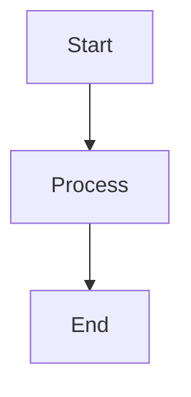

# Coda Formatting Guide

This guide explains how to properly format documentation for Coda, which has its own syntax for diagrams and formatting.

## Key Differences from Markdown

### 1. Diagrams

Coda uses special functions for diagrams instead of Mermaid:

#### Flowcharts
```
DrawFlowchart(
  Syntax(
    "A[Node A] --> B[Node B]",
    "B --> C[Node C]"
  ),
  "TB",  // Direction: TB (top-bottom), LR (left-right)
  "default"
)
```

#### Sequence Diagrams
```
DrawSequenceDiagram(
  Syntax(
    "participant A",
    "participant B",
    "A->>B: Message",
    "B-->>A: Response"
  ),
  "default"
)
```

#### State Diagrams
```
DrawStateDiagram(
  Syntax(
    "[*] --> State1",
    "State1 --> State2: Transition",
    "State2 --> [*]"
  ),
  "default"
)
```

### 2. Line Breaks in Diagrams

Use `<br/>` for line breaks within diagram nodes:
```
"FOOT[Foot Pressure<br/>8 channels @ 20Hz]"
```

### 3. Tables

Tables in Coda use `|---:|` for right alignment:

```
| Header 1 | Header 2 | Header 3 |
|---:|---:|---:|
| Right | Aligned | Content |
```

### 4. Code Blocks

Code blocks work the same as Markdown:
```c
// C code example
int main() {
    return 0;
}
```

## Converting from Markdown to Coda

1. **Replace Mermaid blocks** with appropriate Draw functions
2. **Add `<br/>` tags** for multi-line node labels
3. **Update table alignment** markers to `|---:|`
4. **Keep code blocks** as-is

## Example Conversion

### Markdown (Mermaid):
```markdown

```

### Coda:
```
DrawFlowchart(
  Syntax(
    "A[Start] --> B[Process]",
    "B --> C[End]"
  ),
  "TD",
  "default"
)
```

## Tips

1. **Test your diagrams** in Coda to ensure they render correctly
2. **Use consistent formatting** throughout the document
3. **Keep diagram syntax simple** for better compatibility
4. **Preserve the original content** while adapting the format