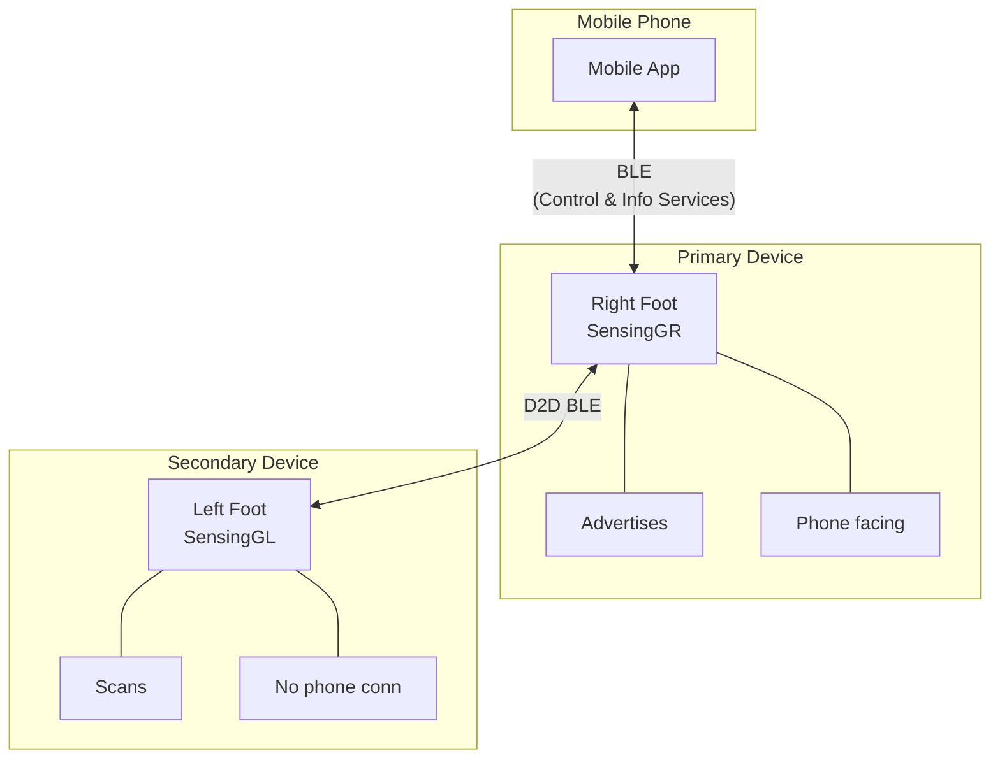
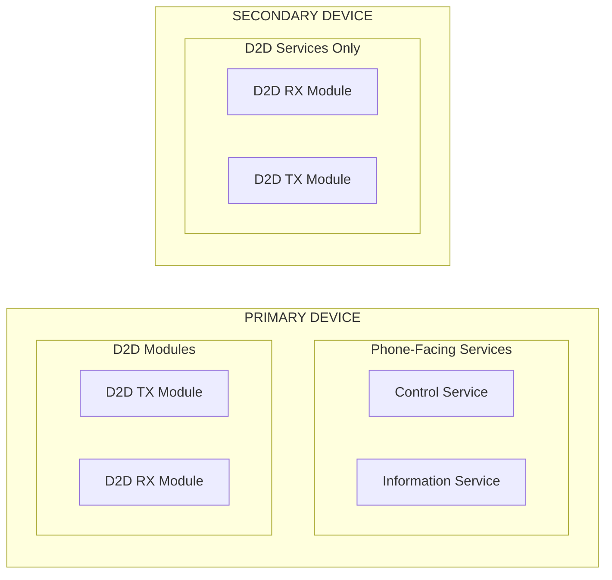
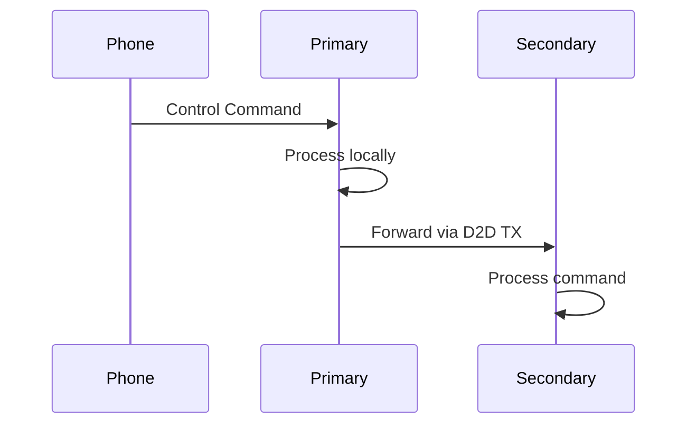
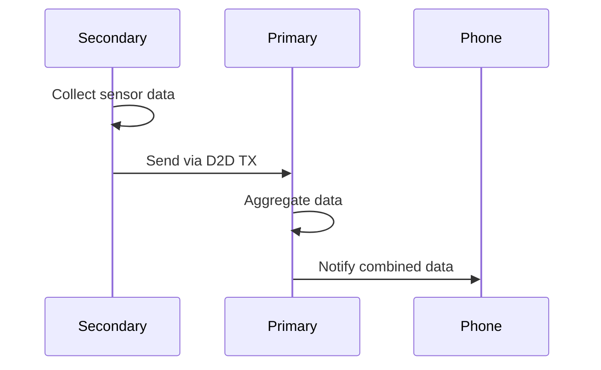
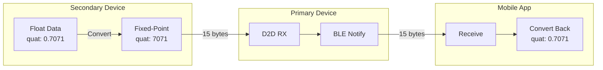
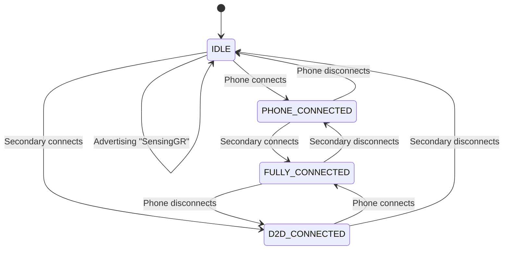
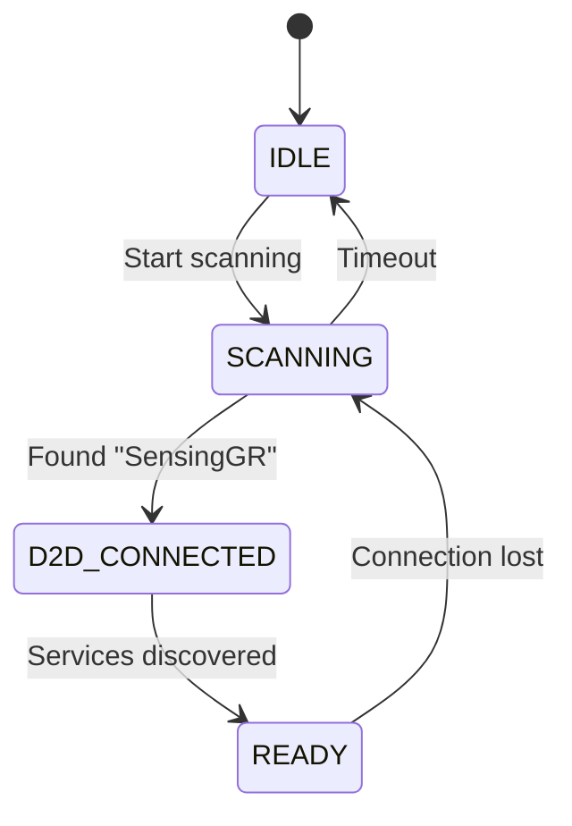
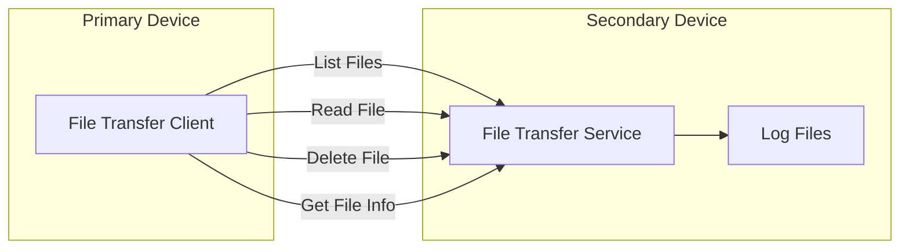

# D2D (Device-to-Device) Communication Complete Guide

**Version:** 1.0  
**Date:** June 2025  
**Scope:** Complete specification for device-to-device communication between primary and secondary sensing devices  
**Purpose:** Comprehensive reference for implementing D2D communication, command forwarding, data aggregation, and file transfer

---

## Table of Contents
1. [System Overview](#system-overview)
2. [Architecture](#architecture)
3. [Command Flow](#command-flow)
4. [Data Flow](#data-flow)
5. [Implementation Details](#implementation-details)
6. [Fixed-Point Data Format](#fixed-point-data-format)
7. [Connection Management](#connection-management)
8. [File Transfer Service](#file-transfer-service)
9. [Testing Guide](#testing-guide)
10. [Configuration](#configuration)

## System Overview

The sensing firmware supports a dual-device configuration where two devices work together to provide complete sensing coverage:

- **Primary Device** (Right Foot - "SensingGR"): Connects to mobile phone and secondary device
- **Secondary Device** (Left Foot - "SensingGL"): Connects only to primary device



## Architecture

### Detailed D2D Architecture

The D2D architecture implements bidirectional communication with distinct data and command flows:

```mermaid
graph TB
    subgraph "Data Flow"
        SEC[Secondary Sensors] -->|"Notify"| SECTX[D2D TX Service]
        SECTX -->|"BLE"| PRIMRX[Primary D2D Client]
        PRIMRX -->|"Internal"| PRIMINFO[Information Service]
        PRIMINFO -->|"Notify"| PHONE[Mobile App]
    end
    
    subgraph "Command Flow"
        PHONE2[Mobile App] -->|"Write"| PRIMCTRL[Control Service]
        PRIMCTRL -->|"Internal"| PRIMD2D[D2D TX Client]
        PRIMD2D -->|"BLE Write"| SECRX[D2D RX Service]
        SECRX -->|"Execute"| SECDEV[Secondary Device]
    end
```



This architecture clearly shows:
- **Data Flow**: How sensor data flows from Secondary → Primary → App
- **Command Flow**: How commands flow from App → Primary → Secondary
- **Service Isolation**: Specific services involved in each direction

### Service Distribution



### Key Design Principles

1. **Unidirectional Phone Communication**: Only Primary ↔ Phone
2. **Bidirectional D2D Communication**: Primary ↔ Secondary for both commands and data
3. **Service Isolation**: Phone services only on Primary, D2D services on both
4. **Clear Role Definition**: Compile-time role selection, no runtime switching
5. **Fixed-Point Efficiency**: All sensor data uses fixed-point integers

## Command Flow

### Supported Commands

All control commands from the mobile app are forwarded to the secondary device:

| Command | Purpose | Data Format |
|---------|---------|-------------|
| Set Time | Synchronize RTC time | `uint32_t` epoch time |
| Delete Foot Log | Remove foot sensor logs | `uint8_t` log ID |
| Delete BHI360 Log | Remove motion sensor logs | `uint8_t` log ID |
| Start Activity | Begin recording | `uint8_t` activity type |
| Stop Activity | End recording | `uint8_t` activity type |

### Command Flow Sequence



### Implementation Details

1. **Service Discovery**
   ```cpp
   // Discovery state machine
   enum discover_state {
       DISCOVER_SERVICE,
       DISCOVER_SET_TIME_CHAR,
       DISCOVER_DELETE_FOOT_LOG_CHAR,
       DISCOVER_DELETE_BHI360_LOG_CHAR,
       DISCOVER_START_ACTIVITY_CHAR,
       DISCOVER_STOP_ACTIVITY_CHAR,
       DISCOVER_COMPLETE
   };
   ```

2. **GATT Write Implementation**
   ```cpp
   int ble_d2d_tx_send_set_time_command(uint32_t epoch_time) {
       if (!d2d_conn) return -ENOTCONN;
       if (!d2d_handles.discovery_complete) return -EINVAL;
       
       return bt_gatt_write_without_response(d2d_conn, 
                                            d2d_handles.set_time_handle,
                                            &epoch_time, 
                                            sizeof(epoch_time), 
                                            false);
   }
   ```

## Data Flow

### Sensor Data from Secondary to Primary



### Data Types Transferred

| Data Type | Size | Format | Description |
|-----------|------|--------|-------------|
| Foot Sensor Samples | 16 bytes | `uint16_t[8]` | 8 pressure channels |
| BHI360 3D Mapping | 15 bytes | Fixed-point | Quaternion + Gyro |
| BHI360 Linear Accel | 6 bytes | Fixed-point | 3-axis acceleration |
| BHI360 Step Count | 8 bytes | `uint32_t` × 2 | Steps + duration |
| Device Status | 4 bytes | `uint32_t` | Status bitfield |
| Log Availability | 1 byte | `uint8_t` | Log file ID |

## Fixed-Point Data Format

### Why Fixed-Point?

- **40% bandwidth reduction** compared to floats
- **No portability issues** between different architectures
- **Efficient BLE transmission** with smaller packet sizes

### Scaling Factors

```cpp
namespace FixedPoint {
    static constexpr int32_t QUAT_SCALE = 10000;     // [-1, 1] → [-10000, 10000]
    static constexpr int32_t ACCEL_SCALE = 1000;     // m/s² → mm/s²
    static constexpr int32_t GYRO_SCALE = 10000;     // rad/s → 0.0001 rad/s
    static constexpr int32_t ACCURACY_SCALE = 100;   // [0, 3] → [0, 300]
}
```

### Data Conversion Flow



## Connection Management

### Primary Device State Machine



### Secondary Device State Machine



### Connection Events

1. **On Connection**
   - Primary: Start service discovery
   - Secondary: Enable notifications

2. **On Disconnection**
   - Clear cached handles
   - Reset discovery state
   - Attempt reconnection

## File Transfer Service

The D2D file transfer service enables the primary device to access log files on the secondary device:

### Operations Supported



### File Transfer Protocol

1. **List Files**: Get directory listing
2. **Select File**: Choose file by name
3. **Read Chunks**: Transfer in 244-byte chunks
4. **Verify**: Check transfer completion

## Testing Guide

### Expected Log Sequence

1. **Connection Phase**
   ```
   D2D TX connection set
   Started D2D service discovery
   ```

2. **Discovery Phase**
   ```
   Found D2D RX service, handle: XX
   Found set time characteristic, handle: XX
   D2D service discovery complete!
   ```

3. **Command Forwarding**
   ```
   D2D TX: Forwarding set time command - epoch: 1234567890
   D2D RX: Set Time Command - epoch: 1234567890
   ```

4. **Data Transfer**
   ```
   D2D TX: Sending foot sensor data
   D2D RX: Received foot sensor data
   ```

### Test Scenarios

1. **Basic Connectivity**
   - Power on both devices
   - Verify D2D connection established
   - Check service discovery completion

2. **Command Synchronization**
   - Set time from mobile app
   - Verify both devices update time
   - Check activity start/stop sync

3. **Data Flow**
   - Start activity on both devices
   - Verify sensor data reaches phone
   - Check data from both feet

4. **Error Handling**
   - Test connection loss recovery
   - Verify command retry logic
   - Check data buffering

## Configuration

### Build Configuration

```cmake
# Primary Device (Right Foot)
set(CONFIG_PRIMARY_DEVICE y)
set(CONFIG_BT_DEVICE_NAME "SensingGR")

# Secondary Device (Left Foot)
set(CONFIG_PRIMARY_DEVICE n)
set(CONFIG_BT_DEVICE_NAME "SensingGL")
```

### Service UUIDs

```cpp
// D2D RX Service
static struct bt_uuid_128 d2d_rx_service_uuid = 
    BT_UUID_INIT_128(0x12345678, 0x1234, 0x5678, 0x1234, 0x56789abcdef0);

// D2D File Transfer Service  
static struct bt_uuid_128 d2d_file_transfer_service_uuid = 
    BT_UUID_INIT_128(0x12345678, 0x1234, 0x5678, 0x1234, 0x56789abcdef1);
```

### MTU Configuration

```cpp
#define D2D_MTU_SIZE 247  // Maximum for BLE 4.2+
```

## Implementation Status

### ✅ Completed Features

- **Command Forwarding**: All control commands properly forwarded
- **Service Discovery**: Automatic discovery with handle caching
- **GATT Operations**: Proper write implementation
- **Connection Management**: Robust connection handling
- **File Transfer**: Complete file access over D2D
- **Fixed-Point Data**: Efficient data encoding

### 🚧 Future Enhancements

1. **Write with Response**: For critical commands requiring acknowledgment
2. **Notification Feedback**: Secondary notifies primary of completion
3. **Batch Commands**: Group multiple commands in single write
4. **Security**: Add encryption and authentication
5. **Data Compression**: Further optimize bandwidth usage

## Troubleshooting

### Common Issues

1. **"Service discovery not complete"**
   - Wait for discovery to finish after connection
   - Check if peer device has D2D RX service

2. **"No connection"**
   - Verify both devices are powered on
   - Check if secondary is scanning for primary
   - Ensure device names match (SensingGR/GL)

3. **"Failed to send command"**
   - Check GATT write error code
   - Verify characteristic handles
   - Ensure MTU is sufficient

### Debug Commands

```bash
# View D2D connection status
shell> d2d status

# List discovered services
shell> d2d services

# Send test command
shell> d2d test_cmd

# View file transfer status
shell> d2d files
```

## Summary

The D2D communication system provides a complete solution for dual-device sensing:

- **Reliable command synchronization** between devices
- **Efficient data transfer** using fixed-point encoding
- **Robust connection management** with automatic recovery
- **Complete file access** for log management
- **Extensible architecture** for future enhancements

The implementation ensures both feet work as a coordinated system while maintaining clear separation of responsibilities between primary and secondary devices.