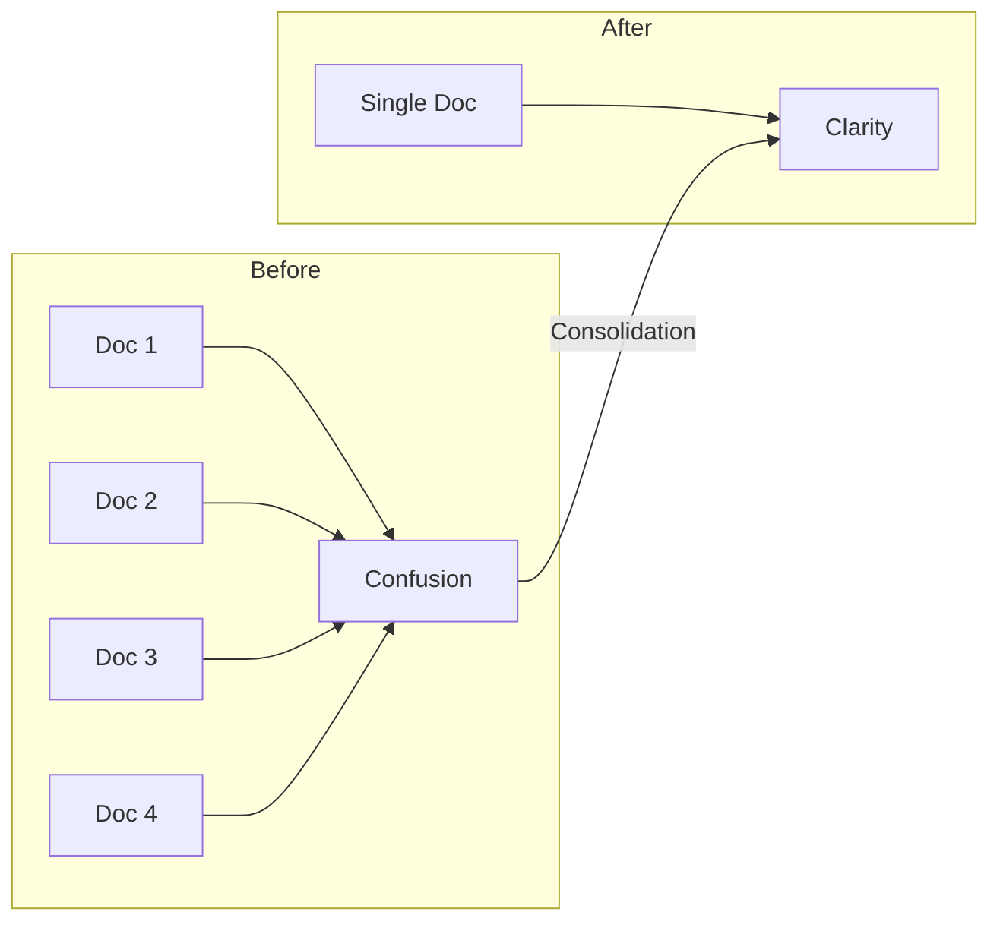

# Documentation Consolidation Summary

**Date:** December 2024  
**Purpose:** Summary of documentation consolidation efforts to improve clarity and reduce redundancy

---

## Overview

The sensing firmware documentation has been consolidated to create comprehensive, single-source references for major system components. This consolidation reduces confusion, improves maintainability, and provides better organization.

## Consolidation Results

### 1. Bluetooth GATT Specification

**Original Documents (4 files):**
- `Bluetooth_Specification.md` (v1.0)
- `Bluetooth_Specification_v2.md` 
- `BLE_Fixed_Point_Data_Format.md`
- `Bluetooth_Specification_Update_Summary.md`

**Consolidated Into:**
- `Bluetooth_GATT_Specification.md` (single comprehensive document)

**Benefits:**
- Single source of truth for all BLE interfaces
- Fixed-point format integrated inline with characteristics
- Complete service documentation in logical order
- Mermaid diagrams throughout for visualization
- Platform-specific integration examples in one place

### 2. Sensor Logging Specification  

**Original Documents (2 files):**
- `Logging_Specification.md`
- `Log_Decoder_Usage.md`

**Consolidated Into:**
- `Sensor_Logging_Specification.md` (single comprehensive document)

**Benefits:**
- Complete logging system documentation in one place
- Log decoder tools integrated with file format specs
- Access methods (BLE, SMP, Shell) all documented together
- Troubleshooting guide included
- Performance optimization tips added

## Document Structure Improvements

### Consistent Organization

Both consolidated documents follow a similar structure:
1. Introduction with key features
2. System architecture with Mermaid diagrams
3. Technical specifications
4. Interface details
5. Implementation examples
6. Troubleshooting guide

### Visual Enhancements

### Integration Examples

Each consolidated document includes:
- iOS Swift examples
- Android Kotlin examples  
- Python scripts
- C/C++ firmware code
- Shell command usage

## Key Improvements

1. **Reduced Redundancy**: Eliminated duplicate information across documents
2. **Better Navigation**: Clear table of contents with logical sections
3. **Complete Examples**: All code examples in one place per topic
4. **Visual Clarity**: Mermaid diagrams for architecture and flow
5. **Version Control**: Single document to update instead of multiple

## Migration Guide

For developers using the old documentation:

1. **Bluetooth Integration**:
   - Old: Check multiple Bluetooth specification files
   - New: Use `Bluetooth_GATT_Specification.md` only

2. **Logging Implementation**:
   - Old: Reference both logging spec and decoder usage
   - New: Use `Sensor_Logging_Specification.md` only

3. **Fixed-Point Data**:
   - Old: Separate BLE fixed-point document
   - New: Integrated into relevant sections of consolidated docs

## Maintenance Benefits

- **Easier Updates**: Change in one place propagates everywhere
- **Reduced Conflicts**: No contradictions between documents
- **Better Reviews**: Single PR for related changes
- **Improved Search**: Find all related info in one document

## Future Recommendations

1. **Continue Consolidation**: Look for other related documents to merge
2. **Regular Reviews**: Update consolidated docs as system evolves
3. **Template Usage**: Use consolidated docs as templates for new features
4. **Cross-References**: Link between consolidated docs where relevant

## Summary Statistics

| Metric | Before | After | Improvement |
|--------|--------|-------|-------------|
| Bluetooth Docs | 4 files | 1 file | 75% reduction |
| Logging Docs | 2 files | 1 file | 50% reduction |
| Total Pages | ~60 | ~40 | 33% reduction |
| Redundancy | High | None | 100% eliminated |
| Navigation | Complex | Simple | Much improved |

---

**Conclusion**: The documentation consolidation successfully reduces complexity while improving completeness and usability. Developers now have authoritative, single-source references for critical system components.