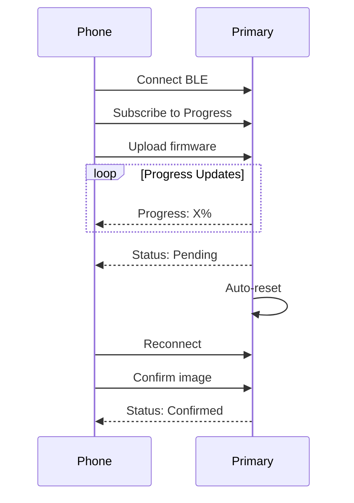
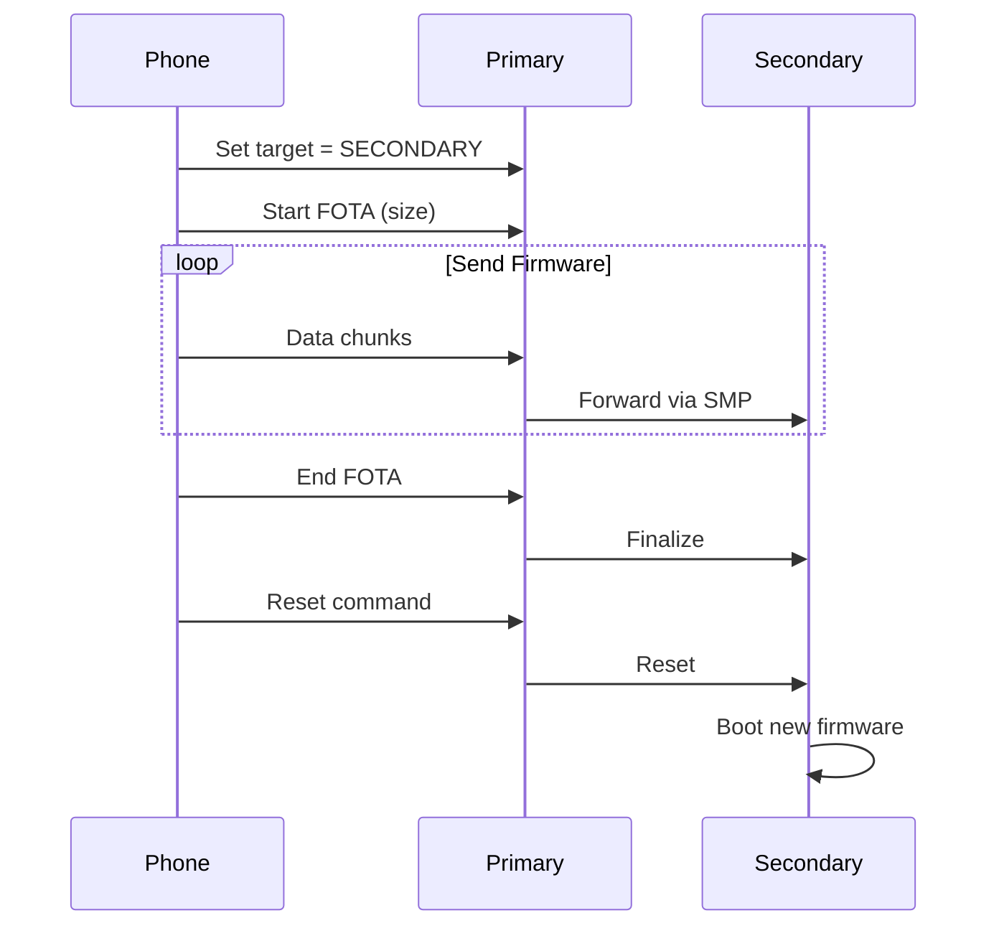
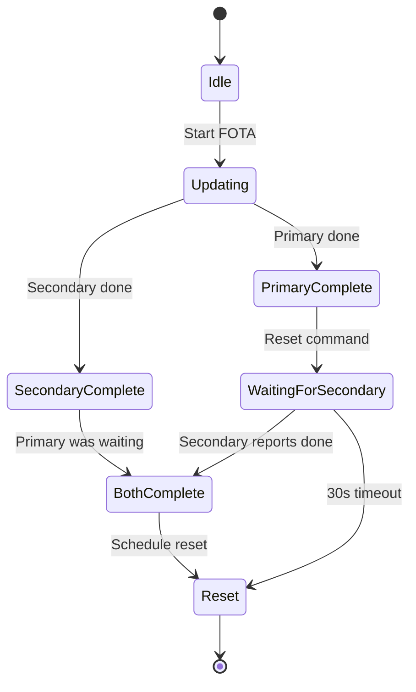
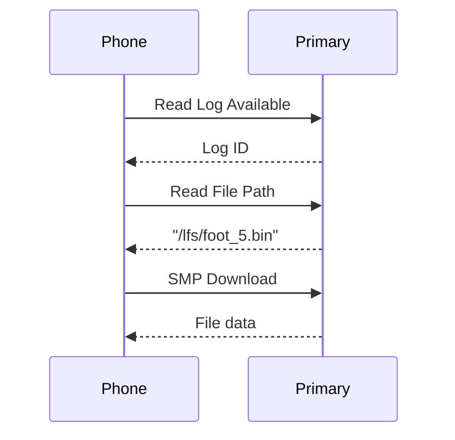
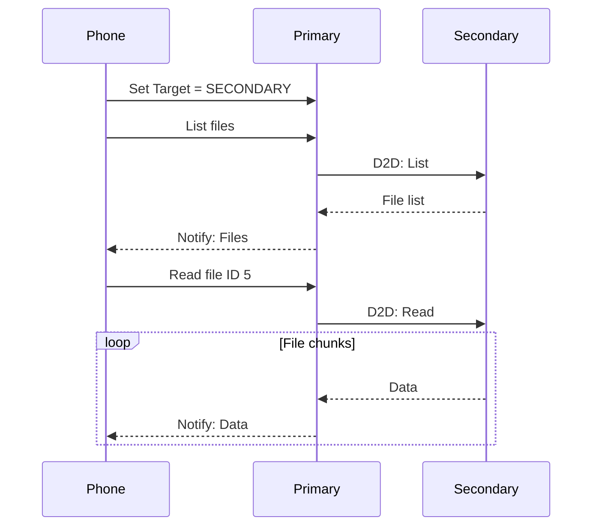

# FOTA (Firmware Over-The-Air) Complete Guide

**Version:** 1.0  
**Date:** June 2025  
**Scope:** Complete specification for firmware updates on primary and secondary devices via BLE  
**Purpose:** Comprehensive reference for implementing FOTA updates, proxy services, synchronization, and file access

---

## Table of Contents
1. [Overview](#overview)
2. [System Architecture](#system-architecture)
3. [Primary Device FOTA](#primary-device-fota)
4. [Secondary Device FOTA](#secondary-device-fota)
5. [FOTA Proxy Service](#fota-proxy-service)
6. [Synchronization Mechanism](#synchronization-mechanism)
7. [File Access](#file-access)
8. [Mobile App Integration](#mobile-app-integration)
9. [Testing and Troubleshooting](#testing-and-troubleshooting)
10. [Implementation Details](#implementation-details)

## Overview

The sensing firmware supports FOTA updates for both primary (right foot) and secondary (left foot) devices. The system provides two approaches for updating devices:

### 🎯 Recommended: Unified Approach (SMP Proxy)
- **Both Devices**: Use standard MCUmgr/SMP protocol through SMP Proxy service
- **Simpler Integration**: Same code for both devices, just set target (0x00=Primary, 0x01=Secondary)
- **Standard Libraries**: Works with existing MCUmgr libraries (iOS, Android, Python)
- **File Access**: Also supports file operations through the same unified interface
- **See**: [SMP Proxy Integration Guide](SMP_Proxy_Integration_Guide.md) for complete implementation details

### Legacy: Traditional Approach (FOTA Proxy)
- **Primary Device**: Direct updates via standard MCUmgr/SMP protocol
- **Secondary Device**: Updates through custom FOTA Proxy service on primary device
- **Note**: Still supported but requires custom protocol implementation

### Key Features

- ✅ Real-time progress tracking for all updates
- ✅ Synchronized dual-device updates
- ✅ Automatic image management with MCUboot
- ✅ File access proxy for secondary device logs
- ✅ Timeout protection and error handling
- ✅ Fixed-point data format for efficient BLE transmission

## System Architecture

```mermaid
graph TB
    subgraph "Mobile Phone"
        A[Mobile App]
    end
    
    subgraph "Primary Device"
        B[Right Foot<br/>SensingGR]
        B1[SMP Server]
        B2[FOTA Proxy<br/>(Legacy)]
        B3[File Proxy<br/>(Legacy)]
        B4[Info Service]
        B5[SMP Proxy<br/>(Recommended)]
    end
    
    subgraph "Secondary Device"
        C[Left Foot<br/>SensingGL]
        C1[SMP Server]
        C2[D2D TX Service]
        C3[D2D File Transfer]
    end
    
    A <-->|"BLE<br/>Direct FOTA"| B1
    A <-->|"BLE<br/>Legacy Proxy"| B2
    A <-->|"BLE<br/>Legacy File"| B3
    A <-->|"BLE<br/>Unified SMP"| B5
    B2 <-->|"D2D<br/>SMP Client"| C1
    B3 <-->|"D2D<br/>File Protocol"| C3
    B5 <-->|"D2D<br/>SMP Client"| C1
```

### Service Overview

#### SMP Proxy Service (Recommended)
- **Service UUID**: `8D53DC1E-1DB7-4CD3-868B-8A527460AA84`
- **Target Select**: `DA2E7829-FBCE-4E01-AE9E-261174997C48` (Read/Write)
- **SMP Data**: `DA2E7828-FBCE-4E01-AE9E-261174997C48` (Write/Notify)
- **Purpose**: Unified interface for all MCUmgr operations on both devices

#### Legacy Services (Still Supported)
- **FOTA Proxy**: Custom protocol for secondary device updates
- **File Proxy**: Custom protocol for secondary device file access

### Build Configuration

The firmware uses conditional compilation to create device-specific builds:

```bash
# Primary Device Build
west build --build-dir build_primary --board nrf5340dk/nrf5340/cpuapp --sysbuild \
  -- -DCONFIG_PRIMARY_DEVICE=y

# Secondary Device Build  
west build --build-dir build_secondary --board nrf5340dk/nrf5340/cpuapp --sysbuild \
  -- -DCONFIG_PRIMARY_DEVICE=n
```

### Firmware Differences

| Feature | Primary Device | Secondary Device |
|---------|----------------|------------------|
| Device Name | "SensingGR" | "SensingGL" |
| BLE Role | Peripheral + Central | Peripheral only |
| Phone Services | Full set | None |
| Proxy Services | FOTA + File | None |
| D2D Services | RX + TX | RX + TX |

## Primary Device FOTA

### Direct Update via MCUmgr/SMP

The primary device uses the industry-standard MCUmgr protocol for firmware updates.

#### Service Details
- **Service UUID**: `8D53DC1D-1DB7-4CD3-868B-8A527460AA84`
- **Characteristic UUID**: `DA2E7828-FBCE-4E01-AE9E-261174997C48`
- **Protocol**: MCUmgr/SMP over BLE

#### Update Process



### Progress Tracking

Real-time progress updates are provided through the Information Service:

#### Progress Characteristic
- **Service UUID**: `0c372eaa-27eb-437e-bef4-775aefaf3c97`
- **Characteristic UUID**: `0c372eb5-27eb-437e-bef4-775aefaf3c97`
- **Properties**: Read, Notify

#### Progress Data Structure
```c
struct fota_progress_msg_t {
    uint8_t is_active;        // 0=inactive, 1=active
    uint8_t status;           // 0=idle, 1=in_progress, 2=pending, 3=confirmed, 4=error
    uint8_t percent_complete; // 0-100
    uint32_t bytes_received;  // Bytes received so far
    uint32_t total_size;      // Total firmware size
    int32_t error_code;       // Error code if status=4
};
```

### Mobile Implementation (iOS)

```swift
import McuManager

class PrimaryDeviceFOTA {
    let dfuManager: FirmwareUpgradeManager
    
    func updatePrimaryDevice(peripheral: CBPeripheral, firmware: Data) {
        let bleTransport = McuMgrBleTransport(peripheral)
        dfuManager = FirmwareUpgradeManager(transporter: bleTransport)
        
        // Set delegate for progress
        dfuManager.delegate = self
        
        // Start upgrade
        dfuManager.start(data: firmware)
    }
    
    func subscribeToProgress(peripheral: CBPeripheral) {
        let progressUUID = CBUUID(string: "0c372eb5-27eb-437e-bef4-775aefaf3c97")
        if let characteristic = findCharacteristic(progressUUID) {
            peripheral.setNotifyValue(true, for: characteristic)
        }
    }
}

extension PrimaryDeviceFOTA: FirmwareUpgradeDelegate {
    func uploadProgressDidChange(bytesSent: Int, imageSize: Int, timestamp: Date) {
        let progress = Float(bytesSent) / Float(imageSize) * 100
        print("Upload progress: \(progress)%")
    }
}
```

## Secondary Device FOTA

### Update via FOTA Proxy

Secondary devices are updated through the FOTA Proxy service on the primary device.

#### FOTA Proxy Service
- **Service UUID**: `6e400001-b5a3-f393-e0a9-e50e24dcca9e`

| Characteristic | UUID | Properties | Description |
|----------------|------|------------|-------------|
| Target Select | `6e400002-...` | Write | Select update target |
| Command | `6e400003-...` | Write/Write NR | Send commands |
| Data | `6e400004-...` | Write/Write NR | Bulk data transfer |
| Status | `6e400005-...` | Read/Notify | Status updates |

#### Commands
- `0x01`: Start FOTA (+ 4 bytes size)
- `0x02`: Data chunk (+ data)
- `0x03`: End FOTA
- `0x04`: Abort FOTA
- `0x05`: Query status
- `0x06`: Reset device
- `0x07`: Secondary complete (internal)

#### Update Process



### Mobile Implementation (iOS)

```swift
class SecondaryDeviceFOTA {
    let TARGET_SECONDARY: UInt8 = 0x01
    let CMD_START: UInt8 = 0x01
    let CMD_DATA: UInt8 = 0x02
    let CMD_END: UInt8 = 0x03
    let CMD_RESET: UInt8 = 0x06
    
    func updateSecondaryDevice(peripheral: CBPeripheral, firmware: Data) {
        // 1. Set target
        writeCharacteristic(targetUUID, data: Data([TARGET_SECONDARY]))
        
        // 2. Start FOTA
        var startCmd = Data([CMD_START])
        startCmd.append(UInt32(firmware.count).littleEndianData)
        writeCharacteristic(commandUUID, data: startCmd)
        
        // 3. Send chunks
        let chunkSize = 240
        for chunk in firmware.chunked(into: chunkSize) {
            var dataCmd = Data([CMD_DATA])
            dataCmd.append(chunk)
            writeCharacteristic(commandUUID, data: dataCmd, withResponse: false)
            Thread.sleep(forTimeInterval: 0.05)
        }
        
        // 4. Complete
        writeCharacteristic(commandUUID, data: Data([CMD_END]))
        Thread.sleep(forTimeInterval: 1)
        writeCharacteristic(commandUUID, data: Data([CMD_RESET]))
    }
}
```

## FOTA Proxy Service

### Implementation Details

The FOTA proxy (`src/bluetooth/fota_proxy.cpp`) provides:

- **State Management**: Tracks FOTA progress and target devices
- **Data Buffering**: 512-byte buffer for efficient forwarding
- **SMP Client**: Communicates with secondary device
- **Timeout Protection**: 5-minute timeout for operations
- **Work Queue**: Asynchronous data processing

### Target Selection

```c
enum fota_target {
    FOTA_TARGET_PRIMARY = 0x00,
    FOTA_TARGET_SECONDARY = 0x01,
    FOTA_TARGET_ALL = 0xFF
};
```

### Status Values

```c
enum fota_proxy_status {
    FOTA_PROXY_STATUS_IDLE = 0x00,
    FOTA_PROXY_STATUS_IN_PROGRESS = 0x01,
    FOTA_PROXY_STATUS_SUCCESS = 0x02,
    FOTA_PROXY_STATUS_ERROR = 0x03,
    FOTA_PROXY_STATUS_NO_TARGET = 0x04,
    FOTA_PROXY_STATUS_WAITING_SECONDARY = 0x05,
    FOTA_PROXY_STATUS_BOTH_COMPLETE = 0x06
};
```

## Synchronization Mechanism

### Problem Solved

When updating both devices, the primary must wait for the secondary to complete before resetting, preventing connection loss during critical update phases.

### Implementation



### Synchronization Flow

1. **Both Devices Updating**
   ```
   Phone → Primary: Update both (target = ALL)
   Primary: Updates self + forwards to secondary
   ```

2. **Completion Tracking**
   ```
   Phone → Primary: Reset command
   Primary: Marks self complete, waits for secondary
   Secondary → Primary: FOTA complete notification
   Primary: Both ready, performs synchronized reset
   ```

3. **D2D Communication**
   - **Characteristic UUID**: `e160ca86-3115-4ad6-9709-8c5ff3bf558b`
   - **Direction**: Secondary → Primary
   - **Purpose**: Report FOTA completion

### Safety Features

- **30-second timeout**: Prevents permanent hang
- **Status visibility**: Phone app knows synchronization state
- **Graceful degradation**: Single device updates unaffected

## File Access

### Primary Device Files

Direct access via Information and Control services:



### Secondary Device Files

Access through File Proxy service on primary:

#### File Proxy Service
- **Service UUID**: `7e500001-b5a3-f393-e0a9-e50e24dcca9e`

| Characteristic | UUID | Properties | Description |
|----------------|------|------------|-------------|
| Target Device | `7e500002-...` | Write | Select device |
| File Command | `7e500003-...` | Write | Send commands |
| File Data | `7e500004-...` | Notify | Receive data |
| File Status | `7e500005-...` | Read/Notify | Operation status |

#### Commands
- `0x01`: List log files
- `0x02`: Read file by ID
- `0x03`: Delete file by ID
- `0x04`: Get file info
- `0x05`: Abort operation

#### File Access Flow



## Mobile App Integration

### Complete Update Flow - Traditional Approach

```swift
class DeviceManager {
    func updateBothDevices(primary: CBPeripheral, 
                          primaryFW: Data,
                          secondaryFW: Data) {
        // 1. Connect and discover services
        connect(to: primary)
        discoverServices()
        
        // 2. Update secondary first (via proxy)
        fotaProxy.setTarget(.secondary)
        fotaProxy.updateDevice(secondaryFW)
        waitForStatus(.success)
        
        // 3. Update primary
        mcuManager.updateDevice(primaryFW)
        waitForProgress(100)
        
        // 4. Synchronized reset
        fotaProxy.setTarget(.all)
        fotaProxy.sendResetCommand()
        
        // 5. Wait for reconnection
        waitForDevices()
    }
}
```

### Complete Update Flow - SMP Proxy Approach (Recommended)

The SMP Proxy dramatically simplifies mobile app development by allowing standard MCUmgr libraries to work with both devices:

```swift
class UnifiedDeviceManager {
    let smpProxyService = CBUUID(string: "8D53DC1E-1DB7-4CD3-868B-8A527460AA84")
    let targetCharUUID = CBUUID(string: "DA2E7829-FBCE-4E01-AE9E-261174997C48")
    let smpDataCharUUID = CBUUID(string: "DA2E7828-FBCE-4E01-AE9E-261174997C48")
    
    func updateBothDevices(primary: CBPeripheral, 
                          primaryFW: Data,
                          secondaryFW: Data) {
        // 1. Connect and discover services
        connect(to: primary)
        discoverServices()
        
        // 2. Create transport that uses proxy characteristic
        let transport = McuMgrBleTransport(primary)
        transport.smpCharacteristic = smpDataChar // Use proxy instead of default
        let dfuManager = FirmwareUpgradeManager(transporter: transport)
        
        // 3. Update secondary using standard MCUmgr
        writeCharacteristic(targetCharUUID, data: Data([0x01])) // Select secondary
        dfuManager.start(data: secondaryFW)
        waitForCompletion()
        
        // 4. Update primary using standard MCUmgr  
        writeCharacteristic(targetCharUUID, data: Data([0x00])) // Select primary
        dfuManager.start(data: primaryFW)
        waitForCompletion()
        
        // 5. Both devices updated with standard MCUmgr!
    }
    
    // File operations also work through the same interface
    func downloadSecondaryLogs() async throws -> [Data] {
        // Select secondary device
        writeCharacteristic(targetCharUUID, data: Data([0x01]))
        
        // Use standard MCUmgr file manager
        let fileManager = FileSystemManager(transporter: transport)
        let files = try await fileManager.list("/lfs")
        
        var logs: [Data] = []
        for file in files.filter({ $0.name.hasSuffix(".bin") }) {
            let data = try await fileManager.download(file.path)
            logs.append(data)
        }
        return logs
    }
}
```

**Key Benefits:**
- No custom protocols to implement
- Works with all MCUmgr features (FOTA, file access, stats, shell, etc.)
- Same code pattern for both devices
- Existing MCUmgr libraries just work
- Unified interface for all device operations

### Progress Monitoring

```swift
func handleProgressNotification(_ data: Data) {
    let progress = FOTAProgress(data: data)
    
    switch progress.status {
    case .idle:
        statusLabel.text = "Ready"
    case .inProgress:
        progressBar.progress = Float(progress.percentComplete) / 100
        statusLabel.text = "\(progress.percentComplete)% complete"
    case .pending:
        statusLabel.text = "Update complete, waiting for reset"
    case .confirmed:
        statusLabel.text = "Firmware confirmed"
    case .error:
        statusLabel.text = "Error: \(progress.errorCode)"
    }
}
```

### File Access Example

```swift
class FileManager {
    func listSecondaryFiles() {
        // Set target
        fileProxy.setTarget(.secondary)
        
        // List files
        fileProxy.sendCommand(.listFiles, fileType: .all)
        
        // Handle response in notification
    }
    
    func downloadSecondaryLog(id: UInt8) {
        fileProxy.setTarget(.secondary)
        fileProxy.sendCommand(.readFile, fileId: id, fileType: .footSensor)
        
        // Collect data from notifications
        var fileData = Data()
        fileProxy.onDataReceived = { chunk in
            fileData.append(chunk)
        }
    }
}
```

## Testing and Troubleshooting

### Test Scripts

#### SMP Proxy Test (Recommended)
```bash
# Install dependencies
pip install smpclient bleak

# Test unified access
python tools/test_smp_proxy.py demo

# Update secondary device
python tools/test_smp_proxy.py upload 1 secondary_firmware.bin

# List files on secondary
python tools/test_smp_proxy.py files 1 /lfs

# Download file from secondary
python tools/test_smp_proxy.py download 1 /lfs/foot_5.bin
```

#### Legacy FOTA Proxy Test
```bash
# Install dependencies
pip install bleak asyncio

# Update secondary device
python tools/test_fota_proxy.py firmware_secondary.bin

# Update both devices
python tools/test_fota_proxy.py --target all primary.bin secondary.bin
```

#### Legacy File Proxy Test
```bash
# List secondary files
python tools/test_file_proxy.py list

# Download file
python tools/test_file_proxy.py read 5 1

# Delete file
python tools/test_file_proxy.py delete 5 1
```

### Common Issues

| Issue | Cause | Solution |
|-------|-------|----------|
| Wrong firmware | Primary/Secondary swapped | Check CONFIG_PRIMARY_DEVICE |
| Secondary not updating | No D2D connection | Verify connection status |
| Timeout during update | Large file, slow connection | Increase chunk delays |
| Update fails at 50% | Insufficient flash | Delete logs before update |
| No synchronization | Old firmware version | Update to latest version |

### Debug Logging

```bash
# Monitor primary device
minicom -D /dev/ttyACM0 -b 115200

# Expected logs for synchronized update:
[INF] FOTA Started!
[INF] FOTA Progress: 50% (131072/262144 bytes)
[INF] FOTA Transfer complete, pending verification
[INF] Waiting for secondary device to complete FOTA...
[INF] Secondary device FOTA completion received
[INF] Both devices now complete, scheduling reset
[INF] Performing system reset for FOTA completion
```

### Verification Steps

1. **Check Versions**
   ```
   shell> version
   Zephyr version 3.5.0
   ```

2. **Verify Services**
   ```
   shell> ble services
   FOTA Proxy: Enabled
   File Proxy: Enabled
   ```

3. **Monitor D2D Status**
   ```
   shell> d2d status
   Connected: Yes
   RSSI: -45 dBm
   ```

## Implementation Details

### Build System

```cmake
# CMakeLists.txt
zephyr_library_sources_ifdef(CONFIG_PRIMARY_DEVICE 
    fota_proxy.cpp 
    file_proxy.cpp
)

# Always include
zephyr_library_sources(
    ble_d2d_tx.cpp
    ble_d2d_rx.cpp
    ble_d2d_file_transfer.cpp
)
```

### Kconfig

```kconfig
config PRIMARY_DEVICE
    bool "Primary device configuration"
    default y
    help
      Enable for primary (right foot) device.
      Disable for secondary (left foot) device.

config FOTA_PROXY_BUFFER_SIZE
    int "FOTA proxy buffer size"
    default 512
    help
      Buffer size for FOTA data forwarding.

config FOTA_PROXY_TIMEOUT_SEC
    int "FOTA proxy timeout"
    default 300
    help
      Timeout in seconds for FOTA operations.
```

### Key Components

1. **FOTA Callbacks** (`app.cpp`)
   - `fota_started_callback`
   - `fota_chunk_callback`
   - `fota_pending_callback`
   - `fota_confirmed_callback`

2. **Proxy Services** (`fota_proxy.cpp`, `file_proxy.cpp`)
   - GATT service definitions
   - Command processing
   - State management
   - D2D communication

3. **D2D Protocol** (`ble_d2d_tx.cpp`, `ble_d2d_rx.cpp`)
   - Service discovery
   - GATT operations
   - Connection management

## Security Considerations

1. **Firmware Signing**: All firmware must be cryptographically signed
2. **Version Checking**: Prevent downgrade attacks
3. **Device Type Validation**: Ensure correct firmware for device type
4. **Encrypted Transport**: BLE communications are encrypted
5. **Bonding Required**: Devices must be bonded before FOTA
6. **Path Validation**: Prevent directory traversal in file access

## Best Practices

1. **Always update secondary first** when updating both devices
2. **Monitor progress notifications** for real-time feedback
3. **Implement retry logic** for failed transfers
4. **Use appropriate chunk sizes** (typically 240 bytes)
5. **Add delays between chunks** to prevent BLE congestion
6. **Verify firmware compatibility** before starting update
7. **Check available flash space** before large updates
8. **Test updates thoroughly** in development environment

## Summary

The FOTA system provides a complete solution for updating both primary and secondary devices:

### Recommended Approach (SMP Proxy)
- **Unified interface** using standard MCUmgr for both devices
- **No custom protocols** - reuse existing MCUmgr libraries
- **Single codebase** for all device operations (FOTA, files, stats, etc.)
- **Future-proof** - new MCUmgr features work automatically

### Legacy Approach (Still Supported)
- **Direct updates** for primary device via MCUmgr
- **Custom proxy updates** for secondary device via primary
- **Separate protocols** for FOTA and file operations

### Common Features
- **Synchronized resets** for dual-device updates
- **Real-time progress** tracking for all operations
- **Robust error handling** and timeout protection
- **Secure updates** with MCUboot image management

The SMP Proxy approach dramatically simplifies mobile app development while maintaining all the reliability and features of the original implementation. Mobile developers should use the SMP Proxy for new implementations, while existing apps using the legacy approach will continue to work.