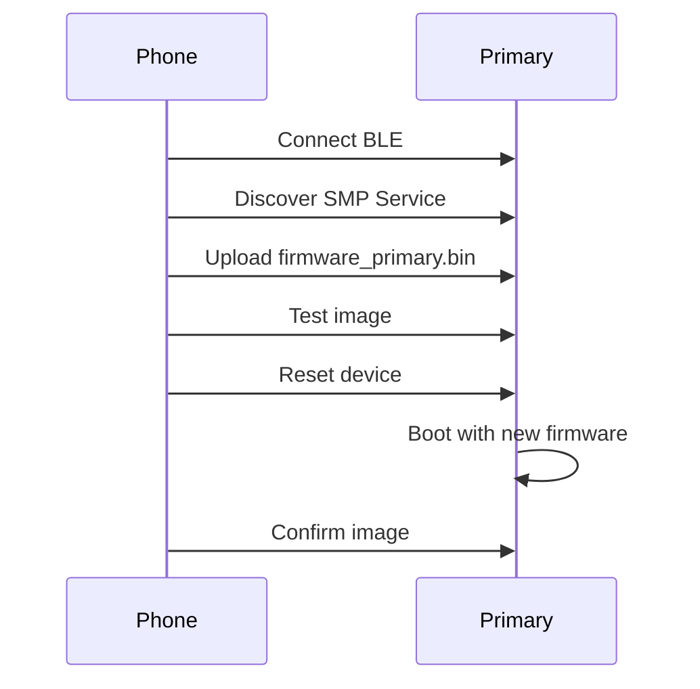
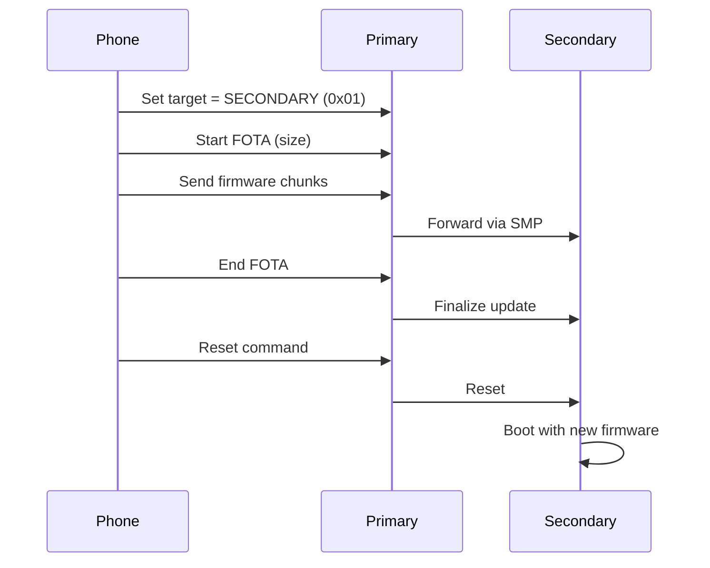
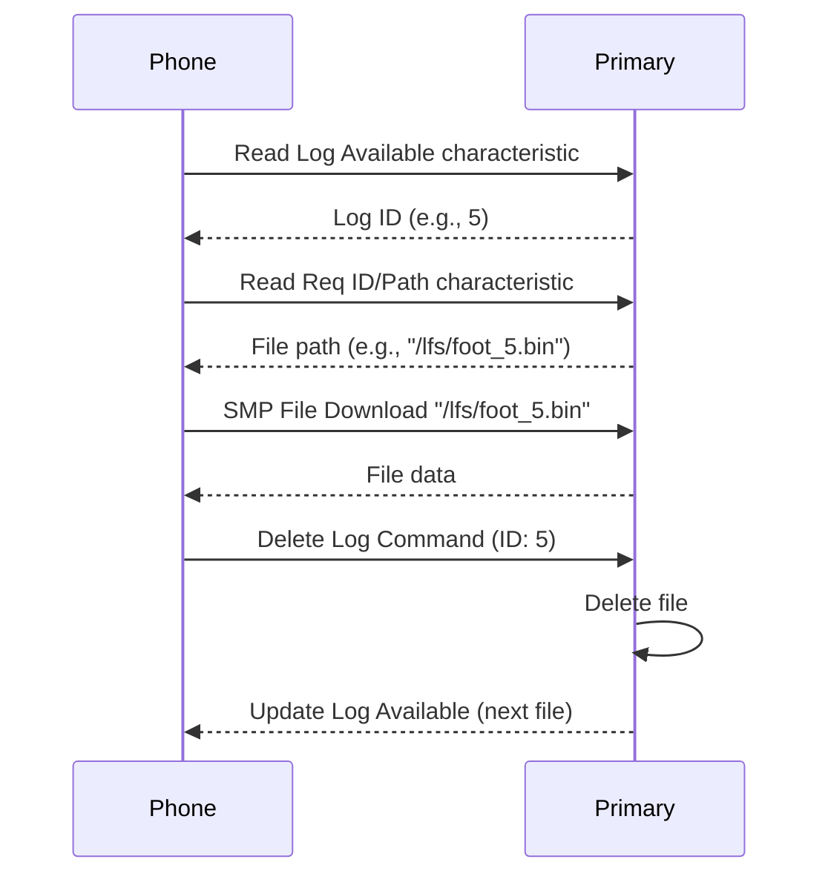
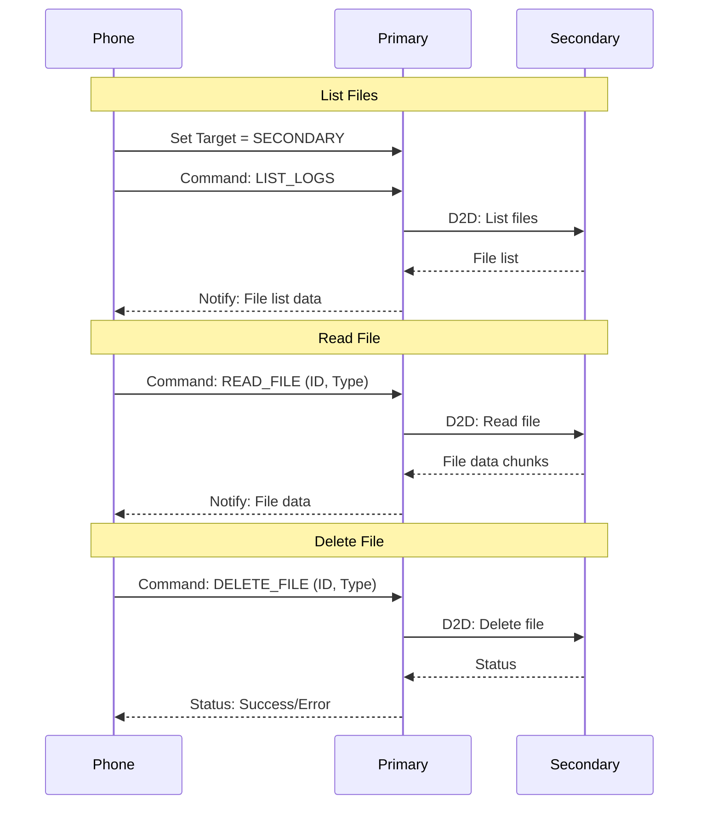
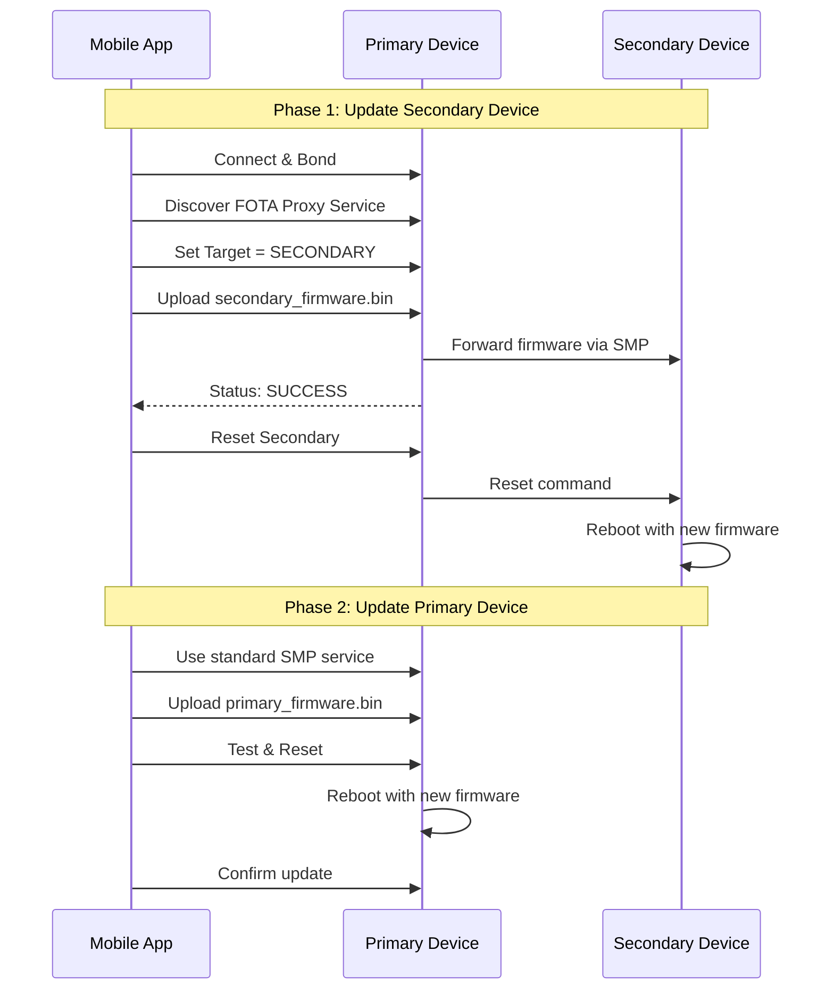
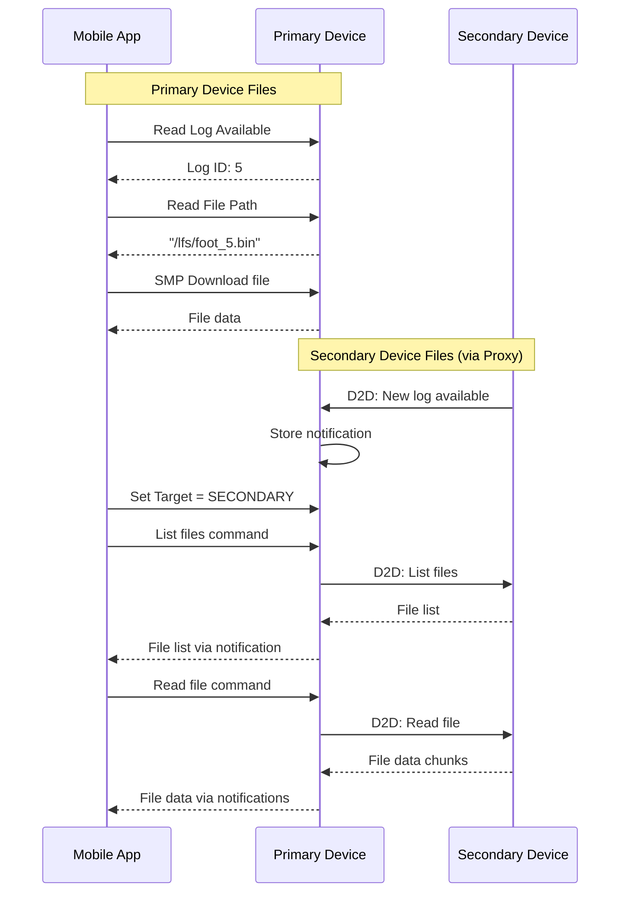

# FOTA and File Access Guide for Primary and Secondary Devices

**Document Version:** 1.0  
**Date:** December 2024  
**Author:** Firmware Team

---

## Table of Contents

1. [Introduction](#introduction)
2. [System Architecture](#system-architecture)
3. [Firmware Differences](#firmware-differences)
4. [FOTA Updates](#fota-updates)
   - [Primary Device FOTA](#primary-device-fota)
   - [Secondary Device FOTA](#secondary-device-fota)
5. [File Access](#file-access)
   - [Primary Device File Access](#primary-device-file-access)
   - [Secondary Device File Access](#secondary-device-file-access)
6. [Implementation Details](#implementation-details)
7. [Mobile App Integration](#mobile-app-integration)
8. [Security Considerations](#security-considerations)
9. [Troubleshooting](#troubleshooting)

---

## 1. Introduction

This document provides comprehensive guidance on performing Firmware Over-The-Air (FOTA) updates and accessing log files for both primary (right foot) and secondary (left foot) devices in the sensing system. The primary device connects directly to the mobile phone, while the secondary device connects to the primary device, creating a relay architecture for both FOTA and file access.

### Key Concepts

- **Primary Device**: Right foot sensor that connects directly to the mobile phone
- **Secondary Device**: Left foot sensor that connects to the primary device
- **FOTA Proxy**: Service on the primary device that relays firmware updates to the secondary device
- **File Proxy**: Service on the primary device that relays file access commands to the secondary device

---

## 2. System Architecture

```
┌─────────────────┐         ┌──────────────────┐         ┌──────────────────┐
│   Mobile Phone  │  BLE    │  Primary Device  │  BLE    │ Secondary Device │
│                 │ <-----> │  (Right Foot)    │ <-----> │  (Left Foot)     │
│   Mobile App    │         │                  │         │                  │
│                 │         │ Services:        │         │ Services:        │
│                 │         │ - SMP Server     │         │ - SMP Server     │
│                 │         │ - Info Service   │         │ - D2D TX Service │
│                 │         │ - Control Service│         │                  │
│                 │         │ - FOTA Proxy     │         │ - D2D File       │
│                 │         │ - File Proxy     │         │   Transfer       │
│                 │         │ - D2D RX Service │         │                  │
└─────────────────┘         └──────────────────┘         └──────────────────┘
```

### Communication Flow

1. **Direct Communication**: Phone ↔ Primary Device
2. **Proxied Communication**: Phone → Primary Device → Secondary Device
3. **Data Flow**: Secondary Device → Primary Device → Phone

---

## 3. Firmware Differences

### Build Configuration

The same source code is compiled differently for primary and secondary devices:

```bash
# Primary Device Build
west build --build-dir /home/ee/sensing_fw/build /home/ee/sensing_fw/ \
  --board nrf5340dk/nrf5340/cpuapp --sysbuild \
  -- -DCONFIG_PRIMARY_DEVICE=y

# Secondary Device Build  
west build --build-dir /home/ee/sensing_fw/build /home/ee/sensing_fw/ \
  --board nrf5340dk/nrf5340/cpuapp --sysbuild \
  -- -DCONFIG_PRIMARY_DEVICE=n
```

### Key Differences

| Feature | Primary Device | Secondary Device |
|---------|----------------|------------------|
| BLE Role | Peripheral (to phone) + Central (to secondary) | Peripheral (to primary) |
| Device Name | "SensingGR" | "SensingGL" |
| Services | Full service set + FOTA/File Proxy | Limited services + D2D TX/File |
| SMP Client | Enabled (for proxy) | Disabled |
| File Access | Direct via SMP | Via primary proxy |

### Important Note on Firmware Files

**The mobile app must maintain TWO different firmware files:**
- `firmware_primary.bin` - Compiled with `CONFIG_PRIMARY_DEVICE=y`
- `firmware_secondary.bin` - Compiled with `CONFIG_PRIMARY_DEVICE=n`

These are NOT interchangeable! Installing primary firmware on a secondary device (or vice versa) will cause the device to malfunction.

---

## 4. FOTA Updates

### Primary Device FOTA

The primary device uses the standard MCUmgr protocol over BLE for direct updates from the mobile phone.

#### Service Details

- **Service UUID**: `8D53DC1D-1DB7-4CD3-868B-8A527460AA84` (Standard SMP)
- **Characteristic UUID**: `DA2E7828-FBCE-4E01-AE9E-261174997C48`
- **Protocol**: MCUmgr/SMP

#### Update Process



#### Mobile Implementation (iOS Swift)

```swift
import McuManager

class PrimaryDeviceFOTA {
    func updatePrimaryDevice(peripheral: CBPeripheral, firmware: Data) {
        let bleTransport = McuMgrBleTransport(peripheral)
        let imageManager = ImageManager(transporter: bleTransport)
        
        // Upload firmware
        imageManager.upload(data: firmware) { progress in
            print("Upload progress: \(progress)%")
        } completion: { response, error in
            if error == nil {
                // Test and reset
                imageManager.test(hash: response.hash)
                imageManager.reset()
            }
        }
    }
}
```

### Secondary Device FOTA

The secondary device is updated through the FOTA Proxy service on the primary device.

#### FOTA Proxy Service Details

- **Service UUID**: `6e400001-b5a3-f393-e0a9-e50e24dcca9e`

| Characteristic | UUID | Properties | Description |
|----------------|------|------------|-------------|
| Target Select | `6e400002-b5a3-f393-e0a9-e50e24dcca9e` | Write | Select update target |
| Command | `6e400003-b5a3-f393-e0a9-e50e24dcca9e` | Write, Write No Response | Send commands |
| Data | `6e400004-b5a3-f393-e0a9-e50e24dcca9e` | Write, Write No Response | Send firmware data |
| Status | `6e400005-b5a3-f393-e0a9-e50e24dcca9e` | Read, Notify | Get status updates |

#### Update Process



#### Mobile Implementation (iOS Swift)

```swift
class SecondaryDeviceFOTA {
    let TARGET_SECONDARY: UInt8 = 0x01
    let CMD_START: UInt8 = 0x01
    let CMD_DATA: UInt8 = 0x02
    let CMD_END: UInt8 = 0x03
    let CMD_RESET: UInt8 = 0x06
    
    func updateSecondaryDevice(peripheral: CBPeripheral, firmware: Data) {
        // 1. Set target to secondary
        writeCharacteristic(TARGET_CHAR_UUID, data: Data([TARGET_SECONDARY]))
        
        // 2. Start FOTA with size
        var startCmd = Data([CMD_START])
        var size = UInt32(firmware.count).littleEndian
        startCmd.append(Data(bytes: &size, count: 4))
        writeCharacteristic(COMMAND_CHAR_UUID, data: startCmd)
        
        // 3. Send firmware in chunks
        let chunkSize = 240
        for i in stride(from: 0, to: firmware.count, by: chunkSize) {
            let chunk = firmware[i..<min(i + chunkSize, firmware.count)]
            var dataCmd = Data([CMD_DATA])
            dataCmd.append(chunk)
            writeCharacteristic(COMMAND_CHAR_UUID, data: dataCmd, withResponse: false)
            Thread.sleep(forTimeInterval: 0.05)
        }
        
        // 4. Complete and reset
        writeCharacteristic(COMMAND_CHAR_UUID, data: Data([CMD_END]))
        Thread.sleep(forTimeInterval: 1)
        writeCharacteristic(COMMAND_CHAR_UUID, data: Data([CMD_RESET]))
    }
}
```

---

## 5. File Access

### Primary Device File Access

The primary device exposes log files through the Information and Control services, with actual file transfer via the SMP server.

#### Available Characteristics

**Information Service** (`0c372eaa-27eb-437e-bef4-775aefaf3c97`):
- Foot Sensor Log Available (`0c372eac-...`): Latest log ID
- Foot Sensor Req ID/Path (`0c372eae-...`): File path
- BHI360 Log Available (`0c372eb0-...`): Latest log ID  
- BHI360 Req ID/Path (`0c372eb1-...`): File path

**Control Service** (`4fd5b67f-9d89-4061-92aa-319ca786baae`):
- Delete Foot Log (`4fd5b682-...`): Delete by ID
- Delete BHI360 Log (`4fd5b683-...`): Delete by ID

#### File Access Flow



### Secondary Device File Access

The secondary device's files are accessible from the mobile phone through the File Proxy service on the primary device.

#### Implementation Status

The secondary device has:
- Its own file system with log files
- D2D TX service that notifies the primary about available logs
- D2D File Transfer service for handling file operations from the primary

#### File Access Proxy (Fully Implemented)

The File Access Proxy service on the primary device enables access to secondary device files:

```
Phone → Primary Device (File Proxy) → Secondary Device
         ↓                              ↓
    File Proxy Service            D2D File Transfer
```

**File Proxy Service**:
- **Service UUID**: `7e500001-b5a3-f393-e0a9-e50e24dcca9e`

| Characteristic | UUID | Properties | Description |
|----------------|------|------------|-------------|
| Target Device | `7e500002-b5a3-f393-e0a9-e50e24dcca9e` | Write | Select primary/secondary |
| File Command | `7e500003-b5a3-f393-e0a9-e50e24dcca9e` | Write | Send file commands |
| File Data | `7e500004-b5a3-f393-e0a9-e50e24dcca9e` | Notify | Receive file data |
| File Status | `7e500005-b5a3-f393-e0a9-e50e24dcca9e` | Read, Notify | Operation status |

**Commands**:
- `0x01`: List log files
- `0x02`: Read file by ID
- `0x03`: Delete file by ID
- `0x04`: Get file info
- `0x05`: Abort operation

**File Types**:
- `0x01`: Foot sensor logs
- `0x02`: BHI360 logs
- `0xFF`: All types

**Status Codes**:
- `0x00`: Idle
- `0x01`: Busy
- `0x02`: Success
- `0x03`: Error
- `0x04`: No target device
- `0x05`: File not found
- `0x06`: Transfer in progress

#### File Access Flow for Secondary Device



**Implementation Status**: Both the File Proxy service and D2D file transfer protocol are now implemented. The secondary device can handle file operations through the primary device proxy.

---

## 6. Implementation Details

### Build System Configuration

The firmware uses conditional compilation based on the `CONFIG_PRIMARY_DEVICE` flag:

#### CMakeLists.txt Configuration

```cmake
# src/bluetooth/CMakeLists.txt
FILE(GLOB app_sources *.cpp)
list(REMOVE_ITEM app_sources ${CMAKE_CURRENT_SOURCE_DIR}/fota_proxy.cpp)
list(REMOVE_ITEM app_sources ${CMAKE_CURRENT_SOURCE_DIR}/file_proxy.cpp)
list(REMOVE_ITEM app_sources ${CMAKE_CURRENT_SOURCE_DIR}/ble_d2d_file_transfer.cpp)

# Only include proxy services for primary devices
zephyr_library_sources_ifdef(CONFIG_PRIMARY_DEVICE fota_proxy.cpp file_proxy.cpp)

# Include D2D file transfer for all devices
zephyr_library_sources(ble_d2d_file_transfer.cpp)
```

#### Kconfig Configuration

```kconfig
# Kconfig
config PRIMARY_DEVICE
    bool "Primary device configuration"
    default y
    help
      Enable this option to build firmware for the primary (right foot) device.
      Disable for secondary (left foot) device.
```

#### Code Conditional Compilation

```cpp
// Example from bluetooth.cpp
#if IS_ENABLED(CONFIG_PRIMARY_DEVICE)
    // Primary device code
    ret = bt_set_name("SensingGR");
    fota_proxy_init();
    file_proxy_init();
#else
    // Secondary device code
    ret = bt_set_name("SensingGL");
    ble_d2d_file_transfer_init();
#endif
```

### FOTA Proxy Implementation

The FOTA proxy is implemented in `src/bluetooth/fota_proxy.cpp`:

```cpp
// Key components
- State management for tracking FOTA progress
- DFU target API for SMP communication
- Command processing for phone requests
- Data buffering and forwarding (512 bytes buffer)
- Status notifications
- 5-minute timeout for operations
- Support for primary, secondary, or all devices targeting
```

Key features:
- Automatic work queue for processing buffered data
- Integration with MCUboot for image management
- Status tracking (idle, in progress, success, error, no target)
- Connection state management for secondary device

### File Proxy Implementation

The file proxy is implemented in `src/bluetooth/file_proxy.cpp`:

```cpp
// Key components
- State management for file operations
- Command processing (list, read, delete, info)
- Target device selection (primary/secondary)
- Data buffering and notifications (512 bytes buffer)
- Timeout handling for operations (30 seconds)
- Integration with D2D file transfer protocol
```

Key features:
- Support for both foot sensor and BHI360 log files
- File listing with metadata (ID, size, type)
- Chunked file transfer for large files
- Abort operation support
- Status notifications for operation progress

### D2D File Transfer Implementation

The D2D file transfer protocol is implemented in `src/bluetooth/ble_d2d_file_transfer.cpp`:

```cpp
// Secondary device components
- GATT service for receiving file commands
- File system operations (list, read, delete, info)
- Chunked data transfer with sequence numbers
- Status notifications
- Support for multiple file types
```

Key features:
- Automatic file discovery in /lfs directory
- Support for .bin and .log files
- File metadata including size and type
- Efficient chunked transfer protocol
- Error handling and status reporting

### Mobile App Integration for File Access

```swift
// iOS Swift example
class FileProxyManager {
    let fileProxyService = CBUUID(string: "7e500001-b5a3-f393-e0a9-e50e24dcca9e")
    let targetChar = CBUUID(string: "7e500002-b5a3-f393-e0a9-e50e24dcca9e")
    let commandChar = CBUUID(string: "7e500003-b5a3-f393-e0a9-e50e24dcca9e")
    let dataChar = CBUUID(string: "7e500004-b5a3-f393-e0a9-e50e24dcca9e")
    let statusChar = CBUUID(string: "7e500005-b5a3-f393-e0a9-e50e24dcca9e")
    
    func listSecondaryFiles(peripheral: CBPeripheral) {
        // 1. Set target to secondary
        peripheral.writeValue(Data([0x01]), for: targetCharacteristic, type: .withResponse)
        
        // 2. Send list command
        peripheral.writeValue(Data([0x01]), for: commandCharacteristic, type: .withResponse)
        
        // 3. Receive file list via data notifications
    }
    
    func deleteSecondaryFile(peripheral: CBPeripheral, fileId: UInt8, fileType: UInt8) {
        // 1. Set target to secondary
        peripheral.writeValue(Data([0x01]), for: targetCharacteristic, type: .withResponse)
        
        // 2. Send delete command with file ID and type
        let deleteCmd = Data([0x03, fileId, fileType])
        peripheral.writeValue(deleteCmd, for: commandCharacteristic, type: .withResponse)
        
        // 3. Monitor status for completion
    }
}
```

### Python Test Scripts

#### FOTA Proxy Test Script

The `tools/test_fota_proxy.py` script provides a command-line interface for testing FOTA updates:

```bash
# Install dependencies
pip install bleak asyncio

# Update secondary device firmware
python tools/test_fota_proxy.py firmware_secondary.bin

# Specify device address
python tools/test_fota_proxy.py firmware_secondary.bin AA:BB:CC:DD:EE:FF

# The script will:
# 1. Connect to the primary device
# 2. Set target to secondary
# 3. Upload firmware in chunks
# 4. Monitor progress and status
# 5. Reset secondary device on success
```

#### File Proxy Test Script

The `tools/test_file_proxy.py` script provides file access testing (to be implemented):

```bash
# List files on secondary device
python tools/test_file_proxy.py list

# Read a specific file
python tools/test_file_proxy.py read <file_id> <file_type>

# Get file information
python tools/test_file_proxy.py info <file_id> <file_type>

# Delete a file
python tools/test_file_proxy.py delete <file_id> <file_type>

# Specify device address
python tools/test_file_proxy.py list AA:BB:CC:DD:EE:FF

# File types:
# 1 = Foot sensor logs
# 2 = BHI360 logs
```

---

## 7. Mobile App Integration

### Complete Update Flow

```swift
class DeviceManager {
    func updateBothDevices(primary: CBPeripheral, 
                          primaryFirmware: Data,
                          secondaryFirmware: Data) {
        // 1. Update secondary first (through proxy)
        updateSecondaryViaProxy(primary, firmware: secondaryFirmware)
        
        // 2. Wait for secondary to complete
        waitForCompletion()
        
        // 3. Update primary directly
        updatePrimaryDirect(primary, firmware: primaryFirmware)
    }
    
    func accessSecondaryFiles(primary: CBPeripheral) {
        // Use File Proxy service
        let fileProxy = FileProxyManager()
        fileProxy.listSecondaryFiles(peripheral: primary)
    }
}
```

### Firmware Management

```swift
struct FirmwareManager {
    let primaryVersion = "1.0.0"
    let secondaryVersion = "1.0.0"
    
    func getFirmwareForDevice(isPrimary: Bool) -> Data? {
        if isPrimary {
            return loadFirmware("firmware_primary_v\(primaryVersion).bin")
        } else {
            return loadFirmware("firmware_secondary_v\(secondaryVersion).bin")
        }
    }
    
    func validateFirmware(data: Data, isPrimary: Bool) -> Bool {
        // Check magic numbers, version, signatures
        // Ensure firmware matches device type
        return true
    }
}
```

---

## 8. Security Considerations

### FOTA Security

1. **Firmware Signing**: All firmware must be signed
2. **Version Checking**: Prevent downgrade attacks
3. **Device Type Validation**: Ensure correct firmware for device type
4. **Encrypted Transport**: All BLE communications are encrypted
5. **Bonding Required**: Devices must be bonded before FOTA

### File Access Security

1. **Authentication**: Only bonded devices can access files
2. **Path Validation**: Prevent directory traversal attacks
3. **Access Control**: Limit file operations to log directories
4. **Data Encryption**: Sensitive log data should be encrypted

---

## 9. Troubleshooting

### Common FOTA Issues

| Issue | Cause | Solution |
|-------|-------|----------|
| Wrong firmware on device | Primary/Secondary firmware swapped | Reflash with correct firmware via cable |
| Secondary not updating | Not connected to primary | Ensure D2D connection established |
| FOTA timeout | Large firmware, slow connection | Increase timeout, reduce chunk size |
| Update fails at 50% | Insufficient flash space | Delete old logs before update |

### File Access Issues

| Issue | Cause | Solution |
|-------|-------|----------|
| No logs available | All logs deleted | Wait for new activity |
| Can't access secondary logs | Proxy connection issue | Check D2D connection status |
| SMP download fails | Invalid path | Check path from Req ID characteristic |

### Debug Commands

```bash
# Monitor primary device
minicom -D /dev/ttyACM0 -b 115200

# Check FOTA proxy status
[INF] FOTA proxy service initialized
[INF] Secondary device connected
[INF] FOTA target set to: SECONDARY
[INF] Starting FOTA update, total size: 245760 bytes

# Check file operations
[INF] Foot Sensor Log ID: 5
[INF] File Path: /lfs/foot_5.bin
[INF] Delete command received for ID: 5
```

---

## Appendix A: Message Sequence Diagrams

### Complete System Update



### File Access Flow (Current)



---

## Appendix B: Testing Procedures

### FOTA Testing

1. **Primary Device Update**:
   ```bash
   # Build primary firmware
   west build --build-dir build_primary --board nrf5340dk/nrf5340/cpuapp --sysbuild -- -DCONFIG_PRIMARY_DEVICE=y
   
   # Test update via phone app
   # Monitor via serial console
   minicom -D /dev/ttyACM0 -b 115200
   ```

2. **Secondary Device Update**:
   ```bash
   # Build secondary firmware
   west build --build-dir build_secondary --board nrf5340dk/nrf5340/cpuapp --sysbuild -- -DCONFIG_PRIMARY_DEVICE=n
   
   # Update through primary proxy
   # Monitor both devices
   ```

### File Access Testing

1. **Test File Proxy**:
   ```python
   # Install dependencies
   pip install bleak asyncio
   
   # List files on secondary
   python tools/test_file_proxy.py list
   
   # Read specific file
   python tools/test_file_proxy.py read 1 1  # file_id=1, type=foot_sensor
   
   # Delete file
   python tools/test_file_proxy.py delete 1 1
   ```

2. **Monitor File Operations**:
   ```bash
   # Primary device console
   [INF] File proxy: Target set to SECONDARY
   [INF] File proxy: List command received
   [INF] D2D File: Sending list command
   [INF] File proxy: Received 3 files from secondary
   ```

---

## Appendix C: Implementation Checklist

### Completed ✓
- [x] Primary device FOTA via standard SMP
- [x] Secondary device FOTA via proxy
- [x] Primary device file access via SMP
- [x] D2D communication framework
- [x] FOTA proxy service implementation
- [x] File access proxy service
- [x] Mobile app file proxy integration (API defined)
- [x] D2D file transfer protocol implementation
- [x] Secondary device file listing backend
- [x] Secondary device file download backend
- [x] Secondary device file deletion backend

### To Do
- [ ] Complete integration testing
- [ ] Performance optimization for large file transfers
- [ ] Add CRC32 calculation for file integrity
- [ ] Add file timestamp support

---

**End of Document**