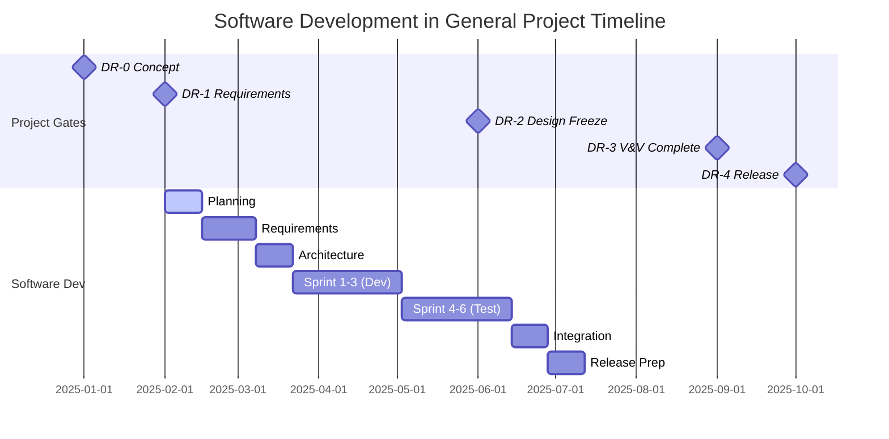
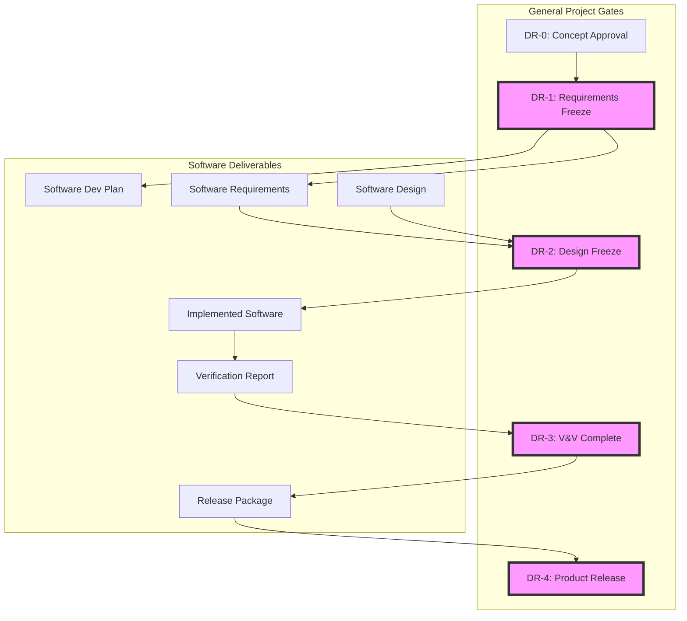
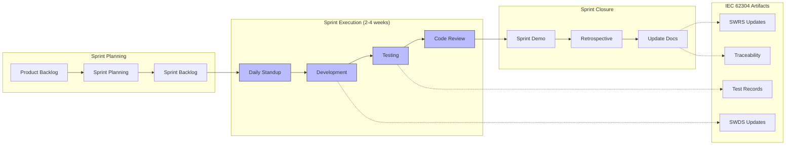
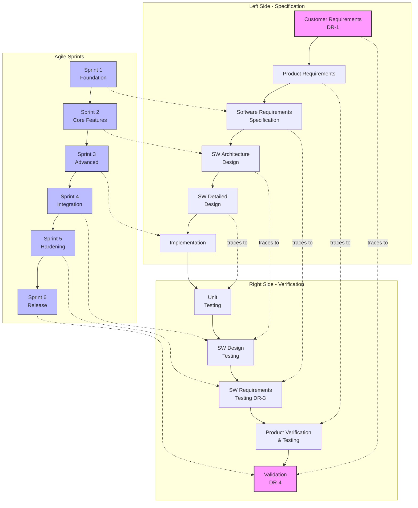
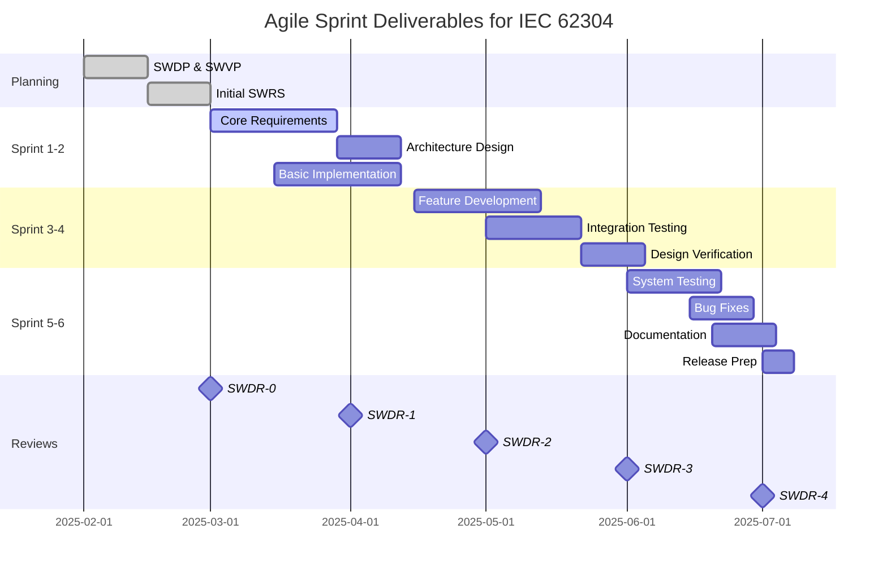
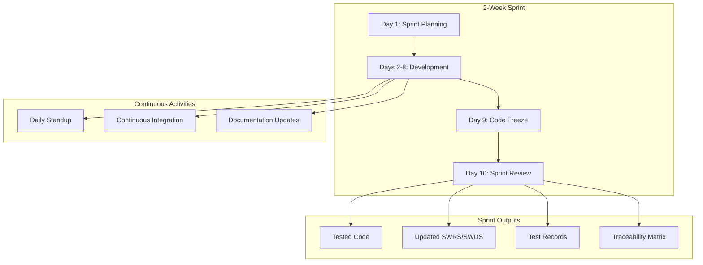
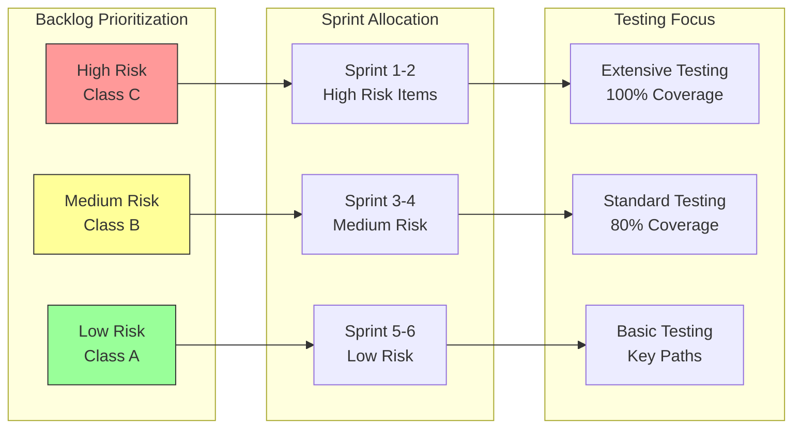
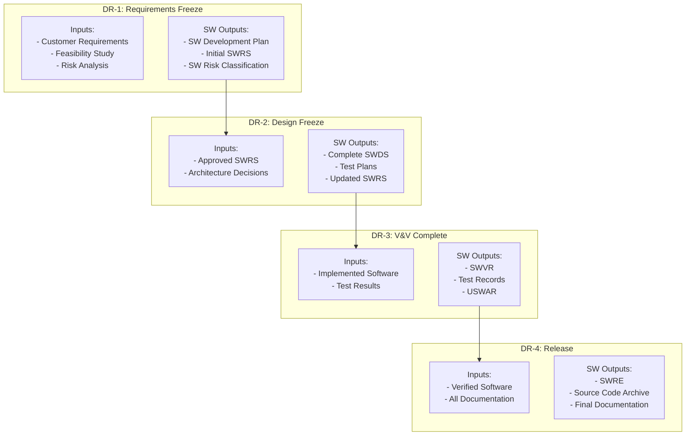
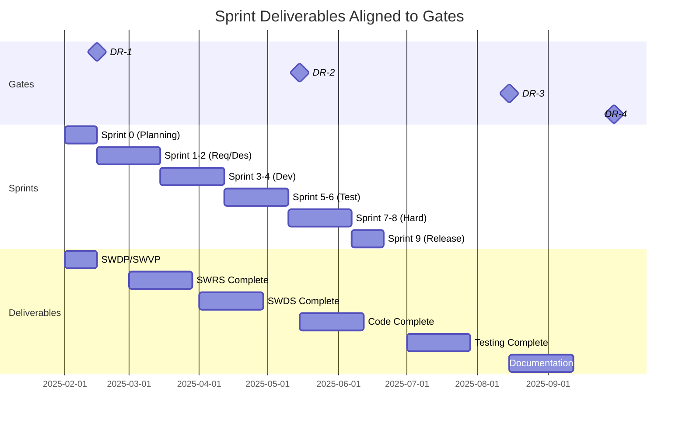

# Software Development Procedure (Simplified)

**Version:** 2.0  
**Date:** July 2025  
**Status:** Simplified and Improved  
**Classification:** IEC 62304 Compliant

---

## 1. Purpose

This procedure defines how Botz Innovation develops, verifies, and releases software for medical devices in compliance with IEC 62304:2006.

**Key Goals:**
- Ensure software safety and quality
- Meet regulatory requirements
- Provide clear, actionable steps for developers

---

## 2. Scope

This procedure applies to:
- ✅ Medical device software (standalone or embedded)
- ✅ Software that controls or monitors medical devices
- ✅ Data management software for medical devices
- ✅ All Botz Innovation personnel and approved partners developing such software

**Note:** Approved partners may use their own procedures if documented in contracts.

---

## 3. Quick Reference - Roles

| Role | Abbreviation | Responsibility |
|------|--------------|----------------|
| **Lead Software Developer** | LSD | Technical leadership, risk input, planning |
| **Software Quality Engineer** | SQE | Quality assurance, verification oversight |
| **Project Manager** | PM | Schedule, resources, coordination |
| **Product Manager** | PrM | Requirements, customer interface |
| **Design Manager** | DM | Design decisions, architecture |

---

## 4. Software Classification (Critical!)

### 4.1 IEC 62304 Safety Classes

| Class | Definition | Example |
|-------|------------|---------|
| **A** | No injury possible | Data display, logging |
| **B** | Non-serious injury possible | Monitoring with alarms |
| **C** | Death or serious injury possible | Therapy delivery, life support |

### 4.2 FDA Level of Concern

| Level | Definition | Documentation Required |
|-------|------------|----------------------|
| **Minor** | Unlikely to cause injury | Basic |
| **Moderate** | Could cause minor injury | Standard |
| **Major** | Could cause death/serious injury | Comprehensive |

**Action:** Classify EVERY software module at the start of development!

---

## 5. Development Process Overview

### 5.1 Integration with General Project Gates



### 5.2 Software Development Mapping to Project Gates



### 5.3 Agile Development with IEC 62304 Compliance



### 5.4 Agile Sprint Mapping to IEC 62304

| Sprint Phase | IEC 62304 Activity | Deliverables |
|--------------|-------------------|--------------|
| **Sprint Planning** | Requirements Analysis | Updated SWRS items |
| **Design Sessions** | Software Design | SWDS for sprint items |
| **Development** | Implementation | Code + Unit Tests |
| **Testing** | Verification | Test Records |
| **Sprint Review** | Design Review | Review Meeting Minutes |
| **Documentation** | Traceability Update | Updated trace matrix |

### 5.5 Key Principles for Agile Medical Device Development

1. **Documentation in Parallel** - Not at the end
2. **Incremental Compliance** - Build compliance artifacts sprint by sprint
3. **Definition of Done** includes:
   - Code complete and reviewed
   - Tests written and passed
   - Documentation updated
   - Traceability maintained
4. **Regular Reviews** - Each sprint end = mini design review
5. **Continuous Integration** - Automated testing for regression

### 5.6 V-Model with Agile Sprints



### 5.7 Sprint-Based Deliverables Timeline



---

## 6. Agile Practices for Medical Device Software

### 6.1 Sprint Structure for IEC 62304



### 6.2 Definition of Done for Medical Device Software

| Level | Criteria | Class A | Class B/C |
|-------|----------|---------|-----------|
| **Code Complete** | | | |
| - Implements design | ��� | ✅ |
| - Follows coding standards | ✅ | ✅ |
| - Compiles without warnings | ✅ | ✅ |
| **Testing Complete** | | | |
| - Unit tests pass | Optional | ✅ |
| - Integration tests pass | ❌ | ✅ |
| - Code coverage >80% | ❌ | ✅ |
| **Review Complete** | | | |
| - Code reviewed | ✅ | ✅ |
| - Static analysis clean | Optional | ✅ |
| **Documentation Complete** | | | |
| - Design updated (SWDS) | ✅ | ✅ |
| - Requirements traced | ✅ | ✅ |
| - Test records filed | ✅ | ✅ |

### 6.3 Agile Artifacts Mapping

| Agile Artifact | IEC 62304 Equivalent | When Updated |
|----------------|---------------------|--------------|
| Product Backlog | SWRS (partial) | Sprint Planning |
| Sprint Backlog | SWDS items | Sprint Planning |
| User Stories | SWRS items | Refinement |
| Acceptance Criteria | Test Cases | Story Creation |
| Sprint Review Notes | Design Review Minutes | Sprint End |
| Burndown Chart | Progress Tracking | Daily |
| Definition of Done | Acceptance Criteria | Planning |

### 6.4 Risk-Based Sprint Planning



---

## 7. Phase 1: Planning

### 7.1 Create Software Development Plan (SDP)

**Required Elements:**

| Element | Class A | Class B/C | Template |
|---------|---------|-----------|----------|
| Team & Roles | ✅ | ✅ | In D&D Plan |
| Schedule | ✅ | ✅ | In D&D Plan |
| Verification Plan | ✅ | ✅ | SWVP Template |
| Configuration Mgmt | ✅ | ✅ | SWCP Template |
| Tools List | ✅ | ✅ + Qualification | Tools Table |
| Integration Plan | ❌ | ✅ | In D&D Plan |

### 7.2 Key Planning Decisions

1. **Define Coding Standards** (e.g., MISRA-C, Google Style)
2. **Select Development Tools** 
   - Class A: Any tools OK
   - Class B/C: Must be qualified per WI-XXXX
3. **Set Up Version Control** (Git, SVN, etc.)
4. **Identify SOUP/OTS Software** early

---

## 7. Phase 2: Requirements & Design

### 7.1 Software Requirements (SWRS)

**Process:**
```
Customer Requirements → Product Requirements → Software Requirements
                    ↓                      ↓
                 (if applicable)      Must include:
                                     - Functional requirements
                                     - Performance requirements  
                                     - Interface requirements
                                     - Safety requirements from risk analysis
```

**Requirements Checklist:**
- [ ] Each requirement has unique ID
- [ ] Each requirement is testable
- [ ] Safety class assigned per module
- [ ] No contradictions
- [ ] Traceable to source

### 7.2 Software Design (SWDS)

**Two Levels Required:**

1. **Architecture Design**
   - High-level structure
   - Module interfaces
   - SOUP integration
   
2. **Detailed Design**
   - Implementation details
   - Algorithms
   - Data structures
   - No ad-hoc decisions during coding!

**Design Review Checklist:**
- [ ] Implements all requirements
- [ ] Modules properly separated
- [ ] Testable design
- [ ] SOUP items identified and qualified

---

## 8. Phase 3: Implementation & Unit Testing

### 8.1 Implementation

**Rules:**
1. Follow coding standards defined in SWVP
2. Implement per detailed design (no ad-hoc changes)
3. Document any deviations

### 8.2 Unit Verification

| Activity | Class A | Class B/C | Output |
|----------|---------|-----------|--------|
| Code Review | Recommended | Required | CRR |
| Static Analysis | Recommended | Required | CRR |
| Unit Tests | Recommended | Required | Test Records |
| Compiler Warnings | Check | Zero tolerance | CRR |

**Acceptance Criteria:**
- Coding standards met
- No compiler errors
- Static analysis passed
- Unit tests passed
- Deviations documented with rationale

---

## 9. Phase 4: Integration & System Testing

### 9.1 Integration Testing (Class B/C only)

**Process:**
1. Integrate units per integration plan
2. Test interfaces between units
3. Verify no unexpected interactions
4. Document results

### 9.2 Design Verification (SWDS Testing)

**Purpose:** Verify implementation matches design

**Methods:**
- Manual testing
- Automated testing
- Review test coverage

### 9.3 Requirements Verification (SWRS Testing)

**Purpose:** Verify software meets requirements

**Key Points:**
- Test complete integrated software
- Include SOUP components
- Test risk control measures
- Document all failures in SWFR

---

## 10. Phase 5: Release

### 10.1 Release Checklist

**Documentation Review:**
- [ ] All requirements verified
- [ ] All design elements tested
- [ ] Code reviews complete
- [ ] Test records complete
- [ ] Failures resolved or documented in USWAR

**Technical Review:**
- [ ] Source code archived
- [ ] Build environment documented
- [ ] Version numbers assigned
- [ ] Release notes created

### 10.2 Unresolved Anomalies (USWAR)

**For each unresolved issue:**
1. Document the anomaly
2. Assess risk impact
3. Justify why not fixed
4. Get approval from PM and QA

---

## 11. Key Documents Summary

### Required for All Classes:

| Document | Purpose | When Created |
|----------|---------|--------------|
| SWRS | Software Requirements | Planning/Requirements |
| SWDS | Software Design | Design Phase |
| SWVP | Verification Plan | Planning |
| SWCP | Configuration Plan | Planning |
| Test Records | Evidence of testing | Testing |
| SWVR | Verification Summary | Release |
| SWRE | Release Documentation | Release |

### Additional for Class B/C:

| Document | Purpose |
|----------|---------|
| Integration Plan | How to integrate units |
| CRR | Code Review Reports |
| Tool Qualification | Evidence tools are suitable |

---

## 12. Common Pitfalls to Avoid

1. **Starting coding before design is complete**
   - Solution: Complete and review SWDS first

2. **Inadequate SOUP documentation**
   - Solution: List all SOUP with versions early

3. **Missing traceability**
   - Solution: Use requirement IDs consistently

4. **Informal testing**
   - Solution: Document all tests, even negative results

5. **Ignoring compiler warnings**
   - Solution: Justify each accepted warning

---

## 13. Quick Decision Trees

### 13.1 Do I need this document?

```
Is it medical software?
├─ No → Follow company standards only
└─ Yes → What class?
    ├─ Class A → Basic documentation set
    ├─ Class B → Full documentation + integration
    └─ Class C → Full documentation + extra rigor
```

### 13.2 What to do with a test failure?

```
Test Failed
├─ Is it a real failure?
│   ├─ No → Fix test, document
│   └─ Yes → What type?
│       ├─ Requirement wrong → Update SWRS, retest all
│       ├─ Design wrong → Update SWDS, reimplement
│       ├─ Code wrong → Fix code, retest unit
│       └─ Test wrong → Fix test, rerun
└─ Document in SWFR
```

---

## 14. Templates and Tools

### Available Templates:
- Software Development Plan (in D&D Plan)
- Software Verification Plan (SWVP)
- Software Configuration Plan (SWCP)
- Software Requirements Specification (SWRS)
- Software Design Specification (SWDS)
- Test Record Templates
- Software Failure Report (SWFR)
- Code Review Report (CRR)

### Recommended Tools:
- **Version Control**: Git, SVN
- **Static Analysis**: PC-Lint, Coverity, PVS-Studio
- **Unit Testing**: Unity, CppUTest, Google Test
- **Documentation**: Markdown, Doxygen
- **Requirements Management**: DOORS, Jira, Excel (with discipline)

---

## 15. Gate Deliverables Mapping

### 15.1 Software Deliverables by Project Gate



### 15.2 Gate Checklist Details

#### DR-1: Requirements Freeze
**Software Deliverables Required:**
- [ ] Software Development Plan (SWDP) - integrated in D&D Plan
- [ ] Software Verification Plan (SWVP)
- [ ] Software Configuration Management Plan (SWCP)
- [ ] Initial Software Requirements (SWRS) - at least high-level
- [ ] Software safety classification documented
- [ ] Development team identified with roles

#### DR-2: Design Freeze  
**Software Deliverables Required:**
- [ ] Complete SWRS - all requirements defined
- [ ] Software Architecture Design (SWDS)
- [ ] Software Detailed Design (SWDS)
- [ ] Test specifications drafted
- [ ] SOUP items identified and listed
- [ ] Integration plan (for Class B/C)
- [ ] Traceability matrix started

#### DR-3: V&V Complete
**Software Deliverables Required:**
- [ ] All code implemented and reviewed
- [ ] Unit test results (Class B/C)
- [ ] Integration test results (Class B/C)
- [ ] Software verification test records
- [ ] Software Verification Report (SWVR)
- [ ] Unresolved anomalies documented (USWAR)
- [ ] Updated traceability matrix

#### DR-4: Product Release
**Software Deliverables Required:**
- [ ] Software Release document (SWRE)
- [ ] Final SWVR with all results
- [ ] Source code archived with build instructions
- [ ] All SOUP items documented with versions
- [ ] Final traceability matrix
- [ ] Residual anomalies reviewed and accepted

### 15.3 Sprint to Gate Alignment



---

## 16. Regulatory Submission Requirements

### For FDA Submission:

| Level of Concern | Required Documents |
|-----------------|-------------------|
| Minor | SRS, Architecture, V&V Summary |
| Moderate | Above + Detailed Design, Test Protocols |
| Major | Above + Complete V&V, Source Code Summary |

### For CE Marking:
- Technical File must include software documentation
- Demonstrate IEC 62304 compliance
- Include risk management per ISO 14971

---

## Appendix A: Acronyms

| Acronym | Meaning |
|---------|---------|
| CRR | Code Review Report |
| D&D | Design and Development |
| DDQP | Design, Development and Quality Plan |
| LSD | Lead Software Developer |
| SOUP | Software of Unknown Provenance |
| SQE | Software Quality Engineer |
| SWCP | Software Configuration Plan |
| SWDS | Software Design Specification |
| SWFR | Software Failure Report |
| SWRE | Software Release |
| SWRS | Software Requirements Specification |
| SWVP | Software Verification Plan |
| SWVR | Software Verification Report |
| USWAR | Unresolved Software Anomalies Report |

---

## Appendix B: Agile User Story Template

### User Story Format for Medical Device Software
```
As a [user type]
I want [functionality]
So that [benefit/value]

Acceptance Criteria:
- [ ] Functional requirement met
- [ ] Performance requirement met  
- [ ] Safety requirement met
- [ ] Tested and documented

Regulatory Considerations:
- Safety Class: [A/B/C]
- Risk Controls: [if any]
- Traceability: [SWRS-XXX]
```

### Example User Story
```
As a clinician
I want to see real-time gait metrics
So that I can assess patient progress

Acceptance Criteria:
- [ ] Displays cadence within 2 seconds
- [ ] Updates at least 1Hz
- [ ] Shows data for both feet
- [ ] Handles sensor disconnection gracefully

Regulatory Considerations:
- Safety Class: B (incorrect data could affect treatment)
- Risk Controls: Data validation, range checking
- Traceability: SWRS-047, SWRS-048
```

---

## Appendix C: Sprint Review Checklist

### End of Sprint Review for Medical Device Software

**Code Review**
- [ ] All code peer reviewed
- [ ] Coding standards verified
- [ ] Static analysis completed (Class B/C)
- [ ] Review comments addressed

**Testing**
- [ ] Unit tests written and passing
- [ ] Integration tests completed (Class B/C)
- [ ] Test coverage meets target
- [ ] Test records archived

**Documentation**
- [ ] SWRS updated with new requirements
- [ ] SWDS updated with design changes
- [ ] Test cases documented
- [ ] Traceability matrix current

**Compliance**
- [ ] Safety classification reviewed
- [ ] Risk analysis updated if needed
- [ ] SOUP items documented
- [ ] Change control followed

**Sprint Metrics**
- [ ] Velocity: ___ story points
- [ ] Defects found: ___
- [ ] Defects resolved: ___
- [ ] Technical debt items: ___

---

## Appendix D: Change History

| Version | Date | Changes | Author |
|---------|------|---------|--------|
| 1.0 | Original | Initial procedure | Botz Team |
| 2.0 | July 2025 | Simplified, added quick references, decision trees | System |
| 2.1 | July 2025 | Added Agile methodology, mermaid diagrams, gate mapping | System |

---

**End of Document**