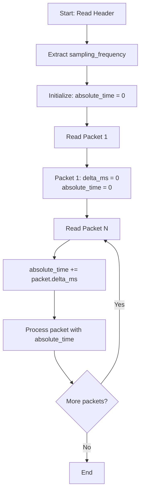
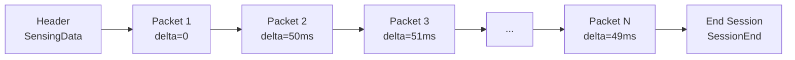
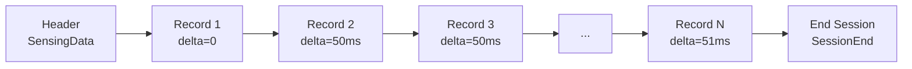
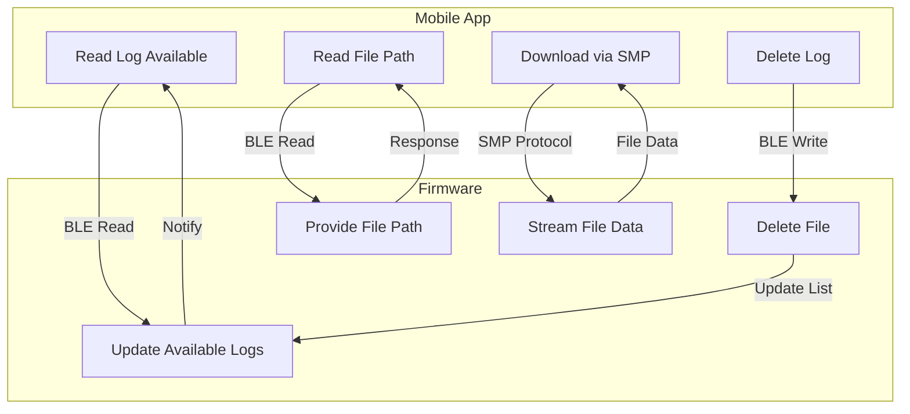
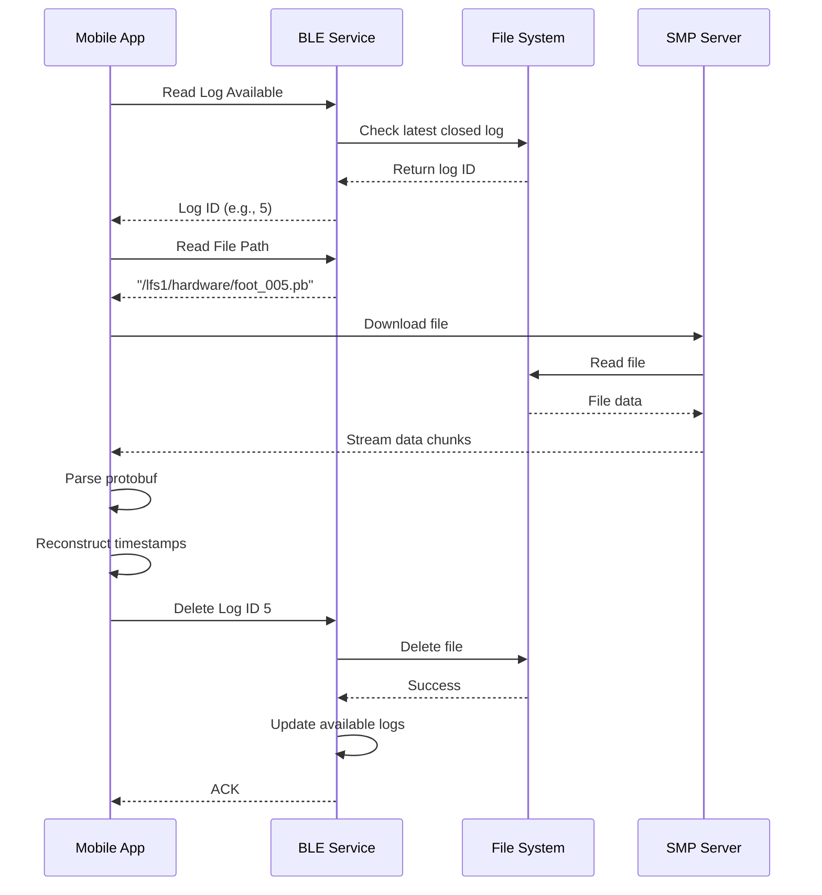
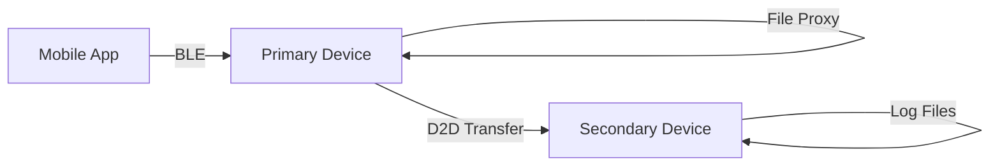
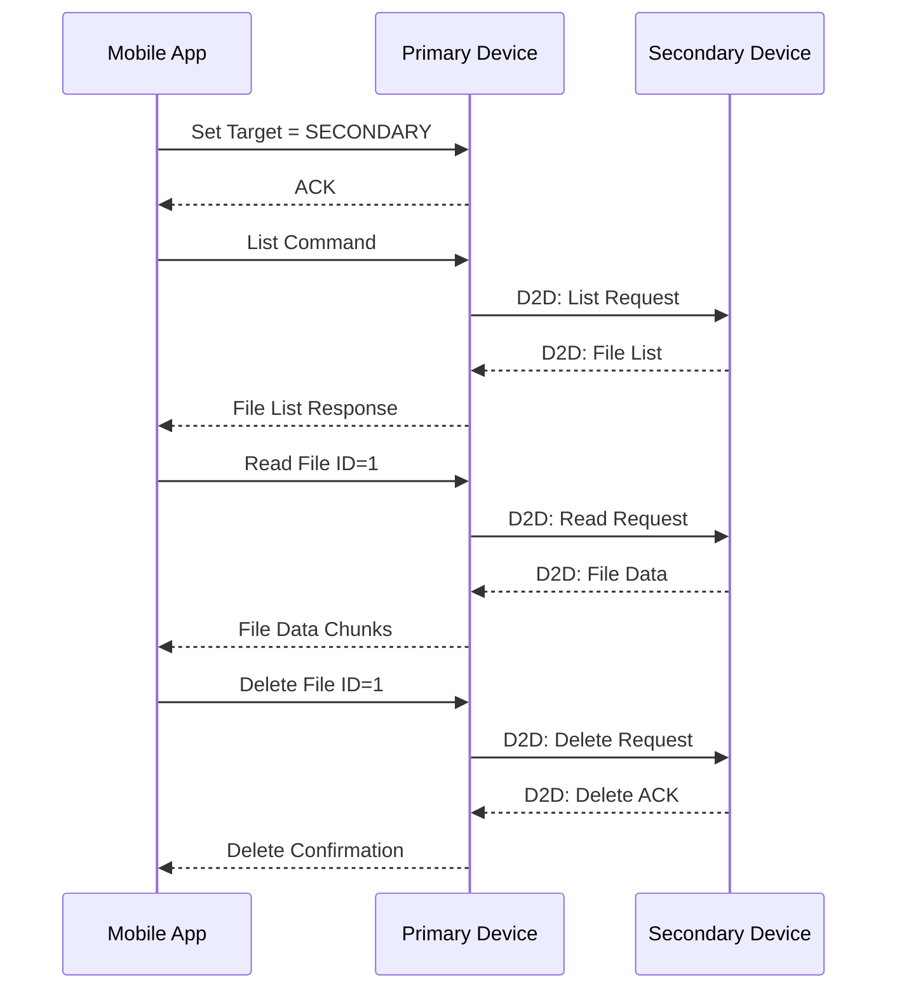

# Logging Specification

**Scope:** This document details the log file formats, BLE characteristics, and workflows for retrieving and managing sensor logs on the device.

**Purpose:** To provide a comprehensive reference for mobile app and integration developers on how to parse, retrieve, and manage log files from the device, including protobuf structures, BLE workflow, and SMP file transfer.

**Revision:** 0.3

**Author:** Firmware Team

**Revision History:**
- 0.1: Initial version with primary device logging
- 0.2: Added secondary device log access via File Proxy service
- 0.3: Added delta timestamp mechanism for accurate timing reconstruction

---

This document details the log file formats, BLE characteristics, and workflows for retrieving and managing sensor logs on the device. It is intended for mobile app developers and integrators. Diagrams and protobuf field listings are included for clarity.

---

## Table of Contents
1. [Introduction](#introduction)
2. [Timing Mechanism](#timing-mechanism)
3. [Foot Sensor Log File](#foot-sensor-log-file)
4. [BHI360 Log File](#bhi360-log-file)
5. [BLE Characteristics for Logging](#ble-characteristics-for-logging)
6. [SMP Server File Retrieval](#smp-server-file-retrieval)
7. [Log Management Workflow](#log-management-workflow)
8. [Secondary Device Log Access](#secondary-device-log-access)
9. [Appendix: Protobuf Definitions](#appendix-protobuf-definitions)

---

## 1. Introduction

The device logs sensor data to files in a binary format using Protocol Buffers (protobuf). There are two main log types: Foot Sensor and BHI360. Each log file starts with a header (containing metadata such as sampling frequency and firmware version), followed by a sequence of data packets. 

**Key Features:**
- Efficient binary format using Protocol Buffers
- Delta timestamp mechanism for minimal storage overhead
- Support for both primary and secondary device logging
- BLE-based file discovery and management

---

## 2. Timing Mechanism

### Delta Timestamp System

To minimize storage overhead while maintaining accurate timing information, the system uses a **delta timestamp** mechanism:

- **No absolute timestamps** are stored in data packets
- Each packet contains a **delta_ms** field (2 bytes, uint16_t) representing milliseconds elapsed since the previous packet
- Maximum delta value: 65,535 ms (approximately 65 seconds)
- Typical delta for 20Hz sampling: ~50ms

### Timestamp Reconstruction Algorithm



### Example: Timestamp Reconstruction

For a log file with 20Hz sampling (50ms expected interval):

| Packet # | delta_ms | Absolute Time (ms) | Notes |
|----------|----------|-------------------|-------|
| Header   | N/A      | N/A               | Contains sampling_frequency = 20 |
| 1        | 0        | 0                 | First data packet always has delta = 0 |
| 2        | 50       | 50                | Normal sampling interval |
| 3        | 51       | 101               | Slight jitter (1ms) |
| 4        | 49       | 150               | Slight jitter (-1ms) |
| 5        | 250      | 400               | Delayed packet (e.g., system busy) |
| 6        | 50       | 450               | Back to normal |

### C++ Reconstruction Example

```cpp
struct TimestampReconstructor {
    uint32_t current_time_ms = 0;
    
    void processPacket(const DataPacket& packet) {
        if (packet.is_first) {
            current_time_ms = 0;  // First packet after header
        } else {
            current_time_ms += packet.delta_ms;
        }
        
        // Process packet with current_time_ms
        processData(packet.data, current_time_ms);
    }
};
```

---

## 3. Foot Sensor Log File

### Description
- Contains time-synchronized readings from the foot sensor
- 8 channels of pressure/force data per packet
- Used for gait analysis, pressure mapping, and related analytics

### File Structure



#### Header (FootSensorSensingData)
- Written as the first protobuf message in the file
- Fields:
  - `firmware_version` (string): Firmware version string
  - `sampling_frequency` (uint32): Logging frequency in Hz (e.g., 20 Hz)
  - `message_type` (enum): Set to FOOT_SENSOR_DATA

#### Data Packets (FootSensorData)
- Each packet is a protobuf message containing:
  - `readings` (repeated uint32): Array of 8 channel readings
  - `delta_ms` (uint32 with nanopb.int_size = IS_16): Time delta in milliseconds (2 bytes)
- **Packet size:** Variable due to protobuf encoding, typically ~20-30 bytes
- **First packet:** Always has delta_ms = 0

#### Session End (FootSensorSessionEnd)
- Final message in the file
- Contains `uptime_ms`: Total system uptime when logging ended

### Binary Layout Example

```
+------------------+------------------+------------------+------------------+
| Header           | Packet 1         | Packet 2         | ... | SessionEnd |
| ~50-100 bytes    | ~25 bytes        | ~25 bytes        |     | ~15 bytes  |
+------------------+------------------+------------------+------------------+
| fw_version: "1.0"| readings:[...]   | readings:[...]   |     | uptime_ms: |
| frequency: 20    | delta_ms: 0      | delta_ms: 50     |     | 3600000    |
| type: FOOT_DATA  |                  |                  |     |            |
+------------------+------------------+------------------+------------------+
```

---

## 4. BHI360 Log File

### Description
- Contains synchronized IMU data from the BHI360 sensor
- Includes quaternion orientation, linear acceleration, and step count
- Used for motion tracking, activity recognition, and analytics

### File Structure



#### Header (BHI360SensingData)
- Written as the first protobuf message in the file
- Fields:
  - `firmware_version` (string): Firmware version string
  - `sampling_frequency` (uint32): Logging frequency in Hz (e.g., 20 Hz)
  - `message_type` (enum): Set to BHI360_3D_DATA

#### Data Packets (BHI360LogRecord)
- Each packet contains:
  - `quat_x, quat_y, quat_z, quat_w` (float): Quaternion orientation
  - `quat_accuracy` (float): Quaternion accuracy metric
  - `lacc_x, lacc_y, lacc_z` (float): Linear acceleration (m/s²)
  - `step_count` (uint32): Cumulative step count
  - `delta_ms` (uint32 with nanopb.int_size = IS_16): Time delta in milliseconds (2 bytes)
- **Packet size:** Approximately 40-45 bytes (36 bytes of sensor data + protobuf overhead)
- **No absolute timestamp field** - removed to save 8 bytes per packet

### Data Fields Detail

| Field | Type | Size | Description |
|-------|------|------|-------------|
| quat_x | float | 4 bytes | Quaternion X component |
| quat_y | float | 4 bytes | Quaternion Y component |
| quat_z | float | 4 bytes | Quaternion Z component |
| quat_w | float | 4 bytes | Quaternion W component |
| quat_accuracy | float | 4 bytes | Accuracy estimate (0-3) |
| lacc_x | float | 4 bytes | Linear acceleration X (m/s²) |
| lacc_y | float | 4 bytes | Linear acceleration Y (m/s²) |
| lacc_z | float | 4 bytes | Linear acceleration Z (m/s²) |
| step_count | uint32 | 4 bytes | Cumulative step count |
| delta_ms | uint16 | 2 bytes | Time delta from previous packet |
| **Total** | | **38 bytes** | Plus protobuf encoding overhead |

---

## 5. BLE Characteristics for Logging

| Characteristic Name         | UUID (prefix bolded)                | Data Type         | Description |
|----------------------------|-------------------------------------|-------------------|-------------|
| Foot Sensor Log Available  | `**0c372eac**-27eb-437e-bef4-775aefaf3c97` | uint8_t          | ID of the latest available foot sensor log (after deletion, the newest closed log is sent; open files are not sent). |
| Foot Sensor Req ID/Path    | `**0c372eae**-27eb-437e-bef4-775aefaf3c97` | char[]           | Path/ID for the latest available foot sensor log file (never an open file). |
| Delete Foot Log Command    | `**4fd5b682**-9d89-4061-92aa-319ca786baae` | uint8_t (write)  | Delete foot sensor log by ID. |
| BHI360 Log Available       | `**0c372eb0**-27eb-437e-bef4-775aefaf3c97` | uint8_t          | ID of the latest available BHI360 log (after deletion, the newest closed log is sent; open files are not sent). |
| BHI360 Req ID/Path         | `**0c372eb1**-27eb-437e-bef4-775aefaf3c97` | char[]           | Path/ID for the latest available BHI360 log file (never an open file). |
| Delete BHI360 Log Command  | `**4fd5b683**-9d89-4061-92aa-319ca786baae` | uint8_t (write)  | Delete BHI360 log by ID. |

---

## 6. SMP Server File Retrieval

- After reading the file path characteristic (e.g., Foot Sensor Req ID/Path or BHI360 Req ID/Path), the mobile app uses the SMP server to request and download the file.
- **SMP Service UUID:** `**8D53DC1D**-1DB7-4CD3-868B-8A527460AA84`
- **Characteristic UUID:** `**DA2E7828**-FBCE-4E01-AE9E-261174997C48`
- The file path is used as the argument for the SMP file download command.
- See Zephyr SMP documentation for protocol details.

---

## 7. Log Management Workflow

### Overview



### Sequence Diagram



---

## 8. Secondary Device Log Access

### Overview

In a dual-device configuration (left and right sensors), the secondary device's log files are accessed through the primary device using the File Proxy service.



### File Proxy Service

**Service UUID:** `7e500001-b5a3-f393-e0a9-e50e24dcca9e`

| Characteristic | UUID | Properties | Description |
|----------------|------|------------|-------------|
| Target Device | `7e500002-b5a3-f393-e0a9-e50e24dcca9e` | Write | Set target device (0x01 = PRIMARY, 0x02 = SECONDARY) |
| Command | `7e500003-b5a3-f393-e0a9-e50e24dcca9e` | Write | Send file command |
| Response | `7e500004-b5a3-f393-e0a9-e50e24dcca9e` | Notify | Receive command responses |
| Data | `7e500005-b5a3-f393-e0a9-e50e24dcca9e` | Notify | Receive file data chunks |

### Command Flow



---

## 9. Appendix: Protobuf Definitions

### Foot Sensor Log Protobuf (foot_sensor_messages.proto)
```protobuf
syntax = "proto3";

import "nanopb.proto";

package sensor_data_messages;

message FootSensorLogMessage {
  oneof payload {
    FootSensorData foot_sensor = 1;
    FootSensorSensingData sensing_data = 4;
    FootSensorSessionEnd session_end = 5;
  }
}

message FootSensorSensingData {
  string firmware_version = 1;
  uint32 sampling_frequency = 2;
  FootSensorMessageType message_type = 3;
}

message FootSensorData {
  repeated uint32 readings = 2; // 8 channels
  uint32 delta_ms = 3 [(nanopb).int_size = IS_16]; // 2-byte delta timestamp
}

message FootSensorSessionEnd {
  uint64 uptime_ms = 1;
}
```

### BHI360 Log Protobuf (bhi360_sensor_messages.proto)
```protobuf
syntax = "proto3";

import "nanopb.proto";

package sensor_data_messages;

message BHI360LogMessage {
  oneof payload {
    BHI360_3D_Data bhi360_3d = 2;
    BHI360_StepCounterData bhi360_step_counter = 3;
    BHI360SensingData sensing_data = 4;
    BHI360SessionEnd session_end = 5;
    BHI360LogRecord bhi360_log_record = 6;
  }
}

message BHI360SensingData {
  string firmware_version = 1;
  uint32 sampling_frequency = 2;
  BHI360MessageType message_type = 3;
}

message BHI360LogRecord {
  float quat_x = 1;
  float quat_y = 2;
  float quat_z = 3;
  float quat_w = 4;
  float quat_accuracy = 5;
  float lacc_x = 6;
  float lacc_y = 7;
  float lacc_z = 8;
  uint32 step_count = 9;
  uint32 delta_ms = 10 [(nanopb).int_size = IS_16]; // 2-byte delta timestamp
}

message BHI360SessionEnd {
  uint64 uptime_ms = 1;
}
```

### Parsing Example (Python)

```python
import foot_sensor_messages_pb2 as foot_pb

def parse_foot_sensor_log(file_path):
    with open(file_path, 'rb') as f:
        # Read header
        header = foot_pb.FootSensorLogMessage()
        header.ParseFromString(read_protobuf_message(f))
        
        sampling_freq = header.sensing_data.sampling_frequency
        print(f"Sampling frequency: {sampling_freq} Hz")
        
        # Read data packets
        absolute_time_ms = 0
        packet_count = 0
        
        while True:
            try:
                msg = foot_pb.FootSensorLogMessage()
                msg.ParseFromString(read_protobuf_message(f))
                
                if msg.HasField('foot_sensor'):
                    if packet_count == 0:
                        absolute_time_ms = 0  # First packet
                    else:
                        absolute_time_ms += msg.foot_sensor.delta_ms
                    
                    print(f"Packet {packet_count}: time={absolute_time_ms}ms, "
                          f"readings={list(msg.foot_sensor.readings)}")
                    packet_count += 1
                    
                elif msg.HasField('session_end'):
                    print(f"Session ended at uptime: {msg.session_end.uptime_ms}ms")
                    break
                    
            except EOFError:
                break
```

---

## 10. Appendix: Log Decoder Tools and Usage

This appendix provides detailed instructions for decoding and analyzing log files using the provided tools.

### 10.1 Overview of Available Tools

The firmware provides multiple methods to decode and analyze log files:

1. **On-Device Shell Commands** - Direct analysis on the device
2. **Python Script** - Host-side analysis with full protobuf support
3. **Standalone C++ Decoder** - Host-side binary decoder
4. **Integrated Application Functions** - Programmatic access

### 10.2 On-Device Shell Commands

#### 10.2.1 Enabling Shell Commands

Add to your `prj.conf`:
```conf
CONFIG_SHELL=y
CONFIG_LOG_DECODER_SHELL_CMD=y
CONFIG_FILE_SYSTEM=y
CONFIG_FILE_SYSTEM_LITTLEFS=y
```

#### 10.2.2 Available Commands

| Command | Description | Example |
|---------|-------------|---------|
| `log list` | List all log files | `uart:~$ log list` |
| `log decode foot` | Decode latest foot sensor log | `uart:~$ log decode foot` |
| `log decode bhi360` | Decode latest BHI360 log | `uart:~$ log decode bhi360` |
| `log decode file <path>` | Decode specific file | `uart:~$ log decode file /lfs1/hardware/foot_001.pb` |
| `log delete_all` | Delete all log files | `uart:~$ log delete_all` |

#### 10.2.3 Example Shell Session

```bash
uart:~$ log list
=== LOG FILE INVENTORY ===
Directory: /lfs1/hardware

FILENAME                  SIZE       TYPE
-------------------------  ---------- ----
foot_001.pb               2048       Foot Sensor
foot_002.pb               4096       Foot Sensor
bhi360_001.pb             8192       BHI360
bhi360_002.pb             16384      BHI360

SUMMARY:
  Foot Sensor Logs: 2
  BHI360 Logs: 2
  Total Files: 4
  Total Size: 30720 bytes (30.00 KB)

uart:~$ log decode foot
=== FOOT SENSOR LOG (ID: 2) ===
File: /lfs1/hardware/foot_002.pb
Size: 4096 bytes
First 32 bytes (hex):
  0A 0C 08 01 12 08 31 2E 30 2E 30 00 18 14 00 00
  0A 0E 12 0C 08 FF 07 08 00 02 08 00 03 08 00 04
Possible version string at offset 6: 1.0.0
Analysis Summary:
  Total bytes read: 4096
  Estimated packets: 64
  Average delta: 50 ms
```

### 10.3 Python Decoder Script

#### 10.3.1 Prerequisites

1. Build the project to generate protobuf Python files:
   ```bash
   cd /home/ee/sensing_fw
   west build
   ```

2. Install required Python packages:
   ```bash
   pip install protobuf
   ```

#### 10.3.2 Usage

```bash
# Decode a specific log file
python tools/decode_log.py /path/to/foot_001.pb

# List all logs in a directory
python tools/decode_log.py --list /path/to/logs/
```

#### 10.3.3 Example Output

```
=== FOOT SENSOR LOG DECODER ===
File: foot_001.pb
Size: 2048 bytes

--- DECODING LOG CONTENTS ---

HEADER:
  Firmware: 1.0.0
  Frequency: 20 Hz

Packet 0:
  Delta: 0 ms
  Time: 0 ms (0.00 s)
  Readings: [1023, 512, 768, 256, 384, 640, 896, 128]

Packet 1:
  Delta: 50 ms
  Time: 50 ms (0.05 s)
  Readings: [1024, 513, 769, 257, 385, 641, 897, 129]

Packet 2:
  Delta: 51 ms
  Time: 101 ms (0.10 s)
  Readings: [1025, 514, 770, 258, 386, 642, 898, 130]

TIMING STATISTICS:
  Min Delta: 49 ms
  Max Delta: 52 ms
  Avg Delta: 50.10 ms
  Jitter: 3 ms
  Expected: 50.00 ms
  Deviation: 0.20%
  Packet Loss: 0.00%
```

### 10.4 Standalone C++ Decoder

#### 10.4.1 Building

```bash
cd /home/ee/sensing_fw/tools
make
```

#### 10.4.2 Usage

```bash
./log_decoder /path/to/foot_001.pb
```

### 10.5 Understanding Decoder Output

#### 10.5.1 Header Information

| Field | Description | Example |
|-------|-------------|---------|
| Firmware Version | Version that created the log | "1.0.0" |
| Sampling Frequency | Data collection rate | 20 Hz |
| Message Type | Type of sensor data | FOOT_SENSOR_DATA |

#### 10.5.2 Packet Data

**Foot Sensor:**
- **Delta**: Time since previous packet (ms)
- **Time**: Absolute time since start (ms)
- **Readings**: 8 channel ADC values

**BHI360:**
- **Delta**: Time since previous packet (ms)
- **Time**: Absolute time since start (ms)
- **Quaternion**: Orientation [x, y, z, w]
- **Linear Accel**: Acceleration [x, y, z] m/s²
- **Step Count**: Cumulative steps

#### 10.5.3 Timing Statistics

| Metric | Description | Good Range |
|--------|-------------|------------|
| Min/Max Delta | Time interval range | Within ±10% of expected |
| Avg Delta | Average packet interval | Close to expected (1000/freq) |
| Jitter | Max - Min delta | < 10ms for 20Hz |
| Deviation | % difference from expected | < 5% |
| Packet Loss | Missing packets estimate | < 1% |

### 10.6 Programmatic Access

#### 10.6.1 C++ API Functions

```cpp
// Decode latest foot sensor log
int decode_latest_foot_log(void);

// Decode latest BHI360 log
int decode_latest_bhi360_log(void);

// Decode specific file
int decode_log_by_path(const char *path);

// Show log inventory
void show_log_inventory(void);
```

#### 10.6.2 Integration Example

```cpp
#include "log_decoder_app.h"

void analyze_logs() {
    // List all logs
    show_log_inventory();
    
    // Decode latest foot sensor log
    int ret = decode_latest_foot_log();
    if (ret == 0) {
        LOG_INF("Foot log decoded successfully");
    }
    
    // Decode specific file
    ret = decode_log_by_path("/lfs1/hardware/bhi360_005.pb");
}
```

### 10.7 Troubleshooting

#### 10.7.1 Common Issues

| Issue | Cause | Solution |
|-------|-------|----------|
| "No log files found" | No logs created | Ensure logging was started/stopped |
| "Cannot open directory" | File system not mounted | Check FS configuration |
| "Decode error" | Corrupted file | Verify file integrity |
| Python import error | Missing protobuf files | Run `west build` first |
| Shell command not found | Not enabled in config | Add CONFIG_LOG_DECODER_SHELL_CMD=y |

#### 10.7.2 Verifying File System

```bash
# Check if file system is mounted
uart:~$ fs mount
/lfs1: LittleFS, mounted

# List files
uart:~$ fs ls /lfs1/hardware
```

#### 10.7.3 Debug Tips

1. **Check file size**: Empty or very small files indicate logging issues
2. **Verify timing**: Large deviations suggest system overload
3. **Monitor packet loss**: High loss indicates buffer overruns
4. **Examine first bytes**: Should show protobuf header pattern

### 10.8 Performance Considerations

#### 10.8.1 On-Device Decoding

- Limited by available RAM
- Shell output may be truncated for large files
- Best for quick verification and debugging

#### 10.8.2 Host-Side Decoding

- No memory limitations
- Full packet analysis possible
- Recommended for detailed analysis

### 10.9 Example Workflow

1. **On Device - Quick Check:**
   ```bash
   uart:~$ log list
   uart:~$ log decode foot
   ```

2. **Download Log Files:**
   - Use BLE/SMP to transfer files
   - Or use debug probe to extract files

3. **Detailed Analysis:**
   ```bash
   python tools/decode_log.py downloaded_foot_001.pb
   ```

4. **Cleanup:**
   ```bash
   uart:~$ log delete_all
   ```

### 10.10 Delta Timestamp Validation

The decoder tools specifically validate the delta timestamp mechanism:

1. **First Packet Check**: Verifies delta_ms = 0
2. **Timing Consistency**: Calculates deviation from expected
3. **Jitter Analysis**: Identifies timing variations
4. **Packet Loss Detection**: Estimates missing packets

Example timing analysis output:
```
TIMING ANALYSIS:
  Expected delta: 50 ms (@ 20 Hz)
  Actual average: 50.1 ms
  Maximum jitter: 3 ms
  Timing accuracy: GOOD (within 5% of expected)
```

This validation ensures the delta timestamp mechanism is working correctly and provides accurate timing reconstruction.

---

**End of Document**