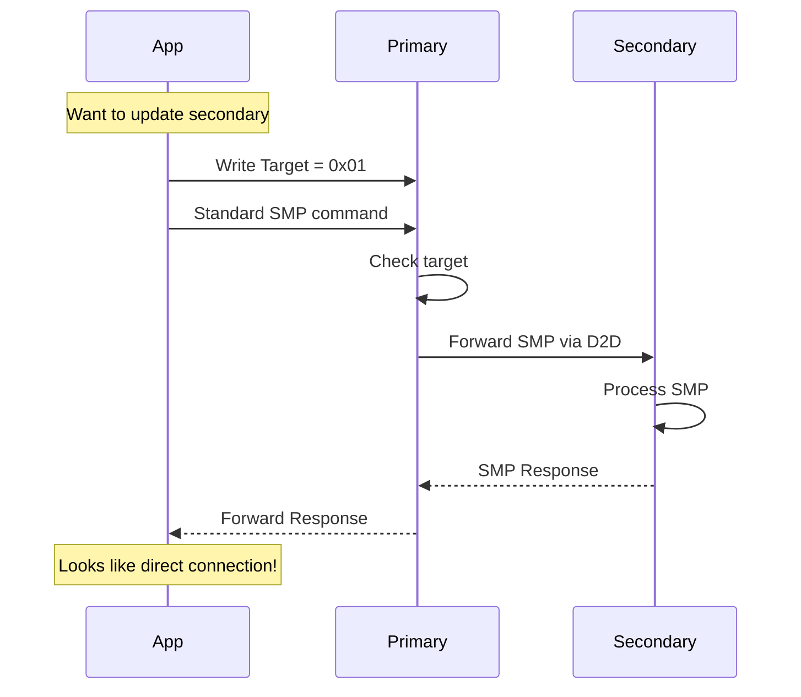

# SMP Proxy Integration Guide

## Overview

The SMP Proxy service provides a unified interface for mobile applications to access both primary and secondary devices using the standard MCUmgr/SMP protocol. This eliminates the need for custom protocols and allows developers to reuse existing MCUmgr libraries.

## Benefits

1. **Single Protocol** - Use standard MCUmgr for everything
2. **Code Reuse** - Same code works for both devices
3. **Standard Tools** - Compatible with existing MCUmgr tools
4. **Simplified Testing** - Test with standard MCUmgr utilities
5. **Future Proof** - New MCUmgr features work automatically

## Service Definition

### SMP Proxy Service
**UUID:** `8D53DC1E-1DB7-4CD3-868B-8A527460AA84`  
**Availability:** Primary device only

| Characteristic | UUID | Properties | Description |
|----------------|------|------------|-------------|
| Target Select | `DA2E7829-FBCE-4E01-AE9E-261174997C48` | Read/Write | Device selection |
| SMP Data | `DA2E7828-FBCE-4E01-AE9E-261174997C48` | Write/Notify | SMP frames |

### Target Values
- `0x00` - Primary device
- `0x01` - Secondary device

## How It Works



## Mobile Integration

### iOS Swift Example

```swift
import CoreBluetooth
import McuManager

class UnifiedDeviceManager {
    let smpProxyService = CBUUID(string: "8D53DC1E-1DB7-4CD3-868B-8A527460AA84")
    let targetCharUUID = CBUUID(string: "DA2E7829-FBCE-4E01-AE9E-261174997C48")
    let smpDataCharUUID = CBUUID(string: "DA2E7828-FBCE-4E01-AE9E-261174997C48")
    
    var peripheral: CBPeripheral!
    var targetChar: CBCharacteristic?
    var smpDataChar: CBCharacteristic?
    var dfuManager: FirmwareUpgradeManager?
    
    enum DeviceTarget: UInt8 {
        case primary = 0x00
        case secondary = 0x01
    }
    
    // Select which device to communicate with
    func selectDevice(_ target: DeviceTarget) {
        guard let targetChar = targetChar else { return }
        let data = Data([target.rawValue])
        peripheral.writeValue(data, for: targetChar, type: .withResponse)
    }
    
    // Update firmware on any device
    func updateFirmware(_ firmware: Data, target: DeviceTarget) {
        // Select target
        selectDevice(target)
        
        // Use standard MCUmgr - it doesn't know about proxy!
        let transport = McuMgrBleTransport(peripheral)
        transport.smpCharacteristic = smpDataChar // Use proxy characteristic
        
        dfuManager = FirmwareUpgradeManager(transporter: transport)
        dfuManager?.delegate = self
        dfuManager?.start(data: firmware)
    }
    
    // List files on any device
    func listFiles(path: String = "/lfs", target: DeviceTarget) async throws -> [FileInfo] {
        // Select target
        selectDevice(target)
        
        // Use standard file manager
        let transport = McuMgrBleTransport(peripheral)
        transport.smpCharacteristic = smpDataChar
        
        let fileManager = FileSystemManager(transporter: transport)
        return try await fileManager.list(path)
    }
    
    // Download file from any device
    func downloadFile(_ path: String, target: DeviceTarget) async throws -> Data {
        // Select target
        selectDevice(target)
        
        // Use standard file manager
        let transport = McuMgrBleTransport(peripheral)
        transport.smpCharacteristic = smpDataChar
        
        let fileManager = FileSystemManager(transporter: transport)
        return try await fileManager.download(path)
    }
}

// Usage example
let manager = UnifiedDeviceManager()

// Update secondary device
await manager.updateFirmware(secondaryFirmware, target: .secondary)

// List files on secondary
let files = try await manager.listFiles(target: .secondary)

// Download log from secondary
let logData = try await manager.downloadFile("/lfs/foot_5.bin", target: .secondary)
```

### Android Kotlin Example

```kotlin
import io.runtime.mcumgr.McuMgrTransport
import io.runtime.mcumgr.ble.McuMgrBleTransport
import io.runtime.mcumgr.dfu.FirmwareUpgradeManager
import io.runtime.mcumgr.managers.FsManager

class UnifiedDeviceManager(private val context: Context) {
    companion object {
        const val SMP_PROXY_SERVICE = "8D53DC1E-1DB7-4CD3-868B-8A527460AA84"
        const val TARGET_CHAR = "DA2E7829-FBCE-4E01-AE9E-261174997C48"
        const val SMP_DATA_CHAR = "DA2E7828-FBCE-4E01-AE9E-261174997C48"
        
        const val TARGET_PRIMARY: Byte = 0x00
        const val TARGET_SECONDARY: Byte = 0x01
    }
    
    private var gatt: BluetoothGatt? = null
    private var targetChar: BluetoothGattCharacteristic? = null
    private var smpDataChar: BluetoothGattCharacteristic? = null
    
    // Select device target
    private fun selectDevice(target: Byte) {
        targetChar?.let { char ->
            char.value = byteArrayOf(target)
            gatt?.writeCharacteristic(char)
        }
    }
    
    // Create transport that uses proxy
    private fun createProxyTransport(): McuMgrTransport {
        return McuMgrBleTransport(context, gatt!!).apply {
            // Override to use proxy characteristic
            setSmpCharacteristic(smpDataChar)
        }
    }
    
    // Update firmware on any device
    fun updateFirmware(firmware: ByteArray, target: Byte) {
        selectDevice(target)
        
        val transport = createProxyTransport()
        val dfuManager = FirmwareUpgradeManager(transport, null)
        
        dfuManager.setUploadCallback(object : FirmwareUpgradeManager.UploadCallback {
            override fun onUploadProgressChanged(current: Int, total: Int, timestamp: Long) {
                val progress = (current * 100) / total
                Log.d(TAG, "Upload progress: $progress%")
            }
            
            override fun onUploadCompleted() {
                Log.d(TAG, "Upload completed!")
            }
            
            override fun onUploadFailed(error: McuMgrException) {
                Log.e(TAG, "Upload failed: $error")
            }
        })
        
        dfuManager.start(firmware)
    }
    
    // List files on any device
    suspend fun listFiles(path: String = "/lfs", target: Byte): List<FileInfo> {
        selectDevice(target)
        
        val transport = createProxyTransport()
        val fsManager = FsManager(transport)
        
        return fsManager.list(path)
    }
    
    // Download file from any device
    suspend fun downloadFile(path: String, target: Byte): ByteArray {
        selectDevice(target)
        
        val transport = createProxyTransport()
        val fsManager = FsManager(transport)
        
        return fsManager.download(path)
    }
}

// Usage
val manager = UnifiedDeviceManager(context)

// Update secondary device
manager.updateFirmware(secondaryFirmware, TARGET_SECONDARY)

// List files on secondary
val files = manager.listFiles(target = TARGET_SECONDARY)

// Download log from secondary
val logData = manager.downloadFile("/lfs/foot_5.bin", TARGET_SECONDARY)
```

### Python Example

```python
from smpclient import SMPClient
from smpclient.transport.ble import SMPBLETransport
import asyncio
from bleak import BleakClient

class UnifiedDeviceManager:
    SMP_PROXY_SERVICE = "8D53DC1E-1DB7-4CD3-868B-8A527460AA84"
    TARGET_CHAR = "DA2E7829-FBCE-4E01-AE9E-261174997C48"
    SMP_DATA_CHAR = "DA2E7828-FBCE-4E01-AE9E-261174997C48"
    
    TARGET_PRIMARY = 0x00
    TARGET_SECONDARY = 0x01
    
    def __init__(self, address):
        self.address = address
        self.client = None
        
    async def connect(self):
        self.client = BleakClient(self.address)
        await self.client.connect()
        
    async def select_device(self, target):
        """Select which device to communicate with"""
        await self.client.write_gatt_char(self.TARGET_CHAR, bytes([target]))
        
    async def create_smp_client(self, target):
        """Create SMP client for the specified target"""
        await self.select_device(target)
        
        # Create transport that uses proxy characteristic
        transport = SMPBLETransport(self.client)
        transport.smp_char_uuid = self.SMP_DATA_CHAR
        await transport.connect()
        
        return SMPClient(transport)
        
    async def update_firmware(self, firmware_path, target):
        """Update firmware on any device"""
        smp = await self.create_smp_client(target)
        
        with open(firmware_path, 'rb') as f:
            firmware = f.read()
            
        # Upload firmware
        async for progress in smp.image_upload(firmware):
            if isinstance(progress, dict):
                percent = (progress['off'] * 100) // len(firmware)
                print(f"Progress: {percent}%")
                
        # Confirm and reset
        await smp.image_confirm()
        await smp.os_reset()
        
    async def list_files(self, path="/lfs", target=TARGET_PRIMARY):
        """List files on any device"""
        smp = await self.create_smp_client(target)
        return await smp.fs_list(path)
        
    async def download_file(self, path, target=TARGET_PRIMARY):
        """Download file from any device"""
        smp = await self.create_smp_client(target)
        
        data = bytearray()
        offset = 0
        
        while True:
            response = await smp.fs_download(path, offset)
            if 'data' in response:
                chunk = response['data']
                data.extend(chunk)
                offset += len(chunk)
                
                if response.get('len', 0) <= offset:
                    break
                    
        return bytes(data)

# Usage
async def main():
    manager = UnifiedDeviceManager("XX:XX:XX:XX:XX:XX")
    await manager.connect()
    
    # Update secondary device
    await manager.update_firmware("secondary.bin", manager.TARGET_SECONDARY)
    
    # List files on secondary
    files = await manager.list_files(target=manager.TARGET_SECONDARY)
    
    # Download log from secondary
    data = await manager.download_file("/lfs/foot_5.bin", manager.TARGET_SECONDARY)
```

## Comparison with Previous Approach

| Feature | Old Proxy Services | SMP Proxy |
|---------|-------------------|-----------|
| Protocol | Custom | Standard MCUmgr |
| Mobile code | Different for each proxy | Same for everything |
| Libraries | Custom implementation | Existing MCUmgr libs |
| Testing | Custom scripts | Standard tools |
| Documentation | Extensive | "Use MCUmgr + set target" |
| Future features | Need proxy updates | Work automatically |

## Migration Guide

### From FOTA Proxy

```swift
// Old approach
fotaProxy.setTarget(.secondary)
fotaProxy.startUpdate(size: firmware.count)
for chunk in firmware.chunks {
    fotaProxy.sendData(chunk)
}
fotaProxy.endUpdate()

// New approach
selectDevice(.secondary)
dfuManager.start(data: firmware) // Standard MCUmgr!
```

### From File Proxy

```swift
// Old approach
fileProxy.setTarget(.secondary)
fileProxy.sendCommand(.listFiles)
// Wait for custom response format

// New approach
selectDevice(.secondary)
let files = try await fileManager.list("/lfs") // Standard MCUmgr!
```

## Testing

Use the provided test script to verify functionality:

```bash
# Install dependencies
pip install smpclient bleak

# Test unified access
python tools/test_smp_proxy.py demo

# List images on both devices
python tools/test_smp_proxy.py images 0  # Primary
python tools/test_smp_proxy.py images 1  # Secondary

# Update secondary device
python tools/test_smp_proxy.py upload 1 secondary_firmware.bin

# List files on secondary
python tools/test_smp_proxy.py files 1 /lfs

# Download file from secondary
python tools/test_smp_proxy.py download 1 /lfs/foot_5.bin
```

## Troubleshooting

### "No SMP response"
- Ensure target is set before sending commands
- Check that secondary device is connected (D2D)
- Verify SMP service is running on secondary

### "Invalid target"
- Target must be 0x00 (primary) or 0x01 (secondary)
- Secondary must be connected for target 0x01

### "Command not supported"
- Not all MCUmgr commands may be implemented
- Check firmware version supports the command

## Summary

The SMP Proxy service dramatically simplifies mobile app development by:
1. Allowing standard MCUmgr libraries to work with both devices
2. Eliminating the need for custom protocol implementations
3. Providing a consistent interface for all operations
4. Enabling use of existing MCUmgr tools and documentation

Mobile developers can now treat both devices as if they have direct connections, with the firmware handling all the complexity of D2D communication transparently.