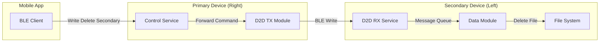
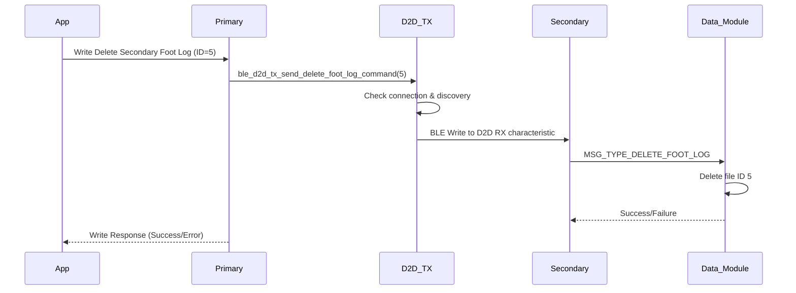

# Secondary Device Delete Mechanism

## Overview

This document explains how the secondary device delete functionality works in the firmware. The mechanism allows the mobile app to delete log files stored on the secondary (left foot) device through the primary (right foot) device using Device-to-Device (D2D) communication.

## Architecture



## Implementation Details

### 1. Control Service Characteristics (Primary Device Only)

The Control Service on the primary device exposes three characteristics specifically for deleting files on the secondary device:

| Characteristic | UUID | Description |
|----------------|------|-------------|
| Delete Secondary Foot Log | `4fd5b688-...` | Delete foot sensor log on secondary |
| Delete Secondary BHI360 Log | `4fd5b689-...` | Delete motion sensor log on secondary |
| Delete Secondary Activity Log | `4fd5b68a-...` | Delete activity log on secondary |

These characteristics are **only available on the primary device** and are conditionally compiled:

```c
#if IS_ENABLED(CONFIG_PRIMARY_DEVICE)
    // Secondary device delete commands - only on primary
    BT_GATT_CHARACTERISTIC(&delete_secondary_foot_log_command_uuid.uuid, ...),
    BT_GATT_CHARACTERISTIC(&delete_secondary_bhi360_log_command_uuid.uuid, ...),
    BT_GATT_CHARACTERISTIC(&delete_secondary_activity_log_command_uuid.uuid, ...),
#endif
```

### 2. Command Flow

#### Step 1: Mobile App Writes to Control Service

The mobile app writes a single byte (log ID) to one of the delete secondary characteristics:

```swift
// iOS Example
let logId: UInt8 = 5 // Delete log file with ID 5
peripheral.writeValue(Data([logId]), 
                     for: deleteSecondaryFootLogCharacteristic, 
                     type: .withResponse)
```

#### Step 2: Primary Device Forwards via D2D

When the primary device receives the delete command, it **does not process it locally**. Instead, it forwards the command to the secondary device:

```c
static ssize_t write_delete_secondary_foot_log_command_vnd(...) {
    uint8_t id_to_delete;
    memcpy(&id_to_delete, buf, sizeof(uint8_t));

    // Only forward to secondary device
    int err = ble_d2d_tx_send_delete_foot_log_command(id_to_delete);
    if (err) {
        LOG_ERR("Failed to forward delete foot log command to secondary: %d", err);
        return BT_GATT_ERR(BT_ATT_ERR_UNLIKELY);
    }

    LOG_INF("Forwarded delete secondary foot log command for ID %u", id_to_delete);
    return len;
}
```

#### Step 3: D2D TX Module Sends Command

The D2D TX module on the primary device:
1. Checks if connected to secondary device
2. Verifies service discovery is complete
3. Writes to the appropriate D2D RX characteristic on the secondary

```c
int ble_d2d_tx_send_delete_foot_log_command(uint8_t log_id) {
    if (!d2d_conn) {
        LOG_WRN("D2D TX: No connection");
        return -ENOTCONN;
    }
    
    if (!d2d_handles.discovery_complete || d2d_handles.delete_foot_log_handle == 0) {
        LOG_WRN("D2D TX: Service discovery not complete or handle not found");
        return -EINVAL;
    }
    
    LOG_INF("D2D TX: Forwarding delete foot log command - ID: %u to handle: %u", 
            log_id, d2d_handles.delete_foot_log_handle);
    
    int err = bt_gatt_write_without_response(d2d_conn, 
                                            d2d_handles.delete_foot_log_handle,
                                            &log_id, 
                                            sizeof(log_id), 
                                            false);
    return err;
}
```

#### Step 4: Secondary Device Processes Command

The secondary device's D2D RX service receives the command and sends it to the data module via message queue, exactly like a local delete command.

### 3. D2D Service Discovery

The primary device performs service discovery when connecting to the secondary device to find the D2D RX service and its characteristics:

```c
// D2D RX Service UUID
static struct bt_uuid_128 d2d_rx_service_uuid =
    BT_UUID_INIT_128(BT_UUID_128_ENCODE(0xe060ca1f, 0x3115, 0x4ad6, 0x9709, 0x8c5ff3bf558b));

// D2D RX Characteristic UUIDs for delete commands
static struct bt_uuid_128 d2d_rx_delete_foot_log_uuid =
    BT_UUID_INIT_128(BT_UUID_128_ENCODE(0xe160ca82, 0x3115, 0x4ad6, 0x9709, 0x8c5ff3bf558b));
static struct bt_uuid_128 d2d_rx_delete_bhi360_log_uuid =
    BT_UUID_INIT_128(BT_UUID_128_ENCODE(0xe160ca83, 0x3115, 0x4ad6, 0x9709, 0x8c5ff3bf558b));
static struct bt_uuid_128 d2d_rx_delete_activity_log_uuid =
    BT_UUID_INIT_128(BT_UUID_128_ENCODE(0xe160ca88, 0x3115, 0x4ad6, 0x9709, 0x8c5ff3bf558b));
```

### 4. Key Differences from Local Delete

| Aspect | Local Delete | Secondary Delete |
|--------|--------------|------------------|
| **Characteristic** | `Delete Foot Log` | `Delete Secondary Foot Log` |
| **Processing** | Sends to local data_msgq | Forwards via D2D |
| **Target Storage** | Primary device | Secondary device |
| **Availability** | Both devices | Primary only |
| **Connection Required** | No | Yes (D2D must be connected) |

### 5. Error Handling

The system handles several error conditions:

1. **No D2D Connection**: Returns `-ENOTCONN`
2. **Discovery Incomplete**: Returns `-EINVAL`
3. **Write Failed**: Returns BLE error code
4. **Secondary Offline**: Command fails, app gets error response

### 6. Mobile App Usage

```kotlin
// Android Example
class DeviceManager {
    fun deleteSecondaryFootLog(logId: Byte) {
        // Write to secondary-specific characteristic
        val characteristic = getCharacteristic(DELETE_SECONDARY_FOOT_LOG_UUID)
        characteristic.value = byteArrayOf(logId)
        gatt.writeCharacteristic(characteristic)
    }
    
    fun deletePrimaryFootLog(logId: Byte) {
        // Write to regular characteristic for primary
        val characteristic = getCharacteristic(DELETE_FOOT_LOG_UUID)
        characteristic.value = byteArrayOf(logId)
        gatt.writeCharacteristic(characteristic)
    }
}
```

## Benefits

1. **Unified Interface**: Mobile app uses same interface for both devices
2. **No Direct Connection**: App doesn't need to connect to secondary device
3. **Consistent API**: Same delete mechanism, just different characteristics
4. **Error Propagation**: Failures are reported back through standard BLE errors

## Sequence Diagram



## Important Notes

1. **Primary Device Only**: These characteristics only exist on the primary device
2. **D2D Connection Required**: Secondary must be connected via D2D
3. **No Local Processing**: Commands are only forwarded, not processed locally
4. **Same Log ID Space**: Log IDs are managed independently on each device
5. **Async Operation**: File deletion happens asynchronously on secondary

## Troubleshooting

### Command Not Working
1. Check D2D connection status in Information Service
2. Verify secondary device is powered on and connected
3. Check log output for discovery completion
4. Ensure log ID exists on secondary device

### Error Responses
- `BT_ATT_ERR_UNLIKELY`: D2D forwarding failed
- `BT_ATT_ERR_INVALID_ATTRIBUTE_LEN`: Wrong data size (must be 1 byte)
- Write timeout: Secondary device not responding

## Future Enhancements

1. **Status Feedback**: Add notification when deletion completes
2. **Bulk Delete**: Support deleting multiple files
3. **Query Before Delete**: Add ability to list files first
4. **Confirmation**: Add delete confirmation mechanism