# Sensor Logging Specification

**Version:** 1.0  
**Date:** June 2025  
**Scope:** Complete specification for sensor data logging, file formats, retrieval methods, and analysis tools  
**Purpose:** Comprehensive reference for developers implementing logging features, parsing log files, and analyzing sensor data

---

## Table of Contents

1. [Introduction](#1-introduction)
2. [System Architecture](#2-system-architecture)
3. [File Formats](#3-file-formats)
4. [Timing Mechanism](#4-timing-mechanism)
5. [Foot Sensor Logs](#5-foot-sensor-logs)
6. [BHI360 Motion Sensor Logs](#6-bhi360-motion-sensor-logs)
7. [Activity Logs](#7-activity-logs)
8. [BLE Interface](#8-ble-interface)
9. [File Retrieval Methods](#9-file-retrieval-methods)
10. [Log Decoder Tools](#10-log-decoder-tools)
11. [Secondary Device Access](#11-secondary-device-access)
12. [Protobuf Definitions](#12-protobuf-definitions)
13. [Integration Examples](#13-integration-examples)
14. [Troubleshooting](#14-troubleshooting)

---

## 1. Introduction

The sensing firmware implements a comprehensive logging system for capturing and storing sensor data from foot pressure sensors, BHI360 motion sensors, and activity tracking. The system is designed for efficiency, accuracy, and ease of integration.

### Key Features

- **Efficient Storage**: Protocol Buffers binary format with fixed-point encoding
- **Accurate Timing**: Delta timestamp mechanism with microsecond precision
- **Dual Device Support**: Access logs from both primary and secondary devices
- **Multiple Access Methods**: BLE characteristics, SMP file transfer, shell commands
- **Analysis Tools**: On-device and host-side decoders with timing validation
- **Activity Tracking**: Integrated step counting and activity metrics

### Storage Efficiency

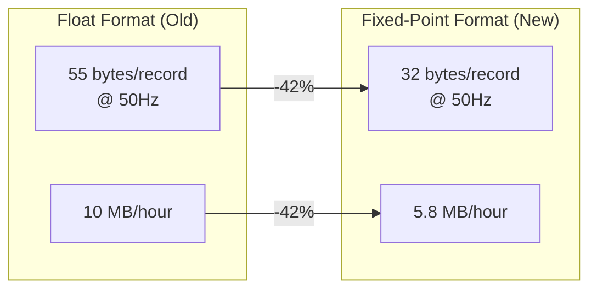

---

## 2. System Architecture

### Logging Flow

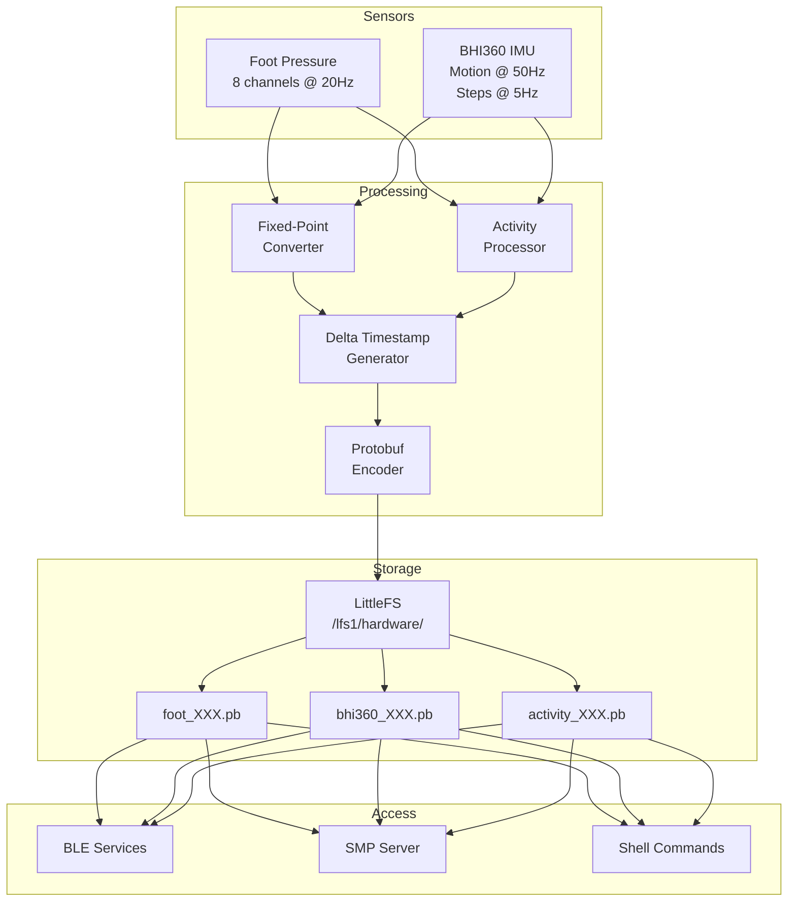

### File Naming Convention

```
/lfs1/hardware/foot_XXX.pb      # Foot sensor logs (XXX = 001-999)
/lfs1/hardware/bhi360_XXX.pb    # BHI360 logs (XXX = 001-999)
/lfs1/hardware/activity_XXX.pb  # Activity logs (XXX = 001-999)
```

---

## 3. File Formats

### General Structure

All log files follow the same basic structure using Protocol Buffers:

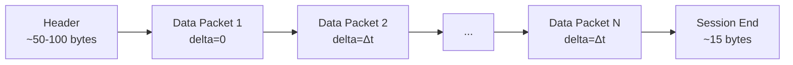

### Binary Layout

The binary file structure uses Protocol Buffers encoding with the following layout:

```
+------------------+------------------+------------------+------------------+
| Header           | Packet 1         | Packet 2         | ... | SessionEnd |
| Protobuf message | Protobuf message | Protobuf message |     | Protobuf   |
+------------------+------------------+------------------+------------------+
| - fw_version     | - sensor_data    | - sensor_data    |     | - uptime   |
| - frequency      | - delta_ms = 0   | - delta_ms = Δt  |     |            |
| - message_type   |                  |                  |     |            |
+------------------+------------------+------------------+------------------+
```

### File Structure Flow

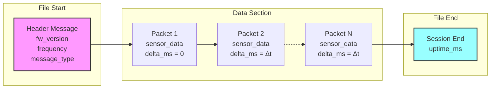

**Key Points:**
- **Header**: Contains metadata about the log file (firmware version, sampling frequency, message type)
- **Data Packets**: Each packet contains sensor data and a delta timestamp (milliseconds since previous packet)
- **First Packet**: Always has delta_ms = 0 as the reference point
- **Session End**: Final message contains the total system uptime when logging stopped

---

## 4. Timing Mechanism

### Delta Timestamp System

To minimize storage overhead while maintaining timing accuracy:

- **No absolute timestamps** in data packets (saves 8 bytes/packet)
- **Delta timestamp** (uint16_t, 2 bytes) stores milliseconds since previous packet
- **First packet** always has delta_ms = 0
- **Maximum delta**: 65,535 ms (~65 seconds)

### Timestamp Reconstruction

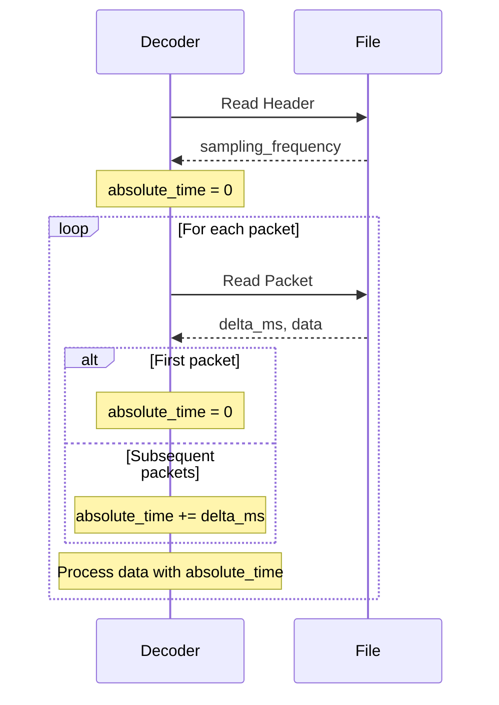

### Implementation Example

```python
def reconstruct_timestamps(packets, sampling_freq):
    absolute_time_ms = 0
    expected_delta = 1000 / sampling_freq
    
    for i, packet in enumerate(packets):
        if i == 0:
            absolute_time_ms = 0  # First packet
        else:
            absolute_time_ms += packet.delta_ms
        
        # Analyze timing
        if i > 0:
            deviation = abs(packet.delta_ms - expected_delta)
            if deviation > expected_delta * 0.1:  # >10% deviation
                print(f"Timing anomaly at {absolute_time_ms}ms")
        
        yield absolute_time_ms, packet.data
```

---

## 5. Foot Sensor Logs

### Specifications

| Parameter | Value |
|-----------|-------|
| Sampling Rate | 20 Hz |
| Channels | 8 (pressure/force sensors) |
| Data Type | uint32_t per channel |
| Packet Size | ~25 bytes |
| Storage Rate | ~500 bytes/second |

### Data Structure

```c
// Header (first message in file)
message FootSensorSensingData {
    string firmware_version = 1;     // e.g., "1.0.0"
    uint32 sampling_frequency = 2;   // 20 Hz
    enum message_type = 3;           // FOOT_SENSOR_DATA
}

// Data packet (repeated)
message FootSensorData {
    repeated uint32 readings = 1;    // 8 channel values
    uint16 delta_ms = 2;            // Time since previous packet
}

// Session end (last message)
message FootSensorSessionEnd {
    uint64 uptime_ms = 1;           // Total system uptime
}
```

### Example Data Flow

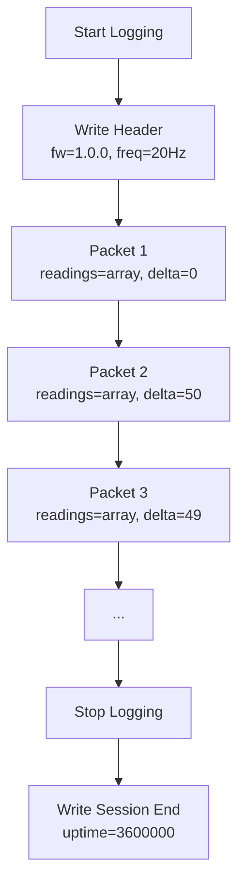

---

## 6. BHI360 Motion Sensor Logs

### Specifications

| Parameter | Value |
|-----------|-------|
| Motion Sensors | 50 Hz (quaternion, accel, gyro) |
| Step Counter | 5 Hz (independent) |
| Data Format | Fixed-point integers |
| Packet Size | ~32 bytes |
| Storage Rate | ~1600 bytes/second |

### Fixed-Point Encoding

| Sensor | Scale Factor | Precision | Range |
|--------|--------------|-----------|-------|
| Quaternion | ×10,000 | 0.0001 | ±1.0 |
| Linear Acceleration | ×1,000 | 0.001 m/s² | ±20 m/s² |
| Gyroscope | ×10,000 | 0.0001 rad/s | ±2.0 rad/s |
| Accuracy | ×100 | 0.01 | 0-3.0 |

### Data Structure

```c
// Data packet with fixed-point encoding
message BHI360LogRecord {
    // Quaternion (×10,000)
    sint16 quat_x = 1;
    sint16 quat_y = 2;
    sint16 quat_z = 3;
    sint16 quat_w = 4;
    
    // Accuracy (×100)
    uint8 quat_accuracy = 5;
    
    // Linear acceleration (×1,000)
    sint16 lacc_x = 6;
    sint16 lacc_y = 7;
    sint16 lacc_z = 8;
    
    // Gyroscope (×10,000)
    sint16 gyro_x = 9;
    sint16 gyro_y = 10;
    sint16 gyro_z = 11;
    
    // Step counter (no scaling)
    uint32 step_count = 12;
    
    // Timing
    uint16 delta_ms = 13;
}
```

### Sensor Synchronization

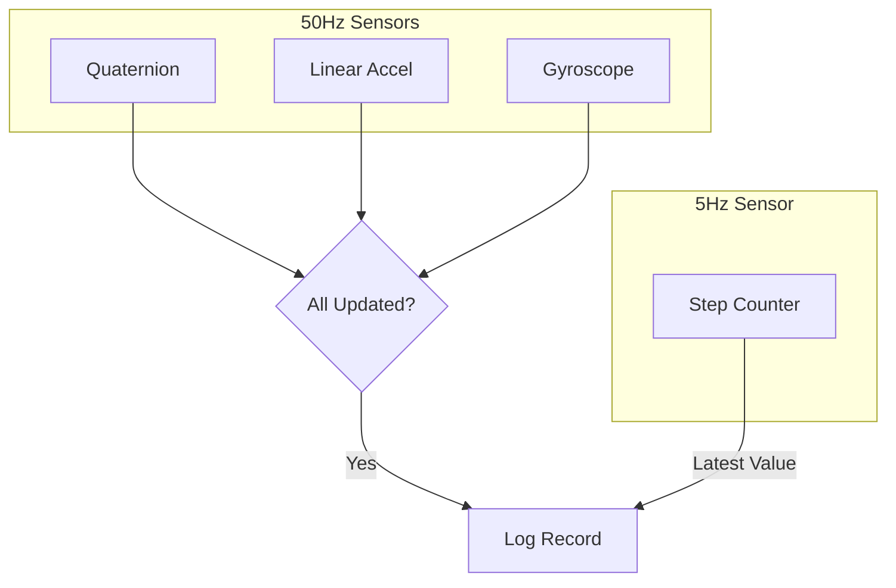

---

## 7. Activity Logs

### Specifications

| Parameter | Value |
|-----------|-------|
| Update Rate | Variable (step-based) |
| Data Type | Step counts per foot |
| Packet Size | ~10 bytes |
| Storage Rate | ~50-100 bytes/second |

### Data Structure

```c
// Header (first message in file)
message ActivitySensingData {
    string firmware_version = 1;     // e.g., "1.0.0"
    uint32 sampling_frequency = 2;   // Variable
    enum message_type = 3;           // ACTIVITY_DATA
}

// Data packet (repeated)
message ActivityData {
    uint32 step_count = 1;          // Combined left + right steps
    uint16 delta_ms = 2;            // Time since previous packet
}

// Session end (last message)
message ActivitySessionEnd {
    uint64 uptime_ms = 1;           // Total system uptime
}
```

### Activity Tracking Features

The activity logging system tracks:
- **Step Count**: Combined left and right foot steps
- **Step Rate**: Calculated from delta timestamps
- **Activity Duration**: Total time of activity session

### Integration with Motion Sensors

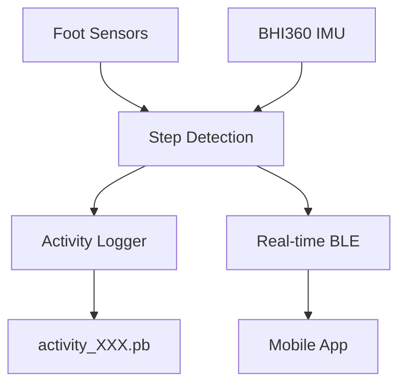

The activity logger combines data from:
- **Foot pressure sensors**: Ground contact detection
- **BHI360 motion data**: Movement validation
- **Algorithm fusion**: Accurate step counting

---

## 8. BLE Interface

### Information Service Characteristics

**Service UUID:** `0c372eaa-27eb-437e-bef4-775aefaf3c97`

| Characteristic | UUID Suffix | Type | Description |
|----------------|-------------|------|-------------|
| Foot Log Available | `...eac` | uint8_t | Latest closed log ID |
| Foot Log Path | `...eae` | string | File path (e.g., "/lfs1/hardware/foot_005.pb") |
| BHI360 Log Available | `...eb0` | uint8_t | Latest closed log ID |
| BHI360 Log Path | `...eb1` | string | File path |
| Activity Log Available | `...eb2` | uint8_t | Latest closed log ID |
| Activity Log Path | `...eb3` | string | File path |

### Control Service Commands

**Service UUID:** `4fd5b67f-9d89-4061-92aa-319ca786baae`

| Command | UUID Suffix | Type | Description |
|---------|-------------|------|-------------|
| Delete Foot Log | `...b682` | uint8_t | Delete by log ID |
| Delete BHI360 Log | `...b683` | uint8_t | Delete by log ID |
| Delete Activity Log | `...b686` | uint8_t | Delete by log ID |
| Start Activity | `...b684` | uint8_t | Start logging (write 1) |
| Stop Activity | `...b685` | uint8_t | Stop logging (write 1) |

### Workflow

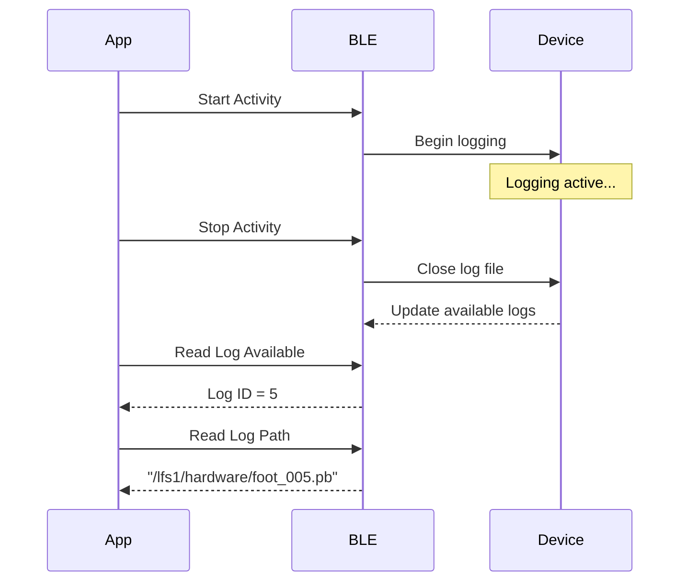

---

## 8. File Retrieval Methods

### Method 1: SMP Proxy (Recommended)

**Service UUID:** `14387800-130c-49e7-b877-2881c89cb258`  
**Characteristic:** `14387802-130c-49e7-b877-2881c89cb258`

The SMP Proxy service provides unified access to files on both primary and secondary devices using standard MCUmgr protocol:

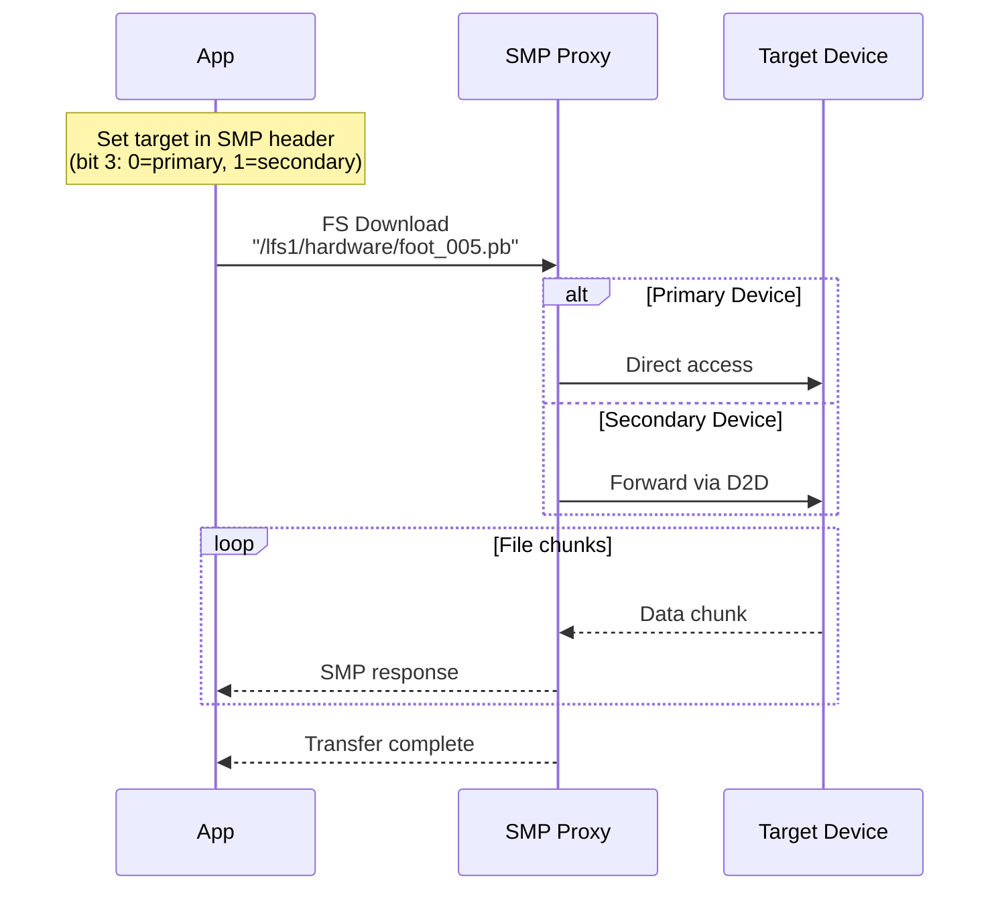

#### Example: Download from Secondary Device

```swift
// iOS Swift using MCUmgr library
func downloadSecondaryLog(path: String) async throws -> Data {
    // Configure transport with SMP proxy
    let transport = McuMgrBleTransport(peripheral)
    transport.smpCharacteristic = "14387802-130c-49e7-b877-2881c89cb258"
    transport.targetDevice = .secondary  // Sets flag bit 3 = 1
    
    // Use standard file manager
    let fileManager = FileSystemManager(transporter: transport)
    return try await fileManager.download(path)
}
```

#### Example: List Files on Both Devices

```python
# Python using smpclient
async def list_all_logs(smp_client):
    logs = {'primary': [], 'secondary': []}
    
    # List primary device logs (target bit = 0)
    primary_files = await smp_client.fs_list("/lfs1/hardware", target=0)
    logs['primary'] = [f for f in primary_files if f.endswith('.pb')]
    
    # List secondary device logs (target bit = 1)
    secondary_files = await smp_client.fs_list("/lfs1/hardware", target=1)
    logs['secondary'] = [f for f in secondary_files if f.endswith('.pb')]
    
    return logs
```

### Method 2: Legacy File Proxy (Secondary Device Only)

**Service UUID:** `14387810-130c-49e7-b877-2881c89cb258`  
**Characteristic:** `14387811-130c-49e7-b877-2881c89cb258`

This legacy service is still available but not recommended for new implementations. Use the SMP Proxy service instead for unified access to both devices.

### Method 3: Debug Interface

For development/debugging:
- J-Link RTT
- USB CDC ACM
- UART console

---

## 9. Log Decoder Tools

### On-Device Shell Commands

```bash
# Enable in prj.conf:
CONFIG_SHELL=y
CONFIG_LOG_DECODER_SHELL_CMD=y
```

#### Available Commands

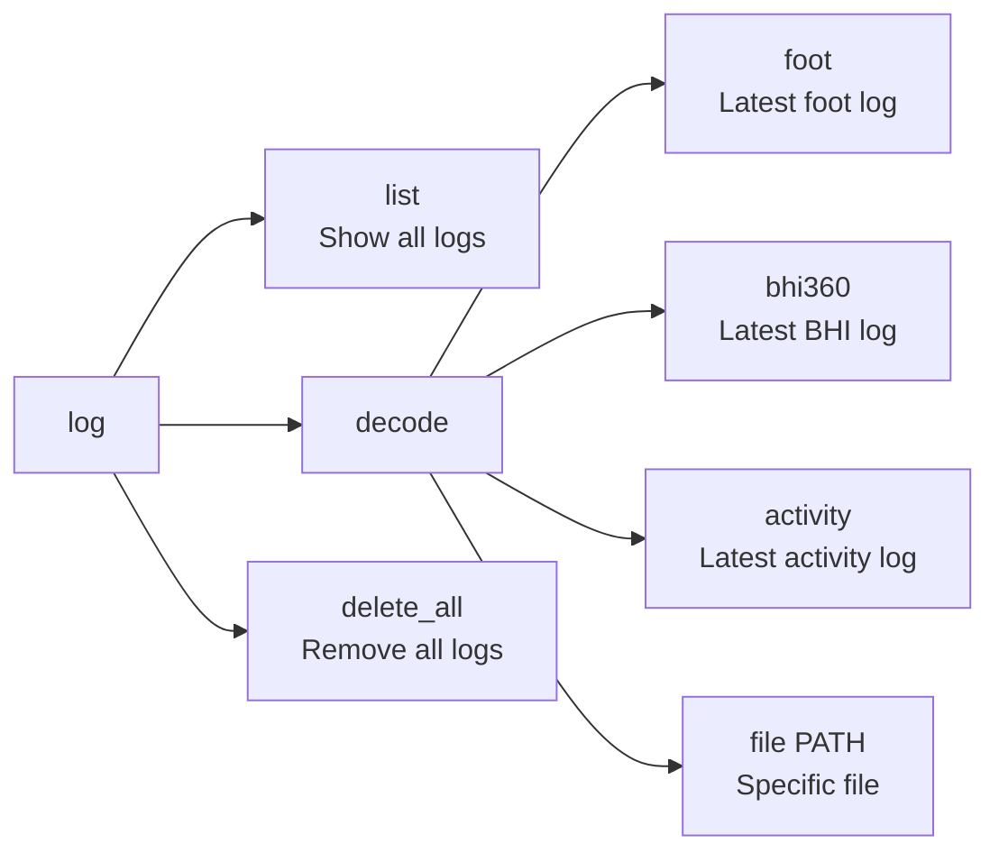

#### Example Session

```bash
uart:~$ log list
=== LOG FILE INVENTORY ===
Directory: /lfs1/hardware

FILENAME                  SIZE       TYPE
-------------------------  ---------- ----
foot_001.pb               2048       Foot Sensor
foot_002.pb               4096       Foot Sensor
bhi360_001.pb             8192       BHI360
bhi360_002.pb             16384      BHI360
activity_001.pb           1024       Activity
activity_002.pb           2048       Activity

SUMMARY:
  Foot Sensor Logs: 2
  BHI360 Logs: 2
  Activity Logs: 2
  Total Files: 6
  Total Size: 33792 bytes (33.00 KB)

uart:~$ log decode foot
=== FOOT SENSOR LOG (ID: 2) ===
File: /lfs1/hardware/foot_002.pb
Firmware: 1.0.0
Frequency: 20 Hz
Packets: 80
Duration: 4.00 seconds

TIMING ANALYSIS:
  Expected delta: 50 ms
  Average delta: 50.1 ms
  Max jitter: 3 ms
  Packet loss: 0.0%
  
First 5 packets:
  [0] t=0ms: [1023, 512, 768, 256, 384, 640, 896, 128]
  [1] t=50ms: [1024, 513, 769, 257, 385, 641, 897, 129]
  [2] t=100ms: [1025, 514, 770, 258, 386, 642, 898, 130]
  [3] t=150ms: [1026, 515, 771, 259, 387, 643, 899, 131]
  [4] t=200ms: [1027, 516, 772, 260, 388, 644, 900, 132]
```

### Python Decoder Script

```python
# Usage
python tools/decode_log.py [options] <log_file>

# Options:
#   --list          List all logs in directory
#   --format json   Output in JSON format
#   --timing        Show detailed timing analysis
#   --export csv    Export data to CSV file

# Examples:
python tools/decode_log.py foot_001.pb
python tools/decode_log.py --timing bhi360_001.pb
python tools/decode_log.py --export data.csv foot_001.pb
```

### Timing Analysis Output

```
TIMING STATISTICS:
┌─────────────────┬──────────┬──────────┬──────────┐
│ Metric          │ Expected │ Actual   │ Status   │
├─────────────────┼──────────┼──────────┼────────���─┤
│ Sample Rate     │ 50 Hz    │ 49.9 Hz  │ ✓ GOOD   │
│ Average Delta   │ 20.0 ms  │ 20.1 ms  │ ✓ GOOD   │
│ Min Delta       │ -        │ 19 ms    │ ✓ GOOD   │
│ Max Delta       │ -        │ 22 ms    │ ✓ GOOD   │
│ Jitter          │ < 5 ms   │ 3 ms     │ ✓ GOOD   │
│ Deviation       │ < 5%     │ 0.5%     │ ✓ GOOD   │
│ Packet Loss     │ < 1%     │ 0.0%     │ ✓ GOOD   │
└─────────────────┴──────────┴──────────┴──────────┘
```

---

## 10. Secondary Device Access

### Architecture

The SMP Proxy architecture provides transparent access to secondary device files through the primary device:

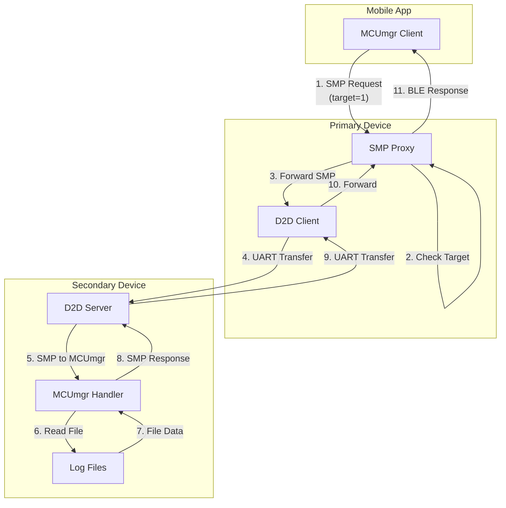

**Key Advantages:**
- **Standard Protocol**: Uses MCUmgr/SMP throughout
- **Transparent Access**: Same API for both devices
- **No Custom Code**: Leverage existing MCUmgr libraries
- **Full Feature Set**: All MCUmgr commands work (files, FOTA, stats, etc.)

### SMP File Operations

Using the SMP Proxy, all standard MCUmgr file operations work seamlessly:

| Operation | SMP Command | Target=0 (Primary) | Target=1 (Secondary) |
|-----------|-------------|-------------------|---------------------|
| List Files | FS List | Direct access | Via D2D proxy |
| Download | FS Download | Direct access | Via D2D proxy |
| Upload | FS Upload | Direct access | Via D2D proxy |
| Delete | FS Delete | Direct access | Via D2D proxy |
| File Info | FS Stat | Direct access | Via D2D proxy |

### Usage Examples

#### Download Log from Secondary Device

```swift
// iOS Swift with MCUmgr
func downloadSecondaryLog(path: String) async throws -> Data {
    // Configure for secondary device
    let transport = McuMgrBleTransport(peripheral)
    transport.smpCharacteristic = "14387802-130c-49e7-b877-2881c89cb258"
    transport.targetDevice = .secondary  // Sets target bit in SMP header
    
    // Standard file download - works transparently!
    let fileManager = FileSystemManager(transporter: transport)
    return try await fileManager.download(path)
}
```

#### List All Logs on Both Devices

```kotlin
// Android Kotlin
suspend fun listAllLogs(): Map<String, List<String>> {
    val logs = mutableMapOf<String, MutableList<String>>()
    
    // List primary device logs
    transport.targetDevice = TARGET_PRIMARY
    val primaryFiles = fileManager.list("/lfs1/hardware")
    logs["primary"] = primaryFiles.filter { it.endsWith(".pb") }
    
    // List secondary device logs
    transport.targetDevice = TARGET_SECONDARY
    val secondaryFiles = fileManager.list("/lfs1/hardware")
    logs["secondary"] = secondaryFiles.filter { it.endsWith(".pb") }
    
    return logs
}
```

#### Delete Old Logs

```python
# Python with smpclient
async def cleanup_old_logs(smp_client, days_to_keep=7):
    """Delete logs older than specified days on both devices"""
    
    for target in [0, 1]:  # Primary and secondary
        device = "primary" if target == 0 else "secondary"
        
        # List all log files
        files = await smp_client.fs_list("/lfs1/hardware", target=target)
        
        for file in files:
            if file['name'].endswith('.pb'):
                # Check file age (simplified)
                if file_is_old(file, days_to_keep):
                    print(f"Deleting {file['name']} from {device}")
                    await smp_client.fs_delete(file['name'], target=target)
```

### Performance Considerations

| Aspect | Primary Device | Secondary Device |
|--------|---------------|------------------|
| Chunk Size | 512 bytes | 256 bytes (UART limited) |
| Throughput | ~20 KB/s | ~5-10 KB/s |
| Latency | ~50ms | ~100-200ms |
| Reliability | Direct BLE | Depends on D2D stability |

### Best Practices

1. **Use Appropriate Chunk Sizes**: Smaller chunks for secondary device
2. **Implement Progress Tracking**: Secondary downloads are slower
3. **Handle Timeouts**: D2D communication may have delays
4. **Verify D2D Connection**: Check before secondary operations
5. **Cache File Lists**: Reduce repeated queries

---

## 11. Protobuf Definitions

### Common Enums

```protobuf
enum MessageType {
    UNKNOWN = 0;
    FOOT_SENSOR_DATA = 1;
    BHI360_3D_DATA = 2;
    ACTIVITY_DATA = 3;
}

enum LogFileType {
    TYPE_UNKNOWN = 0;
    TYPE_FOOT = 1;
    TYPE_BHI360 = 2;
    TYPE_ACTIVITY = 3;
}
```

### Foot Sensor Messages

```protobuf
syntax = "proto3";
import "nanopb.proto";

message FootSensorLogMessage {
    oneof payload {
        FootSensorData data = 1;
        FootSensorSensingData header = 2;
        FootSensorSessionEnd end = 3;
    }
}

message FootSensorData {
    repeated uint32 readings = 1 [(nanopb).max_count = 8];
    uint32 delta_ms = 2 [(nanopb).int_size = IS_16];
}
```

### BHI360 Messages (Fixed-Point)

```protobuf
message BHI360LogRecord {
    // Quaternion ×10,000
    sint32 quat_x = 1 [(nanopb).int_size = IS_16];
    sint32 quat_y = 2 [(nanopb).int_size = IS_16];
    sint32 quat_z = 3 [(nanopb).int_size = IS_16];
    sint32 quat_w = 4 [(nanopb).int_size = IS_16];
    
    // Accuracy ×100
    uint32 quat_accuracy = 5 [(nanopb).int_size = IS_8];
    
    // Linear acceleration ×1,000
    sint32 lacc_x = 6 [(nanopb).int_size = IS_16];
    sint32 lacc_y = 7 [(nanopb).int_size = IS_16];
    sint32 lacc_z = 8 [(nanopb).int_size = IS_16];
    
    // Gyroscope ×10,000
    sint32 gyro_x = 9 [(nanopb).int_size = IS_16];
    sint32 gyro_y = 10 [(nanopb).int_size = IS_16];
    sint32 gyro_z = 11 [(nanopb).int_size = IS_16];
    
    uint32 step_count = 12;
    uint32 delta_ms = 13 [(nanopb).int_size = IS_16];
}
```

### Activity Messages

```protobuf
syntax = "proto3";
import "nanopb.proto";

message ActivityLogMessage {
    oneof payload {
        ActivityData data = 1;
        ActivitySensingData header = 2;
        ActivitySessionEnd end = 3;
    }
}

message ActivityData {
    uint32 step_count = 1;              // Combined left + right steps
    uint32 delta_ms = 2 [(nanopb).int_size = IS_16];
}

message ActivitySensingData {
    string firmware_version = 1 [(nanopb).max_size = 16];
    uint32 sampling_frequency = 2;
    MessageType message_type = 3;
}

message ActivitySessionEnd {
    uint64 uptime_ms = 1;
}
```

---

## 13. Integration Examples

### Mobile App - Complete Log Download

```kotlin
// Android Kotlin using MCUmgr
class LogDownloader(private val transport: McuMgrBleTransport) {
    
    init {
        // Configure SMP proxy
        transport.smpCharacteristic = "14387802-130c-49e7-b877-2881c89cb258"
    }
    
    suspend fun downloadLatestFootLog(fromDevice: DeviceTarget): FootSensorLog? {
        // 1. Set target device
        transport.targetDevice = fromDevice
        
        // 2. Check available logs via BLE characteristic
        val logId = bleManager.readCharacteristic(FOOT_LOG_AVAILABLE_UUID)
        if (logId == 0) return null
        
        // 3. Get file path
        val path = bleManager.readCharacteristic(FOOT_LOG_PATH_UUID)
        
        // 4. Download via SMP proxy
        val fileManager = FileSystemManager(transport)
        val fileData = fileManager.download(path)
        
        // 5. Parse protobuf
        return FootSensorLogParser.parse(fileData)
    }
    
    suspend fun downloadFromBothDevices(): Map<String, FootSensorLog?> {
        return mapOf(
            "primary" to downloadLatestFootLog(DeviceTarget.PRIMARY),
            "secondary" to downloadLatestFootLog(DeviceTarget.SECONDARY)
        )
    }
    
    suspend fun deleteLog(logId: UInt8) {
        bleManager.writeCharacteristic(DELETE_FOOT_LOG_UUID, byteArrayOf(logId))
    }
}
```

### Firmware - Custom Log Analysis

```c
#include "log_decoder_app.h"

void analyze_foot_timing(void) {
    struct log_stats stats = {0};
    
    int ret = analyze_latest_foot_log(&stats);
    if (ret == 0) {
        LOG_INF("Foot log analysis:");
        LOG_INF("  Duration: %d.%03d seconds", 
                stats.duration_ms / 1000,
                stats.duration_ms % 1000);
        LOG_INF("  Packets: %d", stats.packet_count);
        LOG_INF("  Avg delta: %d ms", stats.avg_delta_ms);
        LOG_INF("  Max jitter: %d ms", stats.max_jitter_ms);
        
        if (stats.max_jitter_ms > 10) {
            LOG_WRN("High timing jitter detected!");
        }
    }
}
```

### Python - Batch Processing

```python
import glob
from decode_log import LogDecoder

def process_all_logs(directory):
    """Process all log files and generate report"""
    
    results = {
        'foot': [],
        'bhi360': []
    }
    
    # Process foot sensor logs
    for file in glob.glob(f"{directory}/foot_*.pb"):
        decoder = LogDecoder(file)
        stats = decoder.analyze()
        results['foot'].append({
            'file': file,
            'duration': stats['duration_s'],
            'packets': stats['packet_count'],
            'timing_quality': stats['timing_quality']
        })
    
    # Generate report
    print(f"Processed {len(results['foot'])} foot logs")
    print(f"Total duration: {sum(r['duration'] for r in results['foot']):.1f}s")
    print(f"Average quality: {np.mean([r['timing_quality'] for r in results['foot']]):.1%}")
```

---

## 14. Troubleshooting

### Common Issues and Solutions

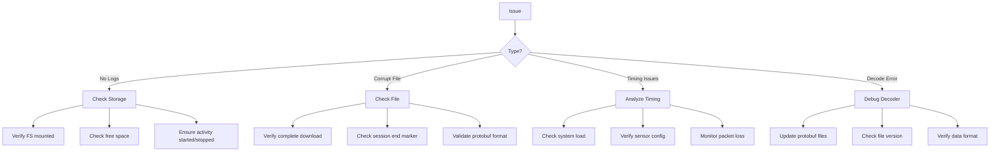

### Debug Checklist

1. **File System Health**
   ```bash
   fs mount
   fs statvfs /lfs1
   ```

2. **Log File Integrity**
   ```bash
   # Check file exists and size
   fs ls /lfs1/hardware
   
   # Verify can read
   fs read /lfs1/hardware/foot_001.pb 0 32
   ```

3. **Timing Validation**
   ```bash
   # On-device analysis
   log decode foot
   
   # Look for:
   # - Consistent deltas
   # - Low jitter
   # - No large gaps
   ```

4. **BLE Communication**
   - Ensure bonding/pairing complete
   - Verify characteristic permissions
   - Check notification subscriptions

### Performance Optimization

1. **Reduce Logging Overhead**
   - Use appropriate sampling rates
   - Enable only needed sensors
   - Implement circular buffers

2. **Improve Timing Accuracy**
   - Minimize ISR processing
   - Use DMA for sensor reads
   - Priority-based task scheduling

3. **Optimize Storage**
   - Regular log cleanup
   - Compression for long-term storage
   - Efficient file rotation

---

**End of Specification**