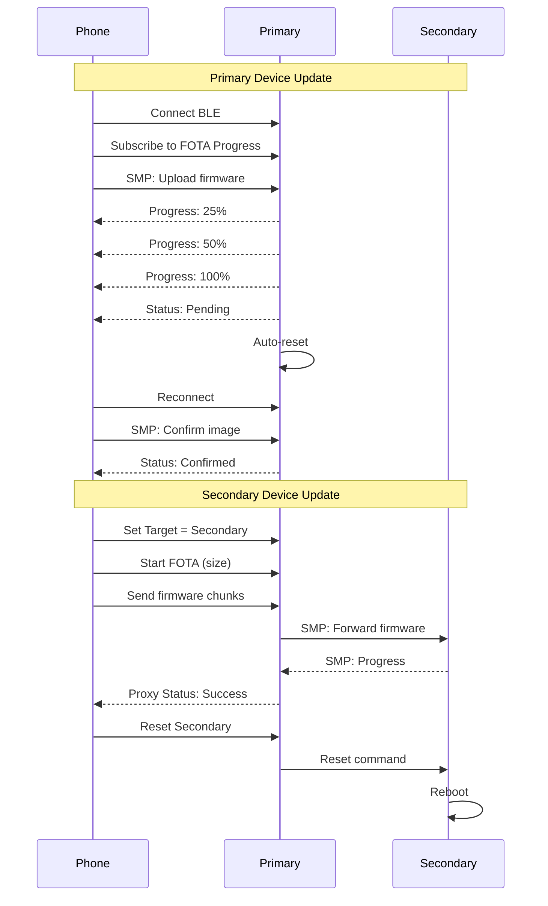

# FOTA Proxy Usage Guide

This guide explains how to perform FOTA (Firmware Over-The-Air) updates on secondary devices (left foot) through the primary device (Right foot) proxy.

## Overview

The FOTA proxy service allows the phone to update firmware on secondary devices that are not directly connected to it. The primary device acts as a relay, forwarding FOTA commands and data to the secondary device.

For primary device updates, the phone uses the standard MCUmgr/SMP protocol directly. The device provides real-time FOTA progress updates through the Information Service.

## Architecture

```
Phone <--BLE--> Primary Device <--BLE--> Secondary Device
         |                          |
         |                          +-- SMP Server
         |
         +-- FOTA Proxy Service
         +-- SMP Server (for primary updates)
```

## FOTA Proxy Service

### Service UUID
- Service: `6e400001-b5a3-f393-e0a9-e50e24dcca9e`

### Characteristics

1. **Target Selection** (Write)
   - UUID: `6e400002-b5a3-f393-e0a9-e50e24dcca9e`
   - Values:
     - `0x00`: Primary device
     - `0x01`: Secondary device
     - `0xFF`: All devices

2. **Command** (Write/Write Without Response)
   - UUID: `6e400003-b5a3-f393-e0a9-e50e24dcca9e`
   - Commands:
     - `0x01`: Start FOTA (followed by 4 bytes total size in little-endian)
     - `0x02`: Data chunk (followed by data bytes)
     - `0x03`: End FOTA
     - `0x04`: Abort FOTA
     - `0x05`: Query status
     - `0x06`: Reset device

3. **Data** (Write/Write Without Response)
   - UUID: `6e400004-b5a3-f393-e0a9-e50e24dcca9e`
   - Used for bulk data transfer

4. **Status** (Read/Notify)
   - UUID: `6e400005-b5a3-f393-e0a9-e50e24dcca9e`
   - Values:
     - `0x00`: Idle
     - `0x01`: In progress
     - `0x02`: Success
     - `0x03`: Error
     - `0x04`: No target device

## Usage Flow

### 1. Update Secondary Device

```python
# Python example using bleak library
import asyncio
from bleak import BleakClient
import struct

FOTA_PROXY_SERVICE = "6e400001-b5a3-f393-e0a9-e50e24dcca9e"
TARGET_CHAR = "6e400002-b5a3-f393-e0a9-e50e24dcca9e"
COMMAND_CHAR = "6e400003-b5a3-f393-e0a9-e50e24dcca9e"
DATA_CHAR = "6e400004-b5a3-f393-e0a9-e50e24dcca9e"
STATUS_CHAR = "6e400005-b5a3-f393-e0a9-e50e24dcca9e"

async def update_secondary_device(address, firmware_path):
    async with BleakClient(address) as client:
        # 1. Set target to secondary device
        await client.write_gatt_char(TARGET_CHAR, bytes([0x01]))
        
        # 2. Read firmware file
        with open(firmware_path, 'rb') as f:
            firmware_data = f.read()
        
        # 3. Start FOTA
        total_size = len(firmware_data)
        start_cmd = bytes([0x01]) + struct.pack('<I', total_size)
        await client.write_gatt_char(COMMAND_CHAR, start_cmd)
        
        # 4. Send data in chunks
        chunk_size = 240  # Adjust based on MTU
        for i in range(0, len(firmware_data), chunk_size):
            chunk = firmware_data[i:i+chunk_size]
            data_cmd = bytes([0x02]) + chunk
            await client.write_gatt_char(COMMAND_CHAR, data_cmd, response=False)
            await asyncio.sleep(0.05)  # Small delay between chunks
        
        # 5. End FOTA
        await client.write_gatt_char(COMMAND_CHAR, bytes([0x03]))
        
        # 6. Wait for completion
        await asyncio.sleep(2)
        
        # 7. Reset secondary device
        await client.write_gatt_char(COMMAND_CHAR, bytes([0x06]))
```

### 2. Update Primary Device

For updating the primary device, use the standard MCUmgr protocol directly via the SMP service:

#### SMP Service Details
- **Service UUID**: `8D53DC1D-1DB7-4CD3-868B-8A527460AA84`
- **Characteristic UUID**: `DA2E7828-FBCE-4E01-AE9E-261174997C48`

#### Python Example using smpclient

```python
from smpclient import SMPClient
from smpclient.transport.ble import SMPBLETransport

async def update_primary_device(address, firmware_path):
    # Create BLE transport
    transport = SMPBLETransport()
    await transport.connect(address)
    
    # Create SMP client
    client = SMPClient(transport)
    
    # Read firmware
    with open(firmware_path, 'rb') as f:
        firmware_data = f.read()
    
    # Upload firmware
    await client.upload_image(firmware_data, slot=0)
    
    # List images to get hash
    images = await client.list_images()
    new_image_hash = images[0]['hash']
    
    # Test the new image
    await client.test_image(new_image_hash)
    
    # Reset device to boot into new image
    await client.reset()
    
    # After reboot, confirm the image
    await transport.connect(address)
    await client.confirm_image()
```

#### Mobile App Implementation (iOS with McuManager)

```swift
import McuManager

class PrimaryDeviceFOTA {
    let dfuManager: FirmwareUpgradeManager
    
    func updatePrimaryDevice(peripheral: CBPeripheral, firmware: Data) {
        let bleTransport = McuMgrBleTransport(peripheral)
        dfuManager = FirmwareUpgradeManager(transporter: bleTransport)
        
        // Set delegate to receive progress updates
        dfuManager.delegate = self
        
        // Start firmware upgrade
        dfuManager.start(data: firmware)
    }
}

extension PrimaryDeviceFOTA: FirmwareUpgradeDelegate {
    func upgradeDidStart(controller: FirmwareUpgradeController) {
        print("FOTA started")
    }
    
    func upgradeStateDidChange(from previousState: FirmwareUpgradeState, 
                               to newState: FirmwareUpgradeState) {
        print("State changed: \(previousState) -> \(newState)")
    }
    
    func upgradeDidComplete() {
        print("FOTA completed successfully")
    }
    
    func upgradeDidFail(inState state: FirmwareUpgradeState, with error: Error) {
        print("FOTA failed: \(error)")
    }
    
    func uploadProgressDidChange(bytesSent: Int, imageSize: Int, timestamp: Date) {
        let progress = Float(bytesSent) / Float(imageSize) * 100
        print("Upload progress: \(progress)%")
    }
}
```

### 3. Monitor FOTA Progress

The primary device provides real-time FOTA progress updates through the Information Service:

#### FOTA Progress Characteristic
- **Service UUID**: `0c372eaa-27eb-437e-bef4-775aefaf3c97` (Information Service)
- **Characteristic UUID**: `0c372eb5-27eb-437e-bef4-775aefaf3c97`
- **Properties**: Read, Notify

#### Progress Data Structure
```c
struct fota_progress_msg_t {
    uint8_t is_active;        // 0=inactive, 1=active
    uint8_t status;           // 0=idle, 1=in_progress, 2=pending, 3=confirmed, 4=error
    uint8_t percent_complete; // 0-100
    uint32_t bytes_received;  // Bytes received so far
    uint32_t total_size;      // Total firmware size
    int32_t error_code;       // Error code if status=4
};
```

#### Subscribing to Progress Updates (iOS)

```swift
func subscribeToFOTAProgress(peripheral: CBPeripheral) {
    let infoServiceUUID = CBUUID(string: "0c372eaa-27eb-437e-bef4-775aefaf3c97")
    let progressCharUUID = CBUUID(string: "0c372eb5-27eb-437e-bef4-775aefaf3c97")
    
    if let service = peripheral.services?.first(where: { $0.uuid == infoServiceUUID }),
       let characteristic = service.characteristics?.first(where: { $0.uuid == progressCharUUID }) {
        peripheral.setNotifyValue(true, for: characteristic)
    }
}

func peripheral(_ peripheral: CBPeripheral, 
                didUpdateValueFor characteristic: CBCharacteristic, 
                error: Error?) {
    guard characteristic.uuid == CBUUID(string: "0c372eb5-27eb-437e-bef4-775aefaf3c97"),
          let data = characteristic.value,
          data.count >= 14 else { return }
    
    let isActive = data[0]
    let status = data[1]
    let percentComplete = data[2]
    let bytesReceived = data.subdata(in: 3..<7).withUnsafeBytes { $0.load(as: UInt32.self) }
    let totalSize = data.subdata(in: 7..<11).withUnsafeBytes { $0.load(as: UInt32.self) }
    let errorCode = data.subdata(in: 11..<15).withUnsafeBytes { $0.load(as: Int32.self) }
    
    print("FOTA Progress: \(percentComplete)% (\(bytesReceived)/\(totalSize) bytes)")
    
    switch status {
    case 0: print("Status: Idle")
    case 1: print("Status: In Progress")
    case 2: print("Status: Pending (waiting for reset)")
    case 3: print("Status: Confirmed")
    case 4: print("Status: Error (code: \(errorCode))")
    default: break
    }
}
```

### 4. Update Both Devices

```python
async def update_all_devices(address, primary_fw, secondary_fw):
    async with BleakClient(address) as client:
        # First update secondary
        await client.write_gatt_char(TARGET_CHAR, bytes([0x01]))
        # ... send secondary firmware ...
        
        # Then update primary
        await client.write_gatt_char(TARGET_CHAR, bytes([0x00]))
        # ... use standard MCUmgr for primary ...
```

## Mobile App Implementation

### iOS (Swift)

```swift
import CoreBluetooth

class FOTAProxyManager: NSObject {
    private var peripheral: CBPeripheral?
    private var targetChar: CBCharacteristic?
    private var commandChar: CBCharacteristic?
    private var statusChar: CBCharacteristic?
    
    func updateSecondaryDevice(firmware: Data) {
        // 1. Set target to secondary
        if let targetChar = targetChar {
            peripheral?.writeValue(Data([0x01]), for: targetChar, type: .withResponse)
        }
        
        // 2. Start FOTA
        var startCmd = Data([0x01])
        var size = UInt32(firmware.count).littleEndian
        startCmd.append(Data(bytes: &size, count: 4))
        
        if let commandChar = commandChar {
            peripheral?.writeValue(startCmd, for: commandChar, type: .withResponse)
        }
        
        // 3. Send firmware in chunks
        let chunkSize = 240
        for i in stride(from: 0, to: firmware.count, by: chunkSize) {
            let end = min(i + chunkSize, firmware.count)
            var chunk = Data([0x02])
            chunk.append(firmware[i..<end])
            
            if let commandChar = commandChar {
                peripheral?.writeValue(chunk, for: commandChar, type: .withoutResponse)
            }
            Thread.sleep(forTimeInterval: 0.05)
        }
        
        // 4. End FOTA
        if let commandChar = commandChar {
            peripheral?.writeValue(Data([0x03]), for: commandChar, type: .withResponse)
        }
    }
}
```

### Android (Kotlin)

```kotlin
class FOTAProxyManager(private val bluetoothGatt: BluetoothGatt) {
    companion object {
        val FOTA_PROXY_SERVICE = UUID.fromString("6e400001-b5a3-f393-e0a9-e50e24dcca9e")
        val TARGET_CHAR = UUID.fromString("6e400002-b5a3-f393-e0a9-e50e24dcca9e")
        val COMMAND_CHAR = UUID.fromString("6e400003-b5a3-f393-e0a9-e50e24dcca9e")
    }
    
    fun updateSecondaryDevice(firmware: ByteArray) {
        val service = bluetoothGatt.getService(FOTA_PROXY_SERVICE)
        
        // 1. Set target to secondary
        val targetChar = service.getCharacteristic(TARGET_CHAR)
        targetChar.value = byteArrayOf(0x01)
        bluetoothGatt.writeCharacteristic(targetChar)
        
        // 2. Start FOTA
        val commandChar = service.getCharacteristic(COMMAND_CHAR)
        val startCmd = ByteArray(5)
        startCmd[0] = 0x01
        ByteBuffer.wrap(startCmd, 1, 4).order(ByteOrder.LITTLE_ENDIAN).putInt(firmware.size)
        commandChar.value = startCmd
        bluetoothGatt.writeCharacteristic(commandChar)
        
        // 3. Send firmware in chunks
        val chunkSize = 240
        for (i in firmware.indices step chunkSize) {
            val end = minOf(i + chunkSize, firmware.size)
            val chunk = ByteArray(1 + end - i)
            chunk[0] = 0x02
            System.arraycopy(firmware, i, chunk, 1, end - i)
            
            commandChar.value = chunk
            commandChar.writeType = BluetoothGattCharacteristic.WRITE_TYPE_NO_RESPONSE
            bluetoothGatt.writeCharacteristic(commandChar)
            Thread.sleep(50)
        }
        
        // 4. End FOTA
        commandChar.value = byteArrayOf(0x03)
        commandChar.writeType = BluetoothGattCharacteristic.WRITE_TYPE_DEFAULT
        bluetoothGatt.writeCharacteristic(commandChar)
    }
}
```

## Error Handling

1. **No Secondary Device Connected**: Status will return `0x04`
2. **Transfer Failure**: Status will return `0x03`
3. **Timeout**: The proxy has a 5-minute timeout for FOTA operations

## Best Practices

1. **Check Status**: Always subscribe to status notifications before starting FOTA
2. **Chunk Size**: Use chunks smaller than the negotiated MTU (typically 240 bytes)
3. **Delays**: Add small delays between chunks to avoid overwhelming the BLE stack
4. **Verification**: Query device version after reset to verify successful update
5. **Error Recovery**: Implement retry logic for failed transfers

## Testing

1. **Test Primary Update**:
   ```bash
   # From phone app
   1. Connect to primary device
   2. Subscribe to FOTA progress characteristic
   3. Use MCUmgr/SMP to upload firmware
   4. Monitor progress notifications
   5. Device auto-resets after upload
   6. Confirm image after reboot
   ```

2. **Test Secondary Update**:
   ```bash
   # From phone app
   1. Connect to primary device
   2. Set target to secondary (0x01)
   3. Upload firmware via proxy
   4. Monitor proxy status
   5. Reset secondary device
   ```

3. **Monitor Logs**:
   ```bash
   # On primary device console
   minicom -D /dev/ttyACM0 -b 115200
   
   # For primary FOTA:
   # "FOTA Started!"
   # "FOTA Progress: 25% (65536/262144 bytes)"
   # "FOTA Transfer complete, pending verification"
   # "FOTA Image confirmed!"
   
   # For secondary FOTA:
   # "FOTA proxy service initialized"
   # "Secondary device connected"
   # "Starting FOTA update, total size: X bytes"
   # "FOTA update completed"
   ```

## Complete FOTA Flow Diagram



## Troubleshooting

### Secondary device not updating
1. Ensure secondary is connected to primary
2. Check FOTA proxy status notifications
3. Verify SMP server is running on secondary
4. Check firmware compatibility

### Transfer failures
1. Reduce chunk size
2. Increase delays between chunks
3. Check BLE connection parameters
4. Monitor RSSI for connection quality

### Primary device issues
1. Ensure sufficient flash space
2. Check MCUboot configuration
3. Verify image signing